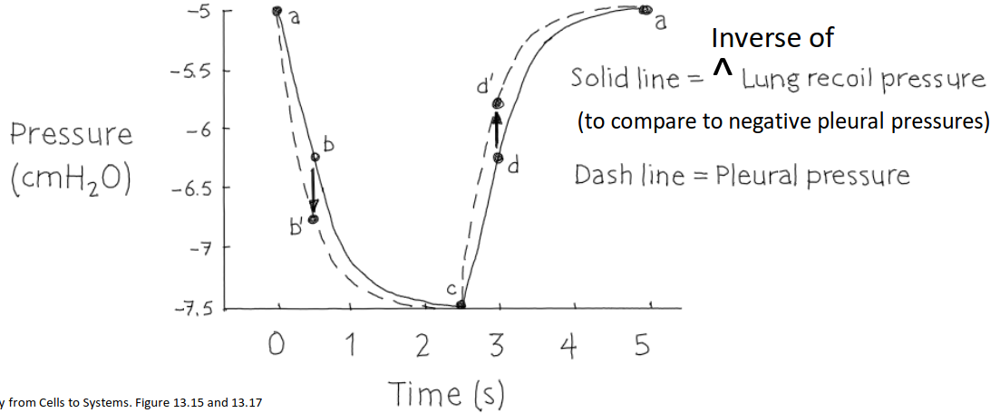
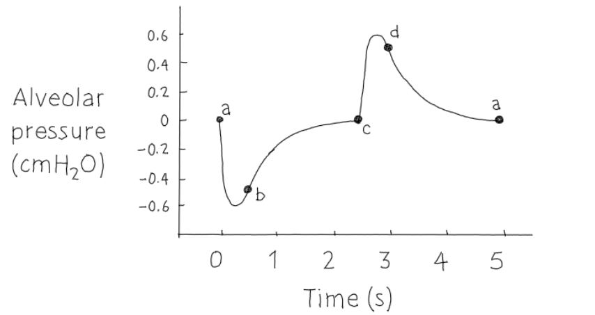
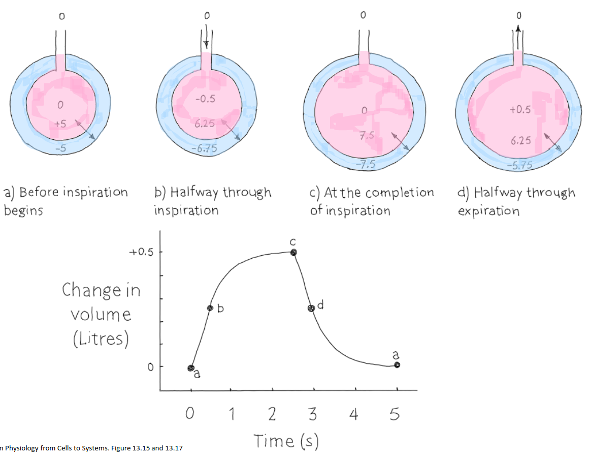
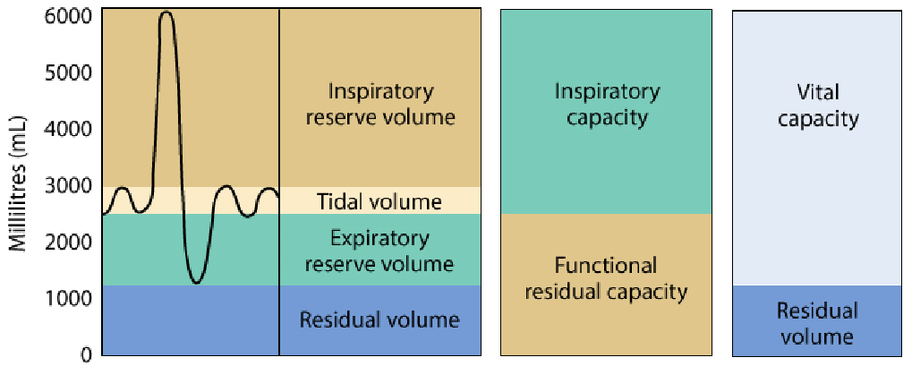

# Lecture 20, Apr 6, 2023

## Changes During Normal Breathing

* Changes during normal breathing:
	1. Lung volume
		* Volume increases until the completion of inspiration, where $P_A$ equalizes with the outside atmosphere
		* Then during exhale $P_A$ becomes higher than atmospheric
	2. Pleural pressure
		* Before inspiration begins, $P_{pl} = -5$
		* Halfway through inspiration, the pleural pressure gets more negative, $P_{pl} = -6.75$ because you're expanding the size of the cavity
		* Pleural pressure reaches a minimum at the completion of respiration, $P_{pl} = -7.5$; at this point the lung recoil (transmural pressure) reaches a maximum, $P_{LR} = 7.5$
		* As the diaphragm relaxes during expiration, both pressures return to normal; halfway through respiration $P_{LR} = 6.65$
		* At the end of expiration everything returns to normal
		* The two ends of the path for pleural and lung recoil pressures are the same but the paths are slightly different
			* Negative pleural pressure drives inspiration, lung recoil pressure drives expiration
			* During inspiration the lung recoil pressure lags the pleural pressure and catches up at the end of inspiration
			* During expiration the pleural pressure lags the lung recoil pressure
		* The flow rate is directly proportional to the alveolar pressure, which is the difference between the pleural and lung recoil pressures
	
{width=70%}

{width=50%}

{width=80%}

* Minute ventilation $\dot V_E = V_T \times f$ is the volume of gas breathed per minute; $V_T$ is the tidal volume and $f$ is the respiratory rate
	* Air exchange only happens at the ends of the lungs, so the upper airways are functional dead spaces that do not transfer oxygen
	* Expired gas is a combination of alveolar and dead space air, $\dot V_E = \dot V_A + \dot V_D$
	* If you breathe too fast, the breaths will be very shallow and only dead space air will be exchanged, which is why you feel lightheaded since you're not getting fresh air
	* Dead space volume is a constant offset subtracted from the total ventilation, about $0.15\si{L}$
* In alveolar gas, the composition of water vapour and carbon dioxide get much higher and oxygen lowers

## Spirometry and Lung Volume

* Residual volume is the amount of air left in the lungs no matter how hard you breathe
* Expiratory reserve volume is the amount of air you have left after expiration during normal breathing; this gives a functional residual capacity (ERV + RV)
* The tidal volume is the normal volume change during breathing
	* This is the sum of dead space and alveolar volumes
* The difference between the total lung capacity and the normal lung capacity after inspiration is the inspiratory reserve volume
* During typical breathing, only the tidal volume is exchanged; in forceful breathing, the IRV and ERV can be exchanged
* The total lung capacity cannot be changed, but IRV/ERV can be increased with training (with a stronger diaphragm muscle)
* The vital capacity is the sum of IRV, ERV and VT, and is the maximum volume you can exchange during breathing
* Inspiratory capacity is the sum of tidal volume and IRV, from the end of normal expiration to total capacity
* Total lung capacity is the sum of vital capacity and residual volume
* RV cannot be measured directly with spirometry since it can only measure air coming out of or going into the lungs

{width=60%}

