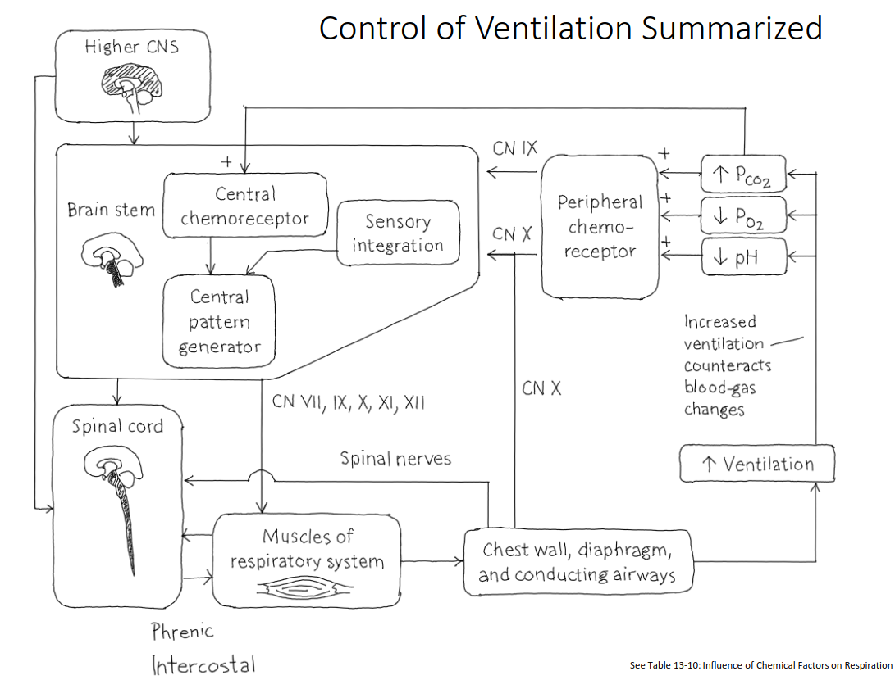

# Lecture 21, Apr 11, 2023

## Gas Exchange During Ventilation

* Exchange of O2 and CO2 are driven by partial pressures; normally, alveolar and arterial $P_{a\ce{O2}} = 100\si{mmHg}$ and $P_{a\ce{CO2}} = 40\si{mmHg}$
	* In hyperventilation the body is breathing faster, so the oxygen partial pressure goes up and CO2 partial pressure declines
	* Hypoventilation is the opposite
	* By the time oxygen gets back to the lungs, the partial pressure will be about 40 mmHg, so the pressure gradient of 100 to 40 drives oxygen diffusion
	* $P_{v\ce{O2}}$ is the partial pressure in venous blood (before alveoli), $P_{a\ce{O2}}$ is the partial pressure in arterial blood (after alveoli) and $P_{A\ce{O2}}$ is the partial pressure in the alveoli themselves (not blood)
	* $P_{A\ce{O2}} = P_{a\ce{O2}} = 100\si{mmHg}$ is higher than $P_{v\ce{O2}} = 40\si{mmHg}$ allowing oxygen to diffuse
* Dissolved gases also exert a partial pressure (more gases dissolved has a greater pressure)
* Blood plasma itself has a very low solubility for oxygen, so hemoglobin proteins are used as the main transporter of oxygen
	* About 270 million hemoglobin molecules in each red blood cell
	* Each hemoglobin has 3 heme sites (iron) where oxygen can bind to
	* Oxygen bound to hemoglobin consists of 98.5% of oxygen transport; only 1.5% is dissolved in the plasma
* For carbon dioxide, the main carrier is bicarbonate ions
	* Dissolved carbon dioxide produces carbonic acid: $\ce{CO2 + H2O \leftrightarrow H2CO3 \leftrightarrow H^+ + HCO3^-}$
	* 5-10% are physically dissolved, with another 5-10% bound to hemoglobin; the rest 80-90% exist as bicarbonate ions
* Hemoglobin's affinity for oxygen and carbon dioxide can be changed; with higher carbon dioxide concentration, acidity, and temperature the affinity for oxygen decreases, which releases oxygen to the cells that need it most

## Nervous Control of Ventilation

* Under rest (normal breathing), arterial carbon dioxide $P_{a\ce{CO2}}$ is the most important factor regulating ventilation
	* Levels are kept constant, so even small changes have big ventilation effects
	* Normal $P_{a\ce{CO2}}$ is about 40; increasing this to 44 almost doubles the resulting minute ventilation
* Central chemoreceptors exist in the medulla in the brain stem to measure $P_{a\ce{CO2}}$ indirectly via blood pH, caused by increased hydrogen ion concentration from dissolved carbonic acid
	* An increase in $P_{a\ce{CO2}}$ causes carbon dioxide to diffuse across the blood-brain barrier, which creates more hydrogen ions and makes ECF surrounding brain cells more acidic
	* The chemoreceptors pick up this change and sends a signal to the brain
	* There are still $\ce{O2}$ sensors but they are less effective and affects heart rate more than breathing
* At the dorsal side of the medulla is the control centre for ventilation and breathing rhythm
* A reverberating circuit (aka rhythm generator, central pattern generator, oscillation pattern) generates periodic innervations to the diaphragm muscles under normal breathing
	* Note unlike the heart, this is not just one pacemaker cell, but a loop of neurons feeding back on themselves
	* Pattern of contracting respiratory muscles for 2 seconds, and then releasing for 3 seconds leads to the breathing cycle
	* The dorsal respiratory group (DRG) innervates the diaphragm and external intercostal muscles
	* Under more forceful breathing, the ventral respiratory group (VRG) innervates other muscles such as the internal intercostal muscles to breathe more air
* More controls in the pons (right above the medulla) further affect breathing (pontine respiratory group, PRG)
	* Pneumotaxic center is the higher one which inhibits the dorsal respiratory group in the medulla
	* Apneustic center is the lower one which excites the DRG
* Example: a disturbance, an increase in $P_{a\ce{CO2}}$, causes the pH level to drop in the brain ECF, which makes the central chemoreceptors fire, that then causes more forceful and frequent berating to expel the extra carbon dioxide in order to bring the body to homeostasis
* Increase in blood $P_{a\ce{CO2}}$ directly leads to a higher minute ventilation
* In general $P_{a\ce{CO2}}, P_{a\ce{O2}}$ are held remarkably constant by minute ventilation
* Neural control of breathing is very complex, since it is subject to both voluntary and involuntary control

{width=80%}

