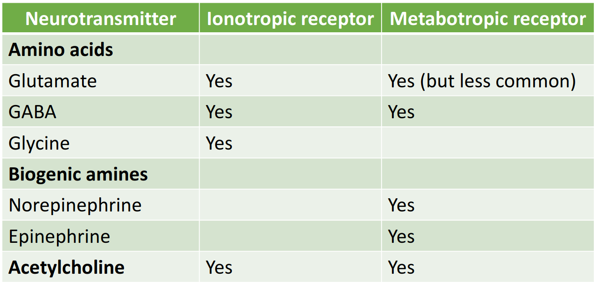

# Lecture 8, Feb 2, 2023

## The Synapse

* Two types:
	* Electrical synapse
		* Almost direct connection between two cells
		* Functionally in terms of depolarization it acts like one continuous cell
		* A small gap junction with connexons to allow ions to pass through
			* These could be closed or open
			* When one cell depolarizes, the ions can go through the channels and depolarize the other cell
	* Chemical synapse
		* Release of neurotransmitters/ligands that diffuse to another cell, attach to a receptor and depolarize another cell
* Before the synapse is the presynaptic neuron; after it is the postsynaptic neuron
	* The presynaptic neuron sends a signal which the postsynaptic neuron receives
* At the axon terminal (synaptic knob, looks like buttons), synaptic vesticles release neurotransmitters that diffuse through a synaptic cleft (gap) of 5-20 nm, resulting in a 0.5 ms delay
	* The receptors (ligand-gated ion channels) on the postsynaptic neuron receives this
* Different neurotransmitters exist:
	* Amino acids: Glutamate, GABA, glycine (these are smaller molecules)
	* Biogenic amines: norepinephrine (aka noradrenaline), epinephrine (aka adrenaline) (larger molecules)
	* Acetylcholine
	* Neuropeptides (opioids)
	* Oxytocin
	* Gases
* Steps of chemical synapse transmission:
	1. Neurotransmitters are synthesized and stored in vesticles
		* The axon carries these to the terminals
	2. An action potential arrives at the presynaptic terminal
	3. Voltage-gated $\ce{Ca^{2+}}$ channels open, allowing calcium ions to flow in
		* The calcium doesn't contribute to depolarization much
		* Ca is a secondary messenger; about $1.0\si{mmol/L}$ out of the cell and $0.001\si{mmol/L}$ in the cell; extremely low permeability
	4. Calcium ions enable exocytosis, allowing vesticle docking and neurotransmitter release
		* The calcium allow structures on the membrane to attach to the vesticle more strongly, which allows the membrane to be broken
	5. Neurotransmitters bind to receptors on the postsynaptic cell, allowing them to open or close
	6. Excitory or inhibitory postsynaptic potential is generated, which travels down the neuron
	7. To get rid of the neurotransmitters:
		* Recycled back into the presynaptic neuron through secondary active transport
		* Transported into glial cells, which destroys them
		* Diffuse away
		* Enzymes also actively degrade the neurotransmitter outside the cell
	8. Vesticles can also be recycled

## Ligand-Gated Ion Channels Details

* Aka postsynaptic receptors
* Nonspecific cation channels:
	* NMDA channels: glutamate and glycine activate it, allowing ions (nonspecific) to go through
	* AMPA channels: two glutamate activate it, allowing sodium and potassium but not calcium transport
	* Ionotropic glutamate receptors
* When glutamate opens the channel, more sodium comes in than potassium leaks out, resulting in overall depolarization
	* Find out via graphical method
	* Much larger potential difference driving sodium than potassium
* There are specific ion channels, e.g. glycine or GABA attaching to a receptor that only lets in chloride
	* These are still ionotropic
* There are also non-ion channels
	* These are metabotropic receptors, protein structures in the membrane that can attach to neurotransmitters (mainly norepinephrine or epinephrine)
	* They don't directly allow ions to go through but go through a series of metabolic steps to open other channels
	* G-protein-coupled receptors (GPCR)
	* There is a long lasting effect (minutes to hours)

{width=70%}

