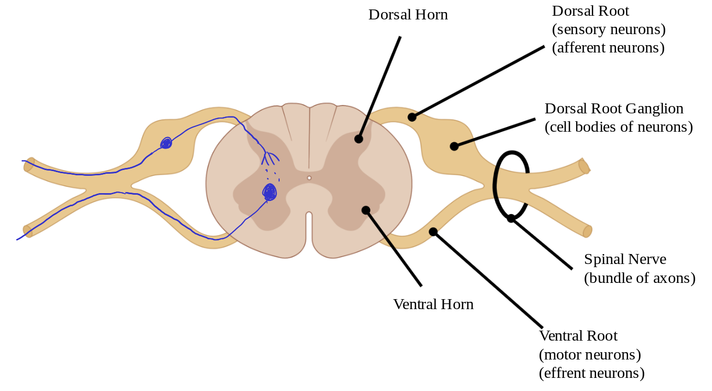

# Lecture 9, Feb 9, 2023

## Activation of Postsynaptic Cell

* Presynaptic axon terminals are the synaptic inputs, which are near the cell body of the postsynaptic neuron
* EPSP: Excitatory PostSynaptic Potential
* IPSP: Inhibitory PostSynaptic Potential
* Glutamate is predominately excitatory; GABA is always inhibitory (but could change based on cellular concentration of ions); glycine is inhibitory
* Norepinephrine and epinephrine depends on the receptors
* Acetylcholine is always excitatory
* Two types of summation for activation:
	* *Temporal summation*: when stimuli are near each other in time, the depolarization caused by them would add on top of each other, and with enough of them the action potential would fire
		* One axon firing fast enough
	* *Spacial summation*: when multiple types of stimuli are present at the same time, the depolarization caused by them adds together
		* Two axons firing at the same time, with some distance in between
* *Inhibitory synapses*: when these fire, the membrane hyperpolarizes; this would cancel out any excitatory synapse signals
* *Presynaptic inhibition*: inhibitory synapses can attach to excitatory synapses (instead of to the postsynaptic neuron body); when these fire, they would inhibit the excitatory synapse from firing at all
	* Inhibitors only affect the synapse they attach to

## Central Nervous System

* From the brain, the nerves travel down the spine and branch out
	* Cervical, thoracic, lumbar and sacral in order
	* On the face is the trigeminal nerves
	* Some nerves come directly out of the brain
* Tracts are neurons grouped in certain regions of the spinal cord
	* Ascending tracts are sensory pathways that start in the periphery regions (e.g. fingertips) that go to the brain
		* Different senses go to different regions of the brain (somatosensory homunculus); more space is allocated to more sensitive regions
	* Descending tracts are motor pathways that start in the brain and go down the spine to muscles
	* Note neurons are unidirectional
* Spinal cord structure:
	* Dorsal side is the back, ventral side is the front
	* Thicker neurons are typically motor neurons since signals travel faster
	* Mnemonic: SAME (Sensory - Afferent, Motor - Efferent), DAVE (Dorsal - Afferent, Ventral - Efferent)
	* Sensory/afferent neurons go through the dorsal side
	* A group of axons get bundled into *fascicles* to become a nerve (typically inside a fascicle, all the neurons are either all sensory or all motor)

{width=80%}

## Reflex Arcs

* Can be monosynaptic or polysynaptic
* Classical example of tapping the patellar tendon with a hammer
	* Cells measure how much the tendon is stretched, which gets sent to the spinal cord
	* Without needing to go into the brain, the synapse activity happens right at the spinal cord and goes back to a muscle group, causing movement of the leg
* A monosynaptic reflex only has one synapse, which has to go all the way to the spinal cord and back, so there is a delay
* A polysynaptic reflex (e.g. withdraw reflex) takes the same path, but excite multiple interneurons in the spinal cord that can excite and inhibit motor neurons for different parts of the body
	* e.g. exciting the biceps and inciting the triceps to withdraw your hand when you touch a hot object

