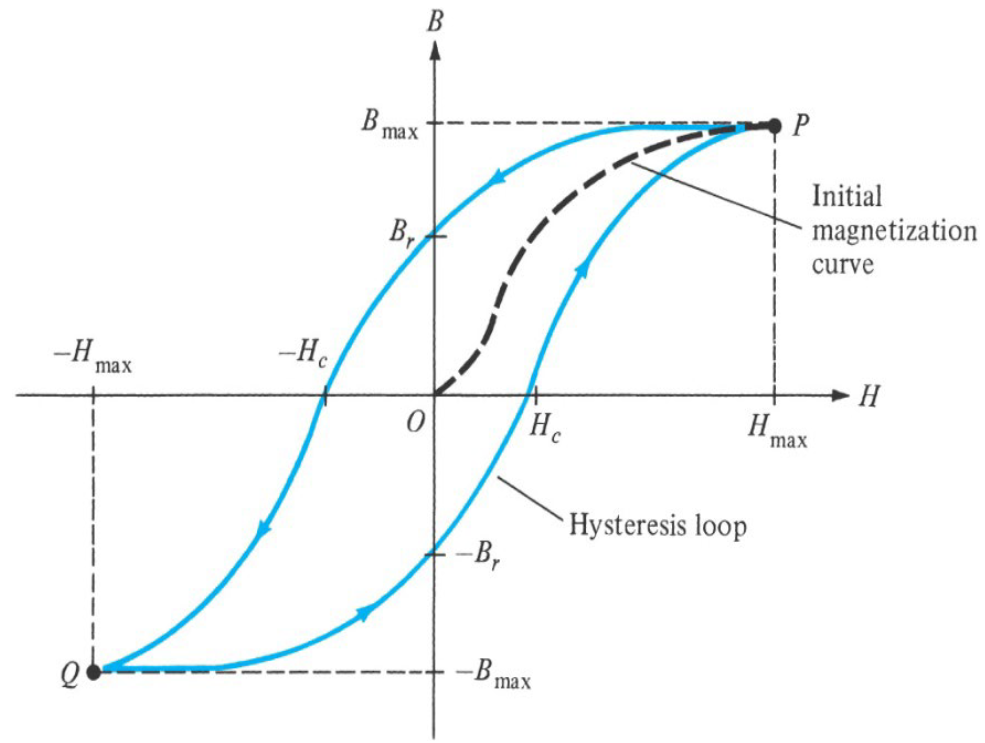

# Lecture 27, Mar 22, 2023

## Generalized Ampere's Law

* Ampere's law becomes $\oint _C \vec B \cdot \dd\vec l = \mu _r\mu _0I_{enc}$
	* Once again the $\vec B$ field is affected by the presence of the material $\mu _r$, but $\vec H$ is not
* Example: field inside a solenoid
	* Consider a very long solenoid with $n$ turns per meter filled with a magnetic material with relative permeability of $\mu _r$, with current $I_0$ through the wire; what is $\vec H, \vec B$ inside the solenoid?
	* $\vec H, \vec B$ will be in the same direction, based on RHR, let this be $\hat a_z$ so $\vec B = B_z\hat a_z$
	* Using Ampere's law, with a contour along the edge of the solenoid of length $w$ that encloses the wire
	* When the solenoid is infinitely long, there is no magnetic field outside
	* Therefore $\oint _C \vec B \cdot \dd\vec l = wB_z$ since only the piece of the contour inside the material gives a nonzero dot product
	* The enclosed current is $I_0nw$
		* For $n$ turns per meter, width of $w$, $nw$ is the number of turns; therefore $nwI_0$ is the total current for all these loops
	* $wB_z = \mu _r\mu _0nwI_0 \implies B = \mu _r\mu _0nI_0\hat a_z$
	* If we have $N$ turns over $L$ meters, then $\vec B = \frac{\mu _r\mu _0I_0N}{L}\hat a_z$
	* $\vec H = nI_0\hat a_z = \frac{NI_0}{L}\hat a_z$

## Ferromagnetic Materials

* On an atomic level, there are 2 major sources of magnetic dipoles:
	* Orbital motion of the electrons around the nucleus
		* This gives an orbital magnetic dipole moment $m_0$
	* Electron spin
		* This gives a spin magnetic dipole moment $m_s$
		* Thee two states of spin means that $m_s$ is either parallel or antiparallel to the applied field
* Materials with non-zero internal moments can align ($\mu _r > 1$)
	* *Ferromagnetic* materials have their fields greatly enhanced (strong alignment) ($\mu _r \gg 1$)
	* *Paramagnetic* materials have their fields only slightly enhanced (weak alignment) $\mu _r \approx 1, \mu _r > 1$
	* *Ferrimagnetic* materials are in-between and have $\mu _r > 1$ but not too big; they're useful for higher frequency circuits (e.g. ferrites)
* Materials with zero internal moments actually reduces the net magnetic field ($\mu _r < 1$)
	* *Diamagnetic materials* will have a field in the opposite direction and get repelled by the applied field ($\mu _r \approx 1, \mu _r < 1$)
		* In superconducting materials there will be perfect diamagnetism (the field is perfectly canceled inside the material); this causes levitation (Meissner effect)

## Hysteresis

{width=60%}

* When a ferromagnetic material is magnetized, eventually it saturates and $B$ begins to level off even with increasing $H$
* When the external field is turned off, $B$ goes back down to $B_r$, the residual flux density -- even though there's no more external field, the material stays magnetized
* At this point if we reverse the external current, we first reach the coercive $H$ field or $H_c$, where the magnetization field disappears
	* At this point the permanent magnetization disappears
* If our applied field $\vec H$ varies with time (e.g. a sinusoidal AC current), we will go through the cycle of magnetization-demagnetization over and over
	* This leads to significant energy losses, which we can show to be equal to the area of the hysteresis curve
* *Soft* magnetic materials have smaller $B_r$ values and narrower hysteresis curves, while *hard* magnetic materials have larger $B_r$ values and wider hysteresis curves
	* Soft materials are easily magnetized and demagnetized
	* Hard materials are difficult to demagnetize and make for good permanent magnets
	* The wider hysteresis curves of hard materials significantly increase the energy loss due to the magnetization-demagnetization cycles
* Since the relationship between $\vec B$ and $\vec H$ is no longer linear, for a ferromagnetic material we need to first determine its *operating condition* in order to determine its value of $\mu _r$

