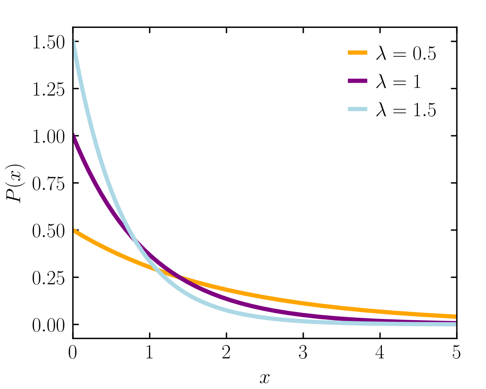

# Lecture 15, Feb 13, 2023

## The Normal as a Limit of the Binomial

* Recall that for the binomial distribution $\mu = np, \sigma^2 = np(1 - p)$
* Let $X$ be distributed according to the binomial distribution, and let $Z = \frac{X - np}{\sqrt{np(1 - p)}}$
* As $n \to \infty$, $Z$ approaches the standard normal

## The Gamma Distribution

\noteDefn{The $\Gamma$ function is defined as: $$\Gamma(\alpha) = \int _0^\infty x^{\alpha - 1}e^{-x}\,\dx, \alpha > 0$$}

* Note $\Gamma(n) = (n - 1)!$ for $n \in \naturals$
	* $\Gamma$ can be thought of as a continuous generalization of the factorial

\noteDefn{The \textit{gamma distribution} with parameters $\alpha, \beta$ is $$f(x; \alpha, \beta) = \twocond{\frac{1}{\beta^\alpha\Gamma(\alpha)}x^{\alpha - 1}e^{-\frac{x}{\beta}}}{x > 0}{0}{x \leq 0}$$}

{width=40%}

* Statistics:
	* $\mu = \alpha\beta$
	* $\sigma^2 = \alpha\beta^2$
* The gamma distribution combines and generalizes multiple distributions
* Note $\frac{1}{\beta^\alpha\Gamma(\alpha)}$ is just normalization (there is no $x$); the gamma function has no real effect on the shape of the distribution

### The Chi-Squared Distribution

\noteDefn{The \textit{$\chi^2$ distribution} is $$f(x; v) = f\left(x; \alpha = \frac{v}{2}, \beta = 2\right) = \twocond{\frac{1}{2^\frac{v}{2}\Gamma\left(\frac{v}{2}\right)}x^{\frac{v}{2} - 1}e^{-\frac{x}{2}}}{x > 0}{0}{x \leq 0}$$}

* This distribution is the distribution of the variance of random data

### The Exponential Distribution

\noteDefn{The \textit{exponential distribution} is $$f(x; \beta) = f(x; \alpha = 1; \beta) = \twocond{\frac{1}{\beta}e^{-\frac{x}{\beta}}}{x > 0}{0}{x \leq 0}$$ \tcblower Where the random variable $X$ is the time between events, given a mean time between events of $\beta = \frac{1}{r}$ where $r$ is the mean rate of events}

{width=40%}

* Statistics:
	* $\mu = \beta$
	* $\sigma^2 = \beta^2$
* This is a decaying exponential which decays faster with larger $\beta$
	* Smaller values of $\beta$ start off higher but decay more quickly
* This is the distribution of how long we need to wait for an event, given a mean waiting time of $\beta$
	* $\beta = \frac{1}{r}$ where $r$ is the rate of events
	* Similar to a discrete version of the inverse binomial distribution
* Relation to the Poisson distribution: $p(x; \lambda) = \frac{e^{-\lambda}\lambda^x}{x!}$
	* The Poisson distribution gives us the distribution for the number of events in an interval of length $t$ where $\lambda = rt$
	* The exponential distribution gives us the time between events
	* The probability of no events occurring in $t$ is $p(0; rt) = e^{-rt}$, which is also the probability that the first event occurs after time $t$
	* Let $X$ be the random variable for time to the first event, then $P(X \geq x) = p(0; rx) = e^{-rx}$
	* From this we can get a CDF $F(x) = P(X \leq x) = 1 - P(X \geq x) = 1 - e^{-rx}$
	* The PDF is then $\diff{}{x}F(x) = re^{-rx} = f\left(x; \beta = \frac{1}{r}\right)$
* Example: on an average day a component fails every $\beta = 4$ days; if the failures are described by an exponential distribution, what is the chance a component lasts more than a week?
	* We want $P(X > 7) = 1 - P(X \leq 7)$
	* This is given by $\int _7^\infty \frac{1}{\beta}e^{-\frac{t}{\beta}}\,\dt = 0 - (-e^{-\frac{7}{4}}) = 0.17$
	* Note the exponential distribution is a continuous probability distribution so we used an integral
* Related question: how many failures should we expect in a week?
	* This is a Poisson distribution with $\lambda = rt = \frac{1}{\beta}t = \frac{1}{4} \cdot 7 = \frac{7}{4}$
	* Therefore the expected number of failures is just $\frac{7}{4}$

