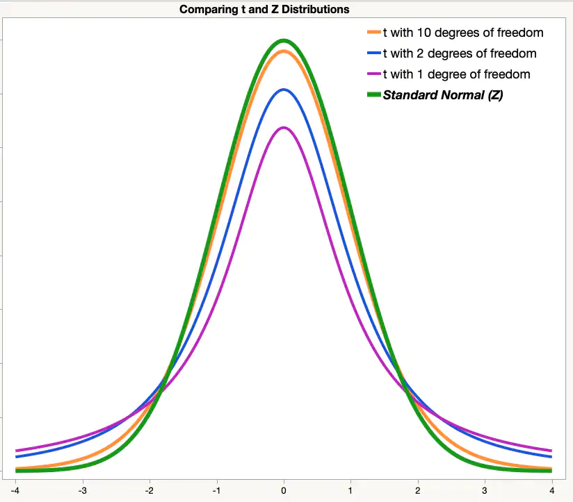

# Lecture 21, Mar 6, 2023

## Distribution of Sample Variance

* What is the distribution of the sample variance $S^2 = \frac{1}{n - 1}\sum _{i = 1}^n (X_i - \bar X)^2$?

\noteThm{Let $$\alignedeqntwo[t]{\chi^2}{\frac{(n - 1)S^2}{\sigma^2}}{\frac{1}{\sigma^2}\sum _{i = 1}^n (X_i - \bar X)^2}$$ then $\chi^2$ has a chi-squared distribution with $v = n - 1$, which is given by $$f(y; v) = \twocond{\frac{1}{2^\frac{v}{2} \Gamma\left(\frac{v}{2}\right)}y^{\frac{v}{2} - 1}e^{-\frac{y}{2}}}{y > 0}{0}{y \leq 0}$$ \tcblower If $\mu$ is known, then $$\frac{1}{\sigma^2}\sum _{i = 1}^n(X_i - \mu)^2$$ has a chi-squared distribution with $v = n$}

* $v$ is the number of degrees of freedom, or independent pieces of information
* In the case where $\bar X$ is used, because $\bar X$ itself is dependent on $X_i$, there is one fewer degree of freedom, which gives higher variance (chi-squared distribution shifts to the right)

## The $t$-distribution

* Using CLT we can make inferences about the mean when $\sigma^2$ is known; however the $t$-distribution must be used when $\sigma^2$ is not known
* Consider the statistic $T = \frac{\bar X - \mu}{\frac{S}{\sqrt{n}}}$; for large $n$ ($n \geq 30$) we have $S \approx \sigma$ so $T$ approaches a normal distribution
* For a smaller $n$ the $t$-distribution is a more accurate description

\noteDefn{The $t$-distribution is given by $$h(t; v) = \frac{\Gamma\left(\frac{v + 1}{2}\right)}{\Gamma\left(\frac{v}{2}\right)\sqrt{\pi v}}\left(1 + \frac{t^2}{v}\right)^{-\frac{v + 1}{2}}$$ \tcblower Given samples $X_1, \cdots, X_n$ with sample mean $\bar X$ and sample variance $S^2$, then the statistic $$T = \frac{\bar X - \mu}{\frac{S}{\sqrt{n}}}$$ has a $t$-distribution with $v = n - 1$ degrees of freedom}

{width=40%}

* The $t$-distribution has heavier "tails" than the standard normal -- because we have less information, it's more likely that our estimate $\bar X$ is further from the true mean $\mu$
* As the number of degrees of freedom $v \to \infty$ the $t$-distribution approaches the standard normal -- if we have infinite samples, we'd know $\sigma$ precisely

