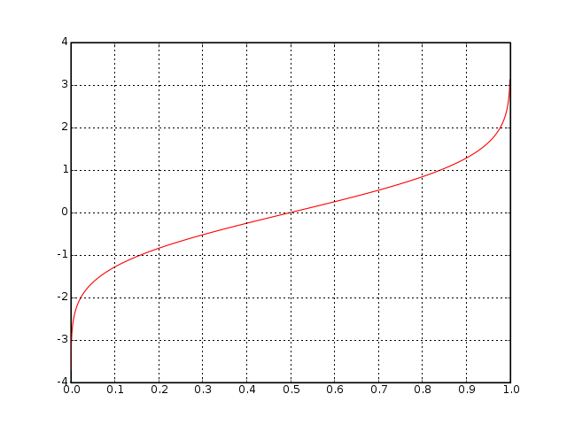

# Lecture 22, Mar 8, 2023

## CLT vs. $t$-distribution

* For the $t$-distribution, we need IID samples that are *normally distributed*; we don't know $\sigma$, so we use $S$ instead, then $T = \frac{\bar X - \mu}{\frac{S}{\sqrt{n}}}$ for *any* $n$
	* If $n \geq 30$ then $S \approx \sigma$ so CLT can be used even if the samples are non-normal
* For the CLT, we don't need to make any assumptions about the underlying distribution, but we need to know $\sigma$ and have $n$ big enough (if $n$ is big enough we can approximate $\sigma$ by $S$)
* The $t$-distribution is therefore less powerful because we need to make assumptions about the underlying distribution
* For the $\chi^2$ distribution, we also need to assume a normal population
* Both $\chi^2$ and $t$ distributions are exact results, because we assume a normal underlying population; the CLT needs no such assumption, but it is an approximation

## Quantile Plots

\noteDefn{Let a sample $X_1, \cdots, X_n$, then a \textit{quantile} $q(f)$ is defined such that a fraction $f$ of the population is less than or equal to $q(f)$ \tcblower In a \textit{quantile plot}, $f$ is plotted against $q(f)$}

* e.g. $q(0.9) = 6'$ means that 90% of the population is less than 6' tall
* Example: data $-2, 0, 0, 1, 3, 3, 3, 4, 6$
	* Trick: plot $\left(\frac{i - \frac{3}{8}}{n + \frac{1}{4}}, x_i\right)$ for all $i$
* Observations:
	* $q(0.5)$ is the empirical sample *median*
	* $q(0.25)$ is the lower quartile, $q(0.75)$ is the upper quartile
	* Flat areas of a quantile plot indicates clusters of data that have the same value
* A quantile is the inverse of the cumulative distribution (however quantiles are not continuous and do not have to be strictly increasing)
	* Suppose we have $X$ be an RV with CDF $F(x)$; $F(x)$ is $P(X \leq x)$ which is approximately the fraction of data less than or equal to $x$
	* The quantile $x = q(f)$ looks for $x$ such that fraction $f$ of data is less than or equal to $x$
	* Therefore $F(q(f)) = f$
	* If the quantile were a continuous and strictly increasing function of $F$, then $q = F^{-1}$
* A quantile distribution can be used to determine whether the data is normal
	* The quantile function for a normal distribution is $q(f) = \Phi^{-1}(f)$
		* *Quantile function* always refers to the inverse of the standard normal CDF
	* This plot is going to look like the transpose of a standard normal CDF
	* Plot $x_1, \cdots, x_n$ on the vertical axis and $\Phi^{-1}(f_i) = q(f_i)$ where $f_i = \frac{i - \frac{3}{8}}{n + \frac{1}{4}}, i = 1, \cdots n$; if this plot is roughly linear, then the data is roughly normally distributed
		* If we had a continuum of data, then we should have $q(f) = x$, so we would be plotting $x_i$ against itself

{width=40%}

