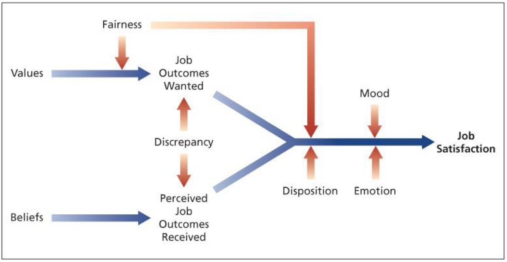
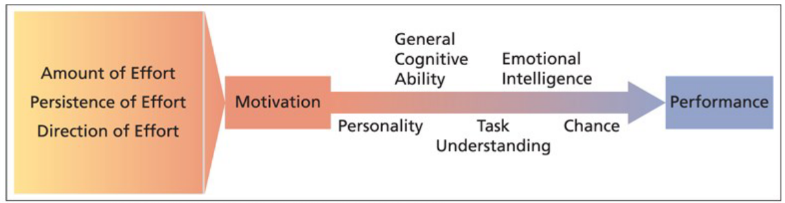

# Lecture 13/14, Feb 6, 2023

## Emotional Regulations

* Two types:
	* Emotional contagion: the tendency for moods and emotions to spread between people or throughout a group
		* Positive emotions are more contagious than negative ones
	* Emotional labour: when employees must display a set of emotions (e.g. customer service, child care/education workers)
		* Often exaggerates positive or suppresses negative emotions
		* Requirement for people to conform to certain "display rules" in their job behaviour, in spite of their true mood or emotions

## Consequences of Job Satisfaction

* Absence from work
	* Going from dissatisfaction to quitting takes time; it's an incremental process that starts with absenteeism
* Turnover (employees leaving)
	* Certain "shocks" might situate turnover
	* 3 commitment factors:
		* Affective commitment: when you want to be at your job -- you engage with the work you're doing, you like the people, and you stay because you want to
			* Staying because you *want to*
		* Continuance commitment: when you stay because it costs you more to leave -- e.g. if you need the money, the benefits, or for immigration reasons
			* Staying for yourself because you *have to*
		* Normative commitment: highly normative (people who engage more in normative behaviour) stay based on ideology or feeling of obligation -- e.g. "if I leave, this project won't be successful"
			* Staying for others because you *should*
* Performance
* Organization citizenship behaviour
* Customer satisfaction and profit

{width=60%}

## Motivation

* Motivation is the extent to which persistent effort is directed toward a goal
	* Intensity: how hard a person tries (effort)
	* Direction: the orientation that benefits the organization
	* Persistence: a measure of how long a person can maintain his/her effort
	* All 3 are applied towards a goal
* Two types:
	* Intrinsic motivation: stems from the direct relationship between the worker and the task, usually applied by oneself
		* e.g. feeling of fulfillment
	* Extrinsic motivation: stems from the work environment external to the task, usually applied by others
		* Reward relationship
		* e.g. pay, promotions, free lunches, feeling of being valued by the organization or coworkers
	* You can extrinsically motivate yourself, but it's hard to get intrinsically motivated by others
* Performance refers to the extent to which an organizational member contributes to achieving the goals of the organization
	* Motivation contributes to performance -- we try harder when we're more motivated (but this relationship is not one-to-one because of other factors like personality and intelligence)
	* Performance is the output of motivation
* (Amount, persistence and direction of) effort feeds into motivation, but these go through a number of other things before performance:
	* General cognitive ability: basic information processing capacities and cognitive abilities
	* Emotional intelligence (EI/EQ): the ability to understand and manage one's own and others' feelings and emotions
		* Perceiving emotions, using emotions, understanding emotions and managing emotions
		* e.g. observing someone's tired is general cognitive ability, but being able to infer that you're not being engaging is EI
	* Also personality, task understanding and chance

{width=70%}

## Theories of Motivation

* Two kinds:
	* Need theories: what do you want?
		* e.g. Maslow's hierarchy
	* Process theories: how you achieve what you want?
		* e.g. expectancy theory, equity theory, goal setting theory
* Maslow's hierarchy & Alderfer's ERG:
	* Maslow's hierarchy of needs orders basic needs to higher order needs
		* From basic physiological needs (food, water, shelter), then to safety (protection from others, the environment, etc), belongingness (feeling like we're part of society), self-esteem (our view of who we are), then self-actualization (what is my purpose? what's next after I achieve my goals?)
		* If the more basic needs are not met, then you are not concerned with higher order needs
	* In Alderfer's model, the basic needs are extrinsic motivations, and the higher order needs are intrinsic motivations
		* From basic existence needs (safety and physiological), to relatedness (how we connect: belonging, self-esteem), then to growth (how we aspire to develop ourselves: self-esteem and self-actualization)
		* ERG stands for existence, relatedness and growth

