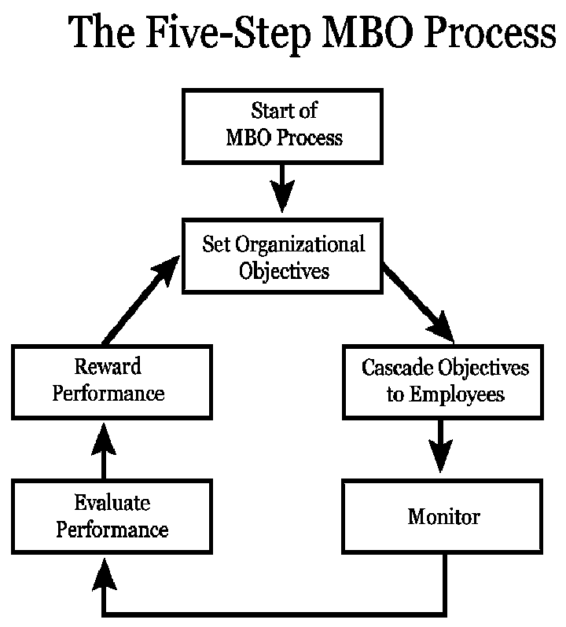

# Lecture 17, Feb 15, 2023

## Ergonomics and Cognitive Ergonomics

* Ergonomics is the study of the interface between an individual's physiology and the characteristics of the physical environment
	* How do we reduce the physical demands of jobs so that people are better able to perform them?
* *Cognitive ergonomics* is designing for mental capacity, instead of physical capacity
	* When there are distractions around you, there is an additional demand for mental capacity
	* Cognitive ergonomics aims to reduce errors and accidents through processes such as reducing manual processes or reducing the amount of memorization
	* Reducing cognitive demands can keep us more focused and motivated
* Alternative working schedules can be used to reduce cognitive demand, allowing you to work and live your personal life at the same time
	* Flex-time: flexibility in the time you start and end work
	* Split shifts: working at different times throughout the day
	* Compressed workweek: working more during some days to take more days off
		* Disadvantages: you might burn out, your colleagues have less access to you, etc
		* Can also rearrange times during the year, e.g. for educators getting summers off
	* Job and work sharing
	* Telecommuting

## Management By Objectives (MBO)

{width=40%}

* Companies have an objective (e.g. developing an app to increase student productivity), which is cascaded down to employees (e.g. designing a UI for students to enter their info)
* Employees' performance are monitored, and at the end of the year there is a performance evaluation
* The hard part is translating that company objective to a specific objective for an employee (e.g. what font for the UI?)
* Manager-employee interaction cycle:
	* Goal setting: manager meets with individual employees to develop employee objectives (which can include performance and personal development objectives)
	* Check-ins: periodic meetings to monitor employee progress
	* Appraisal meeting: held to evaluate how well the agreed upon objectives have been achieved
* When does MBO fail?
	* Lack of commitment from top management
	* Too much focus on quantitative rather than qualitative factors
	* Goals are too short-term
	* Performance reviews are used as punishment
* The motivational systems should fit the goals of the organization
* Consider employee needs, nature of the job, organizational characteristics and motivational outcome
* Motivational systems that make use of a variety of motivators are more effective

