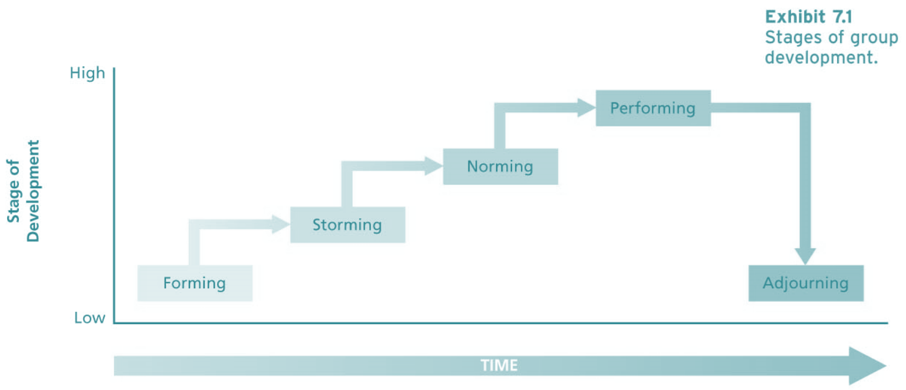

# Lecture 18/19, Feb 27, 2023

## Group Development

{width=70%}

* Groups are people interacting independently to achieve a common goal
	* Interaction is the most basic aspect of a group
* Interdependence: group members rely to some degree on each other to accomplish goals
* Groups may be formal (established by organizations) or informal (emerging naturally in response to common interests)
* Groups develop through a typical process:
	* Forming: a group comes together, either by being assigned together or coming together voluntarily
	* Storming: establishing who we are in a group
	* Norming: solidifying our identities and roles in the group (who we are, what we want to do, what we can contribute)
	* Performing: taking on the tasks and doing them
	* Adjourning: when we look back on what we've done and reflect
		* Short-term groups don't usually involve this reflection

