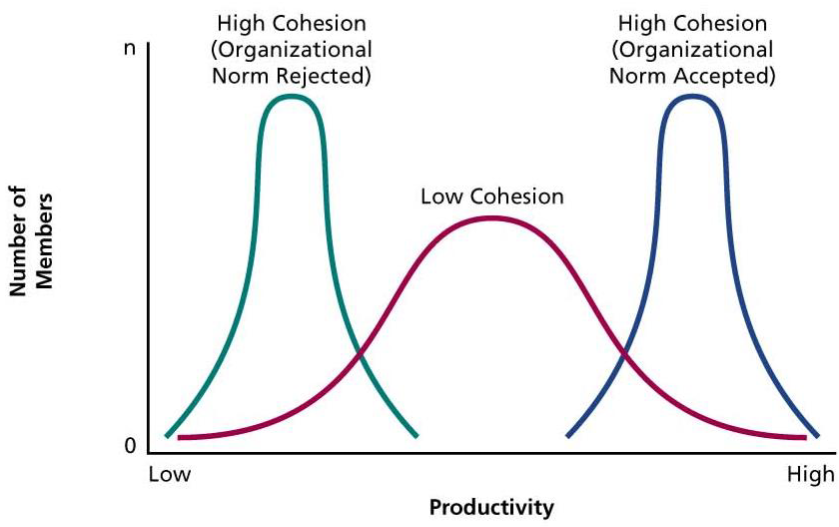
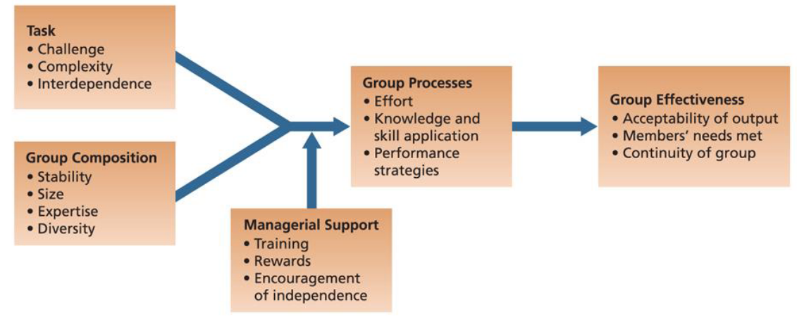

# Lecture 20, Mar 1, 2023

## Impact of Group Structure

* Size
	* In a larger group, there is less satisfaction with group membership
		* More difficult to identify with the success and accomplishments of the group
		* Fewer chances to work on and develop friendships
		* Inhibitions to participation
	* Type of task and definition of performance impact relationship between group size and performance
		* *Additive* tasks are tasks where the group performance is dependent on the sum of performance of individuals (e.g. tug of war)
			* More people means more performance
		* *Disjunctive* tasks are tasks where the group performance is dependent on the best group member (e.g. research team, surgery)
			* More people means more performance
		* *Conjunctive* tasks are tasks where the performance is limited by the worst group member (e.g. relay race, assembly line)
			* More people means less performance
* Diversity
	* Diversity increases difficulty of effective communication and cohesion, so they take longer to develop
	* After development they are just as effective
	* Sometimes performs better on tasks that require creativity
* Norms
	* Norms are expectations of behaviour created over time
	* Norms are often unconscious -- we only become aware of them in special circumstances (e.g. entering new social situations, conflicting norms)
	* Examples:
		* Dress norms
		* Reward allocation norms (e.g. equity, equality, reciprocity, social responsibility)
		* Performance norms
* Roles
	* Roles are positions in a group that have expectations attached to them
	* "packages" of norms
	* Can be either assigned (formally prescribed by an organization) or emergent (naturally developed to meet the needs of the group)
	* *Role ambiguity* occurs when one's job or its goals are unclear
		* Leads to people sitting around and not doing anything at all
	* *Role conflict* occurs when one is faced with incompatible expectations
		* Can occur with incompatibilities within someone's roles or between roles of different people
		* Can be avoided by avoiding contradictory messages, conferring with other role senders, being sensitive to multiple demands and fitting the right person to the roles
	* Roles can have categories:
		* Task roles (e.g. initiating conversations, clarifying, etc)
			* Easy to take on; members can take on a lot of these roles
		* Maintenance roles help you carry out your tasks (e.g. encouraging, harmonizing, etc)
			* Oftentimes team members with maintenance roles can help with reducing hindering roles
		* Hindering roles
			* Role conflict and role ambiguity can lead to hindering roles
* Status of members
* Cohesiveness
	* The degree to which a group is especially attractive to its members -- a sense of belonging
	* Groups are cohesive when members want to stay in the group and describe the group in favourable terms
	* Tend to be higher in shorter, more intensive experiences (e.g. a hackathon), or with groups of friends
		* Social aspects increase cohesiveness
	* Cohesiveness leads to more participation in group activities, more conformity to group norms, more success, and less variation in productivity among members
	* Important factors that effect cohesiveness:
		* Thread and competition: when there is a threat, we're more likely to work together
		* Success: doing well together makes us want it more
		* Member diversity: diversity increases the chance of having common experiences
		* Group size: smaller groups are easier to stay cohesive
		* Toughness of initiation: going through tough challenges together increases cohesion
	* Cohesive groups tend to be more or less productive than less cohesive groups; they have more consistency in productivity, but are not necessarily always more productive
		* A cohesive group can collectively reject norms, or collectively accept norms

{width=30%}

* *Social loafing* is the attempt for group mates to put in less effort than what they are capable of
	* Free riding: people lower their effort to get a free ride at the expense of the other members
	* Sucker effect: people lower their effect because they feel others are free riding
	* Strategies to counteract social loafing:
		* Keep individual performance visible by making smaller groups
		* Make sure work is interesting, to use intrinsic motivation
		* Increase feelings of indispensability; make members feel unique
		* Increase performance feedback
		* Reward group performance

## Factors Influencing Group Effectiveness

{width=70%}

* Cross-functional teams are groups that bring together people with different expertise
	* Communication is harder
	* Members can learn from each other
	* Principles of effectiveness cross-functional teams:
		* Composition: all relevant specialties are necessary and must be included
		* Superordinate goals: attractive outcomes that can only be achieved by collaboration
		* Physical proximity
		* Autonomy
		* Rules and procedures: basic decision rules must be laid down
		* Leadership
* Safety nets in groups allow us to better take risks
* High-performing teams prioritize both the goals of the group and the goals of the individuals

## Virtual Teams

* Key characteristics: lack of face-to-face contact, high physical/geographical dispersion
* Often cross-functional
* Advantages:
	* Around-the-clock work
	* Reduced travel time and cost
	* Larger talent pool
		* Access to better levels of expertise because people hired don't need to be physically close
		* Having people spread out geographically can also mean some members are closer to physical locations
* Challenges:
	* Trust: difficult to develop between virtual team members due to lack of physical contact/socialization
	* Miscommunication: more prevalent due to lack of face-to-face communication
	* High costs: with acquiring, setting up and setting up the required tech
	* Isolation: causal interaction between teammates is not possible
	* Management issues: managers have issue dealing with subordinates who are no longer in view
* To establish norms, we need to develop trust and effect patterns of communication
	* Clear roles need to be established
	* Code of conduct to make sure people don't vanish

