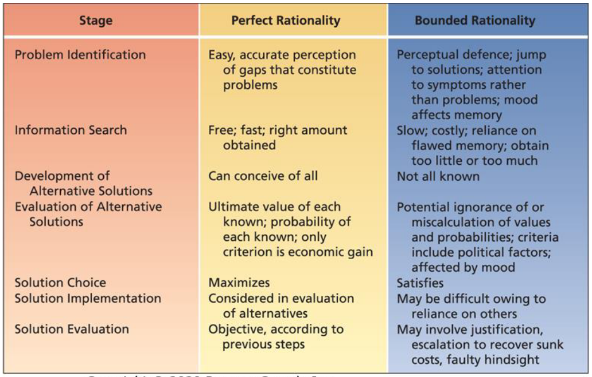
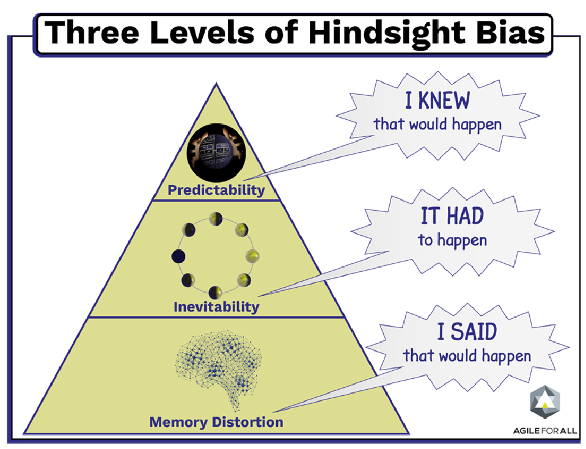

# Lecture 21/22, Mar 6, 2023

## Decision Making and Problem Solving

* The process of developing a commitment to some course of action
* Decision making is problem solving
	* Problem: when a gap is perceived between existing state and desired state
* Decision making involves making a choice and committing resources; it is a process
* Problems can be well-structured (clear existing and desired state and how to get there; familiar problems that have standard operating procedures) or ill-structured (unclear existing and desired states and how to get there; unique problems without a standard procedure)
	* With experience, an ill-structured problem becomes a well-structured problem
* The rational decision-making process:
	1. Identify problem
	2. Search for relevant info
	3. Develop alternative solutions
	4. Evaluate alternative solutions
	5. Choose best solution
	6. Implement solution
	7. Monitor and evaluate chosen solution
* Perfect rationality: a decision strategy that is completely informed, perfectly logical and oriented towards economic gain (minimize cost, maximize output)
	* The "Economic Person" is the perfect decision maker
	* The Economic Person is:
		* Completely informed, able to gather information without cost
		* Perfectly logical
		* Only decides based on economic gain, never emotions etc
* Bounded rationality: a decision strategy that relies on limited information and focuses on using what's in front of you, reflecting time and other constraints

{width=65%}

* 2 types of decision makers:
	* Maximizers: using perfect rationality to get the best results
		* Spends more time and energy and are less happy with outcomes
	* Satisficers: using bounded rationality, accepting the "good enough" to get good results given minimal effort
		* Can move on after deciding, happier with outcomes
* Framing: the aspects of the presentation of information that are assumed by decision makers
* Cognitive biases: tendencies to acquire and process information in a particular way that is prone to error
* Solution implementation: taking the decision and implementing it
	* Decision makers are often dependent on others to implement their decisions
	* When the implementer is not the decision maker problems can arise due to differential motivation, ability, and understanding of the problem
* Solution evaluation
	* Perfectly rational decision makers should be able to evaluate the effectiveness of a decision completely objectively
	* Bounded decision makers might encounter problems:
		* Justification: overconfidence in the adequacy of your own decisions
			* Trying to defend your own decisions even when they're bad
		* Sunk cost: justifying a faulty decision by arguing that it's not worth it to go back
			* Sunk costs are permanent losses of resources as the result of a decision
			* People are unlined to stick to a decision due to sink costs
			* Whether it's a sunk cost or an investment depends on framing -- what is your perception?
			* Escalation of commitment (commitment bias): the tendency to invest additional resources in an apparently failing course of action
				* People acting as if they can recoup sunk costs
				* Personality, moods, and emotions can affect this
				* e.g. getting married when you're having relationship problems
				* To prevent this, shift the framing from saving rather than spending
		* Hindsight: the tendency to review the decision-making process that was used to find what was done right or wrong
			* The tendency to assume (after the fact) that we knew the outcome all along
			* Taking personal responsibility for successful decisions while denying responsibility for unsuccessful outcomes
			* e.g. "I had a feeling this won't work out, look what happened now"
		* Moods and emotions:
			* When we're in positive moods we tend to focus on the positives and overlook the negatives

{width=40%}

* Common cognitive biases:
	* Overconfidence
	* Confirmation bias
	* Recency effect: more recent experiences have greater effect
	* Law of small numbers: rare exceptions and small samples
	* Anchoring
	* Hindsight

## Group Decision Making

* Advantages:
	* Decision quality (everyone's knowledge contributes)
		* Groups are more vigilant (careful), generate more ideas, can better evaluate ideas
	* Decision acceptance and commitment (making sure everybody has the same view)
		* Group decision is more acceptable to those involved
		* Acceptability is especially important to make sure a decision is actually implemented
	* Diffusion of responsibility (less responsibility per person)
		* If the decision doesn't turn out well, no one is singled out for punishment
* Group decision making makes ill-defined problems easier solve, but well-defined problems harder to solve
* Groups are more effective because:
	* They have more diversity in experience and skill
	* Can evaluate in different aspects and characteristics
* Disadvantages:
	* Time: group decisions take much longer because people need to discuss
	* Conflict: people may have different opinions, which leads to conflict
	* Domination: when a single (or a small group of) individuals dominate the conversation, the advantages of group decision making will not be realized
	* Groupthink: when group pressure damages the mental efficiency, reality testing, and moral judgement of decision-making groups
		* Did a unanimous decision arose naturally or is it because we didn't consider all the factors?
		* If everyone is always agreeing to everything, it might be a symptom of groupthink
		* Other symptoms include a sense of superiority, self-censorship (staying quiet and accepting others' opinions even though you disagree), stereotyping of other groups, overconfidence, rationalization
		* To overcome groupthink:
			* Training discussion leadership
				* Leaders should focus on decision making processes, and not exert pressure over decision outcomes
				* Establish norms that encourage and reward responsible dissent
				* Outside experts can be brought in from time to time
			* Stimulating and managing controversy to encourage discussion and bring attention to weaknesses
				* Using devil's advocates
			* Traditional and electronic brainstorming with anonymity
			* Nominal group technique: each individual generates ideas separately, and then shares them to the group for discussion and objective ranking
				* Structured ranking process encourages individuals to share their opinions separately and evaluate them objectively
			* Delphi technique: individuals contribute ideas anonymously, then revise them based on feedback from others
* Follow the rational decision making model

