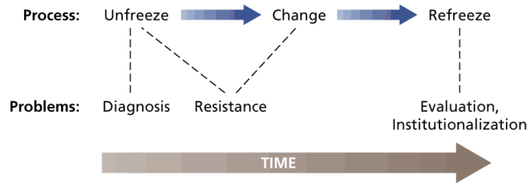
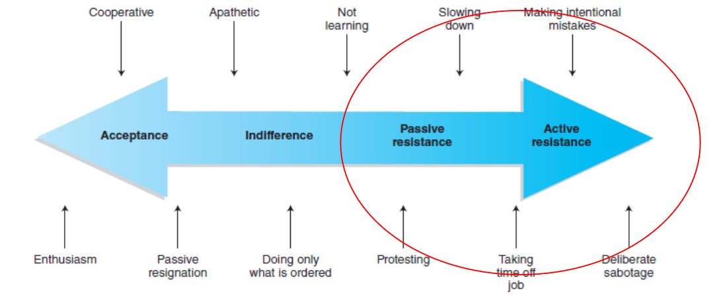
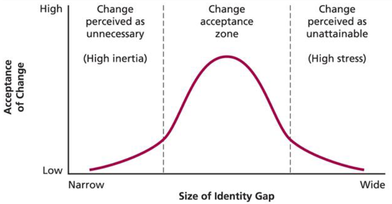

# Lecture 24/25, Mar 13, 2023

## Organizational Change

* Organizational change can have profound impacts on stakeholders; the way changes are implemented and managed is crucial 
* Change is influenced by external (e.g. changing market) and internal (e.g. employee pressure, change in leadership) sources of pressure which can be planned or unplanned
* What do organizations change?
	* Structure (e.g. reducing hierarchy)
	* Technology
		* Can involve a huge (and expensive) overhaul of existing systems and having to retrain employees
	* People (e.g. leadership, staff)
	* Processes (i.e. how we do things)
* Change is often systemic -- change in one area often affects other areas
* Necessary skills and favourable outcomes should be fostered before changes are introduced

{width=50%}

* Regardless of the type of change, there are 2 steps to the process:
	1. Unfreezing: recognizing the need for change and what needs to change; planning the change
		* Crises often stimulate this step
	2. Changing: implementing the planned change
	3. Refreezing: accepting the newly changed state and evaluating its effectiveness
* However often organizations are in hyperturbulent environments where change is an ill-structured problem
	* Lewin's model only works if the change is clear to implement; the more resistance there is, the more volatile the model
	* In hyperturbulent environments it can be hard to follow through the process, so this model does not always apply
* Issues in the change process:
	* Diagnosis problems (not being able to diagnose what to change)
		* Make sure to collect information from all available sources
		* Understand the problem from all aspects and perspectives
	* Resistance (more below)
	* Evaluation and institutionalization (how can we maintain the change?)

### Resistance to Change

* People may resist both unfreezing and change
* Being more inclusive and clear to the people affected by change can help to avoid resistance
* Communicating the motivation behind the change is very important
* Resistance can have many causes (e.g. the change is uncomfortable, the need is unclear, etc)
	* The more we think we don't need the change, the more resistance there will be
	* On the other side, if the change is perceived as unattainable or insufficient, it will also be resisted
* Active resistance can include sabotage (e.g. changes at Twitter)

{width=70%}

{width=50%}

* Sources of individual resistance include:
	* Economic insecurity (will I have a job after this change?)
	* Fear of the unknown (risk)
	* Threats to social relationships (will other people see me differently?)
	* Habit (this is inconvenient because I've always done it the old way)
* Sources of organizational resistance include:
	* Structural inertia (e.g. employees always reporting to the same superiors in the past, so they don't like changing that)
	* Work group inertia (the group has always done things a certain way so people gravitate towards that way)
	* Threats to existing balance of power
	* Previously unsuccessful change efforts (so employees have a negative perception of change)
* How do we overcome resistance to change?
	* Gain leadership support (gets groups onboard)
	* Identify and neutralize change resisters (target the individuals and understand what their concerns are)
	* Educate the workforce and "sell" the need for change (clear communication about the motivation of change)
	* Involve employees in the change efforts
	* Creating a "learning organization"
* In a position of leadership, to minimize resistance to change:
	1. Establish a sense of urgency (making people feel like they need the change)
	2. Form a powerful guiding coalition (have a group of individuals with diverse perspectives that support your change, to show that you have considered everyone)
	3. Creating a vision for the change
	4. Communicating the vision
	5. Empowering others to act on the vision
	6. Planning for and creating short-term wins (create motivational systems to encourage the change)
	7. Consolidating improvements and producing still more change (implement the change gradually)
	8. Institutionalizing new approaches

## The Learning Organization

* Organizational learning refers to the process through which an organization acquires, develops and transfers knowledge throughout the organization
* Learning organizations are constantly developing and improving
* The two main techniques are continuous knowledge acquisition and development
* 4 critical dimensions:
	* Vision/support (making sure values align)
	* Culture
	* Learning systems/dynamics (making sure people have resources to learn and grow, e.g. workshops)
	* Knowledge management/infrastructure (ways to build developmental programs into the organization)
* Organizational development techniques are used by learning organizations to work towards improvement of organizational functioning
	1. Team building
		* Can help teams understand their goals better and clarify the challenges they're facing
		* Can help establish motivations, roles, styles of embracing change
	2. Survey feedback
		* A pulse check with employees and stakeholders to understand what the challenges are
	3. Total Quality Management (TQM)
		* Improving products and services
		* Systematic attempt to achieve continuous improvement in the quality of an organization's products and services
		* Common tools used include flowcharts, Pareto analysis, statistical process control, and fishbone diagrams
	4. Re-engineering
		* The radical redesign of organizational processes
		* Breaking something down to its root causes

