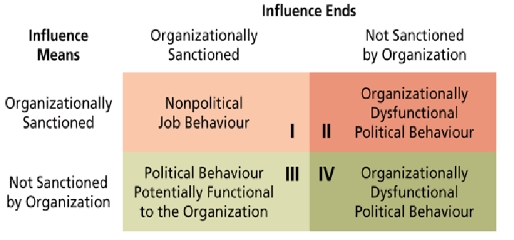
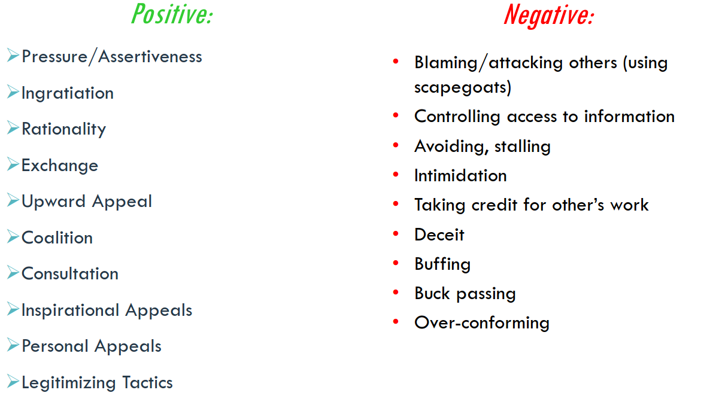

# Lecture 29/30, Mar 27, 2023

## Power

* Power is the capacity to influence others who are in a state of dependence
* Not always perceived or exercised
* Does not imply a good or poor relationship -- people can like or dislike the people who have power over them
* Power comes from 5 bases:
	1. Legitimate power: derived from a person's position, formal authority and level in an hierarchy (results in compliance)
		* e.g. politicians, CEOs
		* We are socialized to accept its influence
	2. Reward power: derived from ability to provide positive and prevent negative outcomes (results in compliance)
		* e.g. payment, but also praising, complimenting
		* The reward doesn't always take into consideration everything we want
		* Largely about influencing and encouraging desired behaviour
	3. Coercive power: derived from use of punishment and threat (results in the most resistance)
		* Generally less effective and can provoke resistance
	4. Referent power: derived from being well liked by others (results in commitment)
		* Friendly interpersonal relations cause influence to go beyond organizations
		* Tends to be by choice
	5. Expert power: derived from having special knowledge/information that is valuable (results in commitment)
		* Also tends to be by choice
* Referent and expert power are the most effective because they result in commitment -- we comply and we want to do it
* Reward and legitimate power result in compliance, but people may not want it
* Coercive power is the least effective because it will result in resistance

## Acquiring Power

* People obtain power by getting into positions, doing certain activities, and developing relationships with others
* Certain activities are more effective for generating power:
	* Extraordinary: unusual, non-routine activities (e.g. innovation, taking big risks, new roles)
	* Visible: power can only be generated if others know about your activities
	* Relevant: people have to care about your activity to generate power
* Developing relationships with the right people can generate power:
	* Outsiders
	* Subordinates
	* Peers
	* Superiors

## Need for Power

* Need for power (n Pow) is the need to have strong influence over others
* Power has consequences -- it comes with responsibilities
* n Pow is a personality characteristic; some people want power more than others
	* Individuals with internal locus of control tend to have high n Pow
* *Institutional managers* are effective managers that use their power for the good of the organization
	* Typically high n Pow
	* Relative unconcerned with how much others like them
* There are positive and negative ways that we influence people (influence means); this is also affected by our intentions

## Organizational Politics

* Using and abusing power/influence to further your own goals, whether or not it aligns with the goals of the organization
* Typically involves using means of influence that the organization does not sanction or pursuing goals that it does not sanction
* Political activity is self-concious and intentional (unconscious behaviour is not organizational politics)

{width=50%}

* Political behaviour can involve using means not sanctioned by the organization to achieve ends sanctioned by the organization; in this case the outcomes can be beneficial even though the tactics are questionable
* Political skill is the ability to understand others and use it to your advantage to enhance your own objectives
* 4 facets to political skill:
	1. Social astuteness: being able to "read" people, interpersonal skills/emotional intelligence
	2. Interpersonal influence: being able to convince and persuade others; not to pressure but to make them feel at ease
	3. Apparent sincerity: coming across as genuine and exhibiting high integrity; making people think you care more than you actually do
	4. Networking ability: establishing good relations with key people to establish your goals; building a good reputation

{width=80%}

