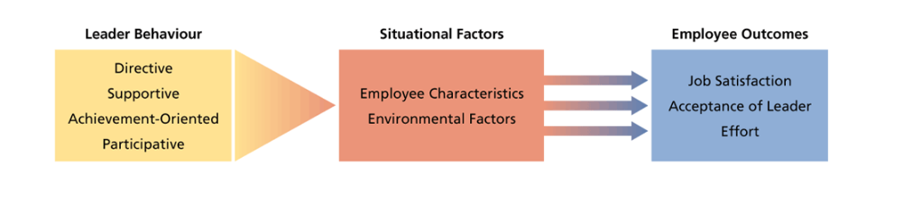

# Lecture 34, Apr 5, 2023

## Leadership Theories

* Trait theories: theories based on characteristics -- leaders are born; focuses on personality traits, social traits, physical characteristics
	* Leadership depends on the personal qualities (traits) of the leader
	* Based on the assumption that those who become good leaders have a special set of traits that distinguish them from everyone else
		* e.g. intelligence, energy and drive, confidence, dominance, motivation to lead, emotional stability, honesty and integrity, need for achievement, sociability
	* Personality dimensions can be directly related to leadership emergence and success
		* Extraversion and conscientiousness are most consistent predictors
	* Narcissism is often linked to leadership
	* Limitation: difficult to determine whether traits make the leader or whether the opportunity for leadership produces the traits
* Exchange relationship-based theories
	* Transactional leadership: contingent reward-based behaviour
		* Manage by exception -- if followers do well, reward them; if followers don't do well, let them know about it
	* Use transactional leadership to build the relationship, then transformational leadership to take take that relationship further -- invest in the follower
	* Transformational leadership: helping and motivating subordinates to grow
		* Increase subordinates awareness of the importance of tasks and performing well
		* Make aware of their needs for development and accomplishment
		* Motivate them to work for the good of the organization, rather than their own benefit
	* 4 dimensions of transformational leadership:
		* Charisma (idealized influence): leaders should be someone that people look up to; taking legitimate power to referent power
		* Individualized consideration: being empathetic and caring of others
		* Inspirational motivation: the ability to articulate a vision to create intrinsic motivation
		* Intellectual stimulation: giving follower challenges and motivating them; making them go past their comfort zone; allowing independence
	* Transformational leadership is the most consistent predictor of effective leadership
	* Transformational leadership builds self-efficacy
* Situational/contingency theories: conditions affect leadership
	* Leadership depends on the situation and context that's involved
	* House's path-goal theory: using goal setting as a leadership approach
	* The leader helps employees achieve their goals and in doing so achieve organizational goals
	* A leader's behaviour in interacting with their followers and the environment contributes to how the employee feels, how much effort they put in and how receptive they are of the leader
	* 4 different path-goal styles:
		* Directive: instructive, coaching, guiding; being hands-on and giving guidance
		* Supportive: coaching but without telling them what do to
		* Participative: consulting with subordinates, asking and taking suggestions
		* Achievement oriented: sets challenging goals and expecting high performance; pushing employees past their limits to build self-efficacy
	* A leader has to first understand who their followers are before choosing a style
	* Leaders assess their followers' needs and attributes with the context, and use appropriate behaviours to guide followers to actions that lead to need satisfaction
	* Issues with perceived fairness, too much effort involved with using different styles for different subordinates

{width=70%}

