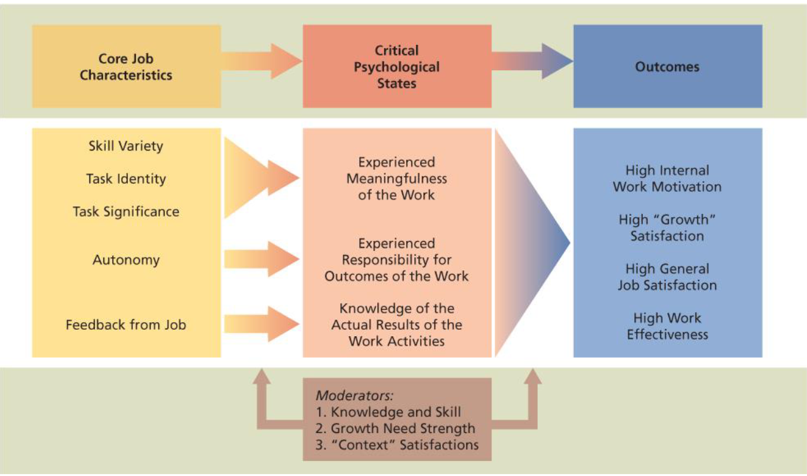

# Lecture 15/16, Feb 13, 2023

## Motivation at Work

* Financial incentives increase performance and decrease turnover
	* Pay may well be the most important and effective motivator of performance
	* However money typically has a cap in terms of how much they can satisfy/motivate us
* Compensation is often an incentive to perform, not necessarily for your direct performance -- it is an investment in performance
* Money as a motivator primarily focuses on need-based theories
* Problems with wage incentives:
	* Lowered quality
	* Differential opportunity
	* Reduce cooperation
	* Incompatible job design (where the job requires you to do one thing but the incentive makes you do another)
	* Restriction of productivity
* Wage incentives hit differently depending on the occupation (e.g. blue/physical vs white collar/office jobs)
* Merit pay plans are often used to motivate employees; these link pay to performance on white collar jobs
	* Managers use employee evaluation results to recommend merit pay awarded to each individual
	* e.g. linking pay to performance, seniority, responsibilities
	* The challenge is the ambiguity in connection between merit pay and performance (e.g. more pay for seniority -- does seniority directly lead to performance?)
		* Subjective evaluations impacted by biases
		* Small increases -- are they motivating enough?
		* Lack of visibility into standards and privacy
* Pay plans to motivate *teamwork*:
	* Profit sharing: the return of some company profit to employees in the form of a cash bonus or retirement supplement
	* Employee stock ownership plans: allowing employees to own a set amount of a company's shares
		* Employees are profiting by making the company successful as a whole
		* Many CEOs are incentivized through these
	* Gainsharing: a group pay incentive plan based on productivity over which the workforce has some control (e.g. efficiency, cost reductions)
	* Skill-based pay: a system in which employees are paid according to the number of skills they have acquired
		* Motivates employees to learn more skills
		* Easier in e.g. construction, civil engineering
		* Based on e.g. experience, education, certification
* Job characteristics model: why people choose the professions that they do
	* Core job characteristics: skill variety, task identity, task significance, autonomy, and feedback
	* Critical psychological states: experienced meaningfulness of the work (belongingness and self-actualization), experienced responsibility of the work, and knowledge of the results of the work activities (i.e. my work actually has impact)
		* Relates to personality, OCEAN model
	* Outcomes: high internal work motivation, high "growth" satisfaction, high general satisfaction and high work effectiveness
	* With moderators: knowledge and skill, growth need strength and "context" satisfactions

{width=80%}

* We are more passionate about jobs we find more meaningful

