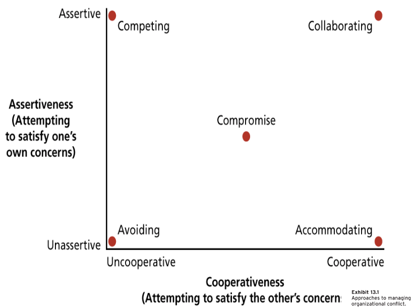

# Lecture 27/28, Mar 20, 2023

## Organizational Conflict

* Conflict doesn't have to be interpersonal, could also be about a task
	* Could be between individuals, or groups
* Involves antagonistic attitudes and behaviours
* Causes of conflict:
	* Group identification and intergroup bias
		* People think more positively of their in-group
		* Self-esteem is a critical factor
		* People don't just represent themselves; in complex groups people can represent an entire group of people and their ideals
	* Interdependence (reliance on one another)
		* When one group is reliant on another, it creates a power unbalance
		* Does not always lead to conflict
	* Ambiguity in goals, jurisdictions, performance criteria, etc
	* Differences in power, status, culture
		* Power: one-sided dependence
			* People protest together because they don't have the power to push for the change themselves
		* Status: authority within an organization
		* Culture: clashes in beliefs and values between very different cultures can result in conflict
	* Resource scarcity
		* Power jockeying (to get into a better position by any means) leads to conflict
* Types of conflict:
	* Relationship conflict: interpersonal tensions that stem from their relationship
		* Always interpersonal, between individuals
		* e.g. personality clashes
	* Task conflict: disagreements about the nature of work (what we need to do)
		* Difference in understanding of the task
		* e.g. differences in opinion about goals or technical matters
	* Process conflict: disagreements about how work should be organized and accomplished (how we should do it)
		* Difference in understanding of how the task needs to be accomplished
		* e.g. disagreements about responsibility, authority, resource allocation
* Conflict leads to lower member satisfaction and performance, and prevents the development of cohesiveness
	* Conflict is unpleasant because it requires change -- that is what we're really afraid of
	* Conflict requires change, and change leads to stress
* However not all conflict is detrimental; some occasional conflict might be beneficial (opens up diverse perspectives, encourages resiliency, etc)
* Conflict leads to discomfort, and if discomfort becomes too much, it will cause aggressive behaviour
	* The consequences of a little conflict and a lot of conflict are very different
	* Conflicts are productive to a point
	* Relationship conflicts especially are bad
* Conflict can be functional when it promotes necessary organizational change
	* New ideas are considered
	* Each party monitors the other's performance more carefully
	* Signals that a redistribution of power is necessary

## Conflict Resolution Styles

{width=40%}

* Different individuals approach conflict differently
	* Even as the same person, we approach conflicts differently based on who the conflict is with (e.g. family, friends, professors)
* TKI measures conflict management behaviour in two dimensions:
	* Assertiveness: how far are you willing to go to get what you want
	* Cooperativeness: how far are you willing to make sure others get what they want
* Avoiding: uncooperative, unassertive
	* Short term stress reduction, but doesn't change the situation in the long term
	* Effective when:
		* The issue is trivial
		* Others in the group are aggressive and need to cool down
* Accommodating: cooperative, unassertive
	* Cooperating with the other party and not asserting one's own interests
	* Effective when:
		* You are wrong
		* The issue is more important to the other party
		* You want to build good will
* Competing: high assertiveness, low cooperation
	* Effective when:
		* You have a lot of power/confidence/knowledge
		* The situation is win-lose
		* There are no long-term consequences (you won't have to interact with the other person again)
* Compromise: intermediate assertiveness and cooperation
	* Nobody gets what they truly want
	* Does not result in the most creative response
	* Not useful for resolving conflicts that stem from power asymmetry
	* Effective when:
		* Conflict from scarcity
		* As a fall-back option
* Collaborating: high assertiveness and cooperation
	* Advocating for ourselves and the other party
	* Pushes for creative responses that result in a win-win situation
	* Enhances productivity and achievement, but hard to develop
	* Effective when:
		* Each party has information useful to the other
		* Conflict is not intense

## Stress

* Conflict leads to stress
* Stress is a response to some motivator -- it is the flight or flight response or preparation for action
	* The decision to engage or not engage
	* When high effort leads to low rewards (effort-reward imbalance model), strain follows
		* We're not motivated enough to engage more
* The *stressor* is the person or event that triggers the stress
* *Distress* (stress reactions) are the adverse psychological, physical, behavioural, and organizational consequences that follow as a result of stress
	* e.g. sweat, nail biting, fear, nervousness, anxiety
	* Our ability to deal with emotions decreases, which projects as anger
	* Some of these are passive responses that the individual has no control over (e.g. elevated blood pressure)
* Personality can make you more or less susceptible to stress
	* Locus of control
	* Positive/negative affectivity
	* Type A behaviour pattern (aggressiveness, ambitiousness, competitiveness, hostility, impatience, sense of urgency)
* Common stressors occur in particular roles:
	* Executive and managerial roles: heavy responsibility, role overload
	* Operative-level roles: poor physical working conditions and job design
	* Boundary roles (people who straddle the boundary between the organization and its environment)
* What can an organization do?
	* Reducing physical and task demands
	* Training, mentoring
	* Better treatment, more control
	* Better work-life balance
* Jobs have demands and resources
	* Demands: physical, psychological, social, or organizational features of a job that require sustained effort
		* High demands lead to burnout
		* e.g. work overload, time pressure
	* Resources: features of a job that are functional in that they help achieve work goals, reduce job demands, and meet growth needs
		* They come from the organization, interpersonal social relations, organization of work, or the task itself

