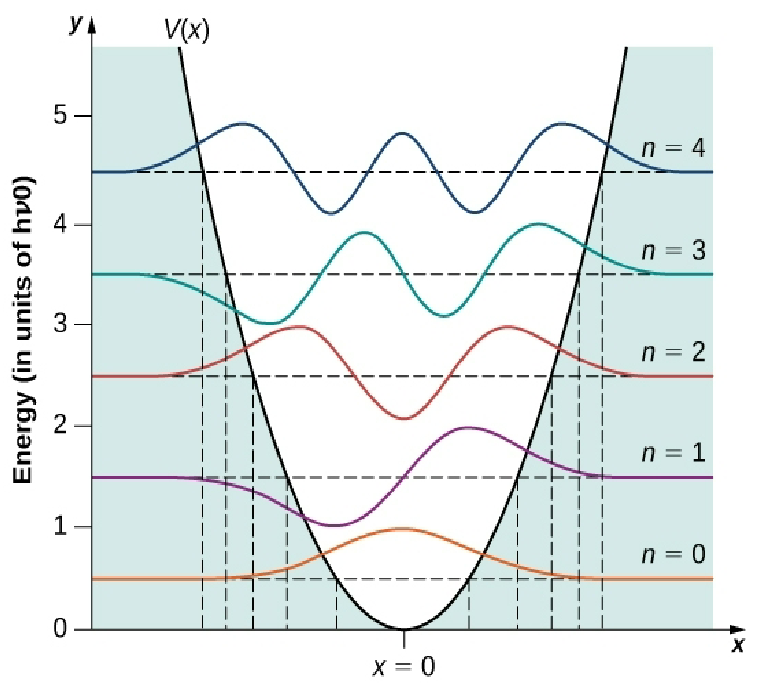

# Lecture 15, Feb 13, 2023

## Absorption of Photons

* The probability of absorption of a photon by a molecule depends on the dipole strength $D_{0A} = \norm{\vec \mu_{0A}}^2$ where $0$ is the ground state and $A$ is the excited singlet state
* Beer's law: $\frac{I(\lambda)}{I_0(\lambda)} = e^{-\varepsilon(\lambda)Cb}$
	* Exponential decay of transmitted light intensity
	* $C$ is the amount of material (concentration)
	* $b$ is the path length
	* $\varepsilon$ is the molar absorptivity (absorption strength)

## Vibrational Energies

* Harmonic oscillator is a very good approximation for the potential
* The true potential is the Morse potential
* Molecules have dipole moments, which allows absorption of electromagnetic radiation
	* $\diff{\mu}{r} > 0$, i.e. the electric dipole must change with bond length during a vibration
	* This is why oxygen and nitrogen gas don't cause climate change but water vapour does
		* Carbon dioxide is normally linear, but when it vibrates there is a dipole
	* Vibrational energies are close together so the transitions are infrared
* Due to the deviation between the real potential and the harmonic oscillator, this gives it antiharmonic character which allows energy redistribution
* Example: water
	* 3 normal modes of vibrations (9 DoF from each atom - 3 translation - 3 rotation, to put it in molecular frame)
	* all 3 have dipole moments, so they are all IR active, making it a very good infrared absorber
* Quantum harmonic oscillator: $U = \frac{1}{2}kx^2$
	* Boundary conditions: symmetry, and approaches zero for $x \to \infty$
	* Solution has energies given by $E = \frac{1}{2}(n + 1)h\nu$
	* This has a zero point energy of $\frac{1}{2}h\nu$ -- even at 0 kelvin, atoms are still moving
		* This is due to the uncertainty relation
	* Energies are equally spaced, unlike the particle in a box
	* The actual wavefunctions are given by $\psi _n(x) = N_ne^{-\beta^2x^2/2}H_n(\beta x)$, where $n$ is an integer quantum number, $\beta = \sqrt{\frac{mv}{h}}$, and $H_n$ are the *Hermite polynomials*

{width=50%}

