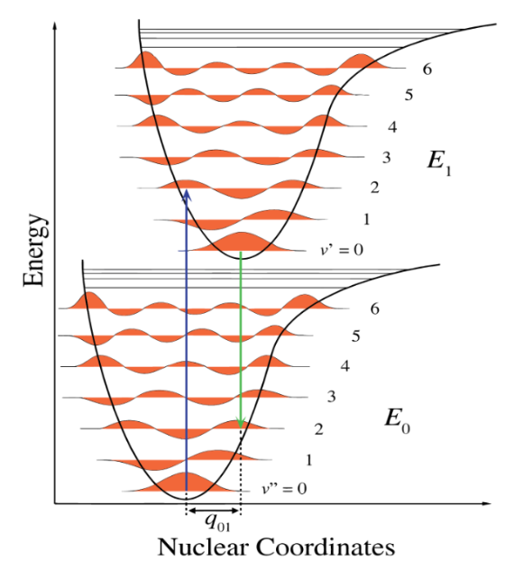
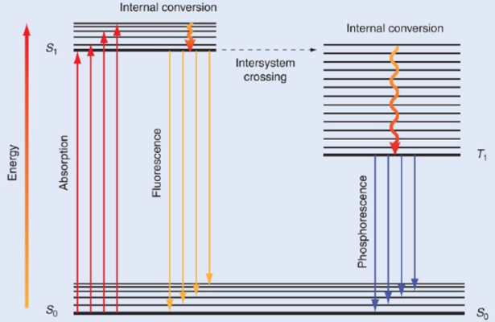

# Lecture 17, Feb 17, 2023

## Combining Electronic and Vibrational Spectra

* The electronic transition happens much faster than nuclear motion; so this limits where we can land on the upper state
	* This is a vertical transition
	* The favoured transitions are to vibrational states that have the same probabilities before and after the transition (there is more overlap)
	* In the excited state there is a slight distortion; the atoms move further apart because they are higher energy, and electron density between atoms is depleted

{width=40%}

* After the electronic transition, internal transitions happen between vibrational states
	* This happens very fast because there are a lot of vibrational motions
* After falling to the vibrational ground state, it then falls back down the electronic transition and emits a photon (fluorescence)
	* This transition probabilities is determined in the same way as going up
* Phosphorescence happens after inter system crossing
	* This is much weaker because it's less likely, but it's longer lived
	* e.g. old CRT monitors
* The spectrum of an atom is a sharp line, for a diatomic atom there are multiple lines that begin to merge together, and for a polyatomic atom the lines completely merge together
* As proteins unfold, their spectrum shape changes -- we can watch DNA unfold in transcription in real time using this

{width=70%}

