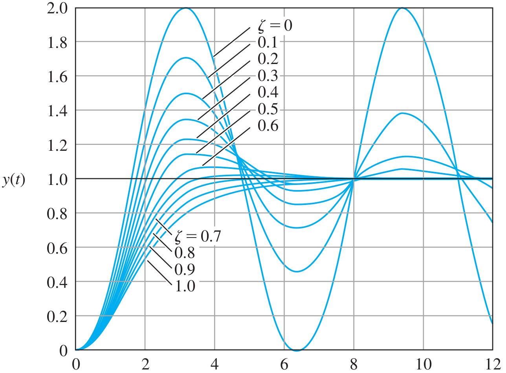
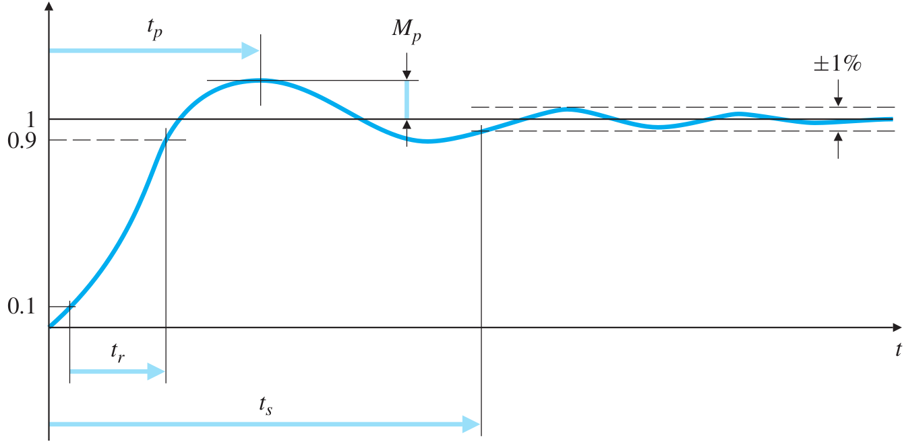
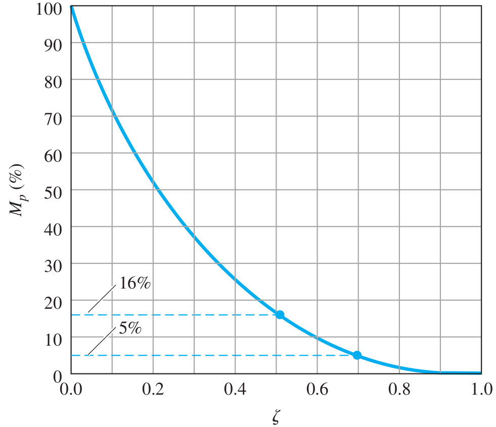

# Lecture 10, Feb 8, 2024

## Second Order System Response (Continued)

* Consider the step response
	* $\alignedeqntwo[t]{y_s(t)}{\ilaplace{\frac{H(s)}{s}}}{\ilaplace{\frac{\sigma^2 + \omega _d^2}{(s + \sigma)^2 + \omega _d^2)s}}}{\ilaplace{\frac{1}{s} - \frac{s + 2\sigma}{(s + \sigma)^2 + \omega _d^2}}}{\ilaplace{\frac{1}{s} - \frac{s + \sigma}{(s + \sigma)^2 + \omega _d^2} - \frac{\sigma}{\omega _d}\frac{\omega _d}{(s + \sigma)^2 + \omega _d^2}}}{1 - e^{-\sigma t}\left(\cos(\omega _dt) + \frac{\sigma}{\omega _d}\sin(\omega _dt)\right)}{1 - e^{-\sigma t}\frac{\omega _n}{\omega _d}\cos(\omega _d t - \theta)}$
		* Where $\theta = \tan^{-1}\left(\frac{\omega _d}{\sigma}\right) = \tan^{-1}\left(\frac{\omega _d}{\zeta\omega _n}\right)$
* For an overdamped system, the two separate poles lie on the real axis, and with decreasing $\zeta$ the poles move together until they overlap, and then move radially into the imaginary axis
* The system starts with no oscillation but a slow response to faster responses but oscillations begin; when $\zeta = 0$ the poles are purely imaginary, at which point the response is purely oscillatory and no decay occurs
	* When $\zeta = 1$, the poles overlap, and we get critical damping, which is the fastest possible system response without oscillation

{width=40%}

* For the second order system, we can characterize it using the following (for a unit step input):
	* DC gain $y_{ss}$: the steady-state value of the system output
	* Peak time $t_p$: time to reach the maximum overshoot/undershoot point
	* Overshoot $M_p$: the max amount the output overshoots $y_ss$, divided by the steady state value (usually as a percentage)
	* Rise time $t_r$: the time the system takes to rise from 10% to 90% of $y_ss$
	* Settling time $t_s$: the time the system takes to reach, and stay within, 1% of $y_ss$ (2% in some texts)

{width=60%}

* DC gain: $y_ss = \lim _{s \to 0} sY_s(s) = \lim _{s \to 0} s\frac{1}{s}H(s) = \frac{\omega _n^2}{\omega _n^2} = 1$
	* The DC gain here is 1 because when we derived the system, we multiplied $u$ by $k$
	* Without this scaling the DC gain would be $k$ instead
* Peak time:
	* Take derivative: $\dot y_s(t) = \ilaplace{sY_s(s)} = \ilaplace{s\frac{1}{s}H(s)} = y_i(t)$
		* Note the derivative of the step response is just the impulse response
	* Therefore $y_i(t) = \frac{\omega _n}{\sqrt{1 - \zeta^2}}e^{-\zeta\omega _n t}\sin\left(\omega _n\sqrt{1 - \zeta^2 t}\right)$
	* $\dot y_s(t) = y_i(t) = 0 \implies \omega _n\sqrt{1 - \zeta^2 t} = n\pi \implies t = \frac{n\pi}{\omega _n\sqrt{1 - \zeta^2}}$
	* The first peak occurs at $t_p = \frac{\pi}{\omega _n\sqrt{1 - \zeta^2}} = \frac{\pi}{\omega _d}$
	* As we reduce the damping, 
* Overshoot:
	* Substitute $t_p$ into the step response to get the peak of the response
	* $y_s(t_p) = 1 - \frac{e^{-\frac{\pi\zeta}{\sqrt{1 - \zeta^2}}}}{\sqrt{1 - \zeta^2}}\cos(\pi - \theta) = 1 + \frac{e^{-\frac{\pi\zeta}{\sqrt{1 - \zeta^2}}}}{\sqrt{1 - \zeta^2}}\cos\theta$
	* We know $\cos\theta = \sqrt{1 - \zeta^2}$ so this simplifies to $1 + e^{-\frac{\pi\zeta}{\sqrt{1 - \zeta^2}}}$
	* The overshoot is therefore $M_p = e^{-\frac{\pi\zeta}{\sqrt{1 - \zeta^2}}}$ (or times 100 for percentage)
	* Notice that this depends only on $\zeta$
		* Usually we're interested in two values: $\zeta = \frac{1}{2}$ which gives 16% overshoot, and $\zeta = 0.7$ which gives 5% overshoot
	* The percent overshoot decreases with $\zeta$, but $\omega _nt_p$ increases with $\zeta$

{width=40%}

* Rule of thumb: the response of the second-order underdamped systems (with no finite zeroes) with different damping ratios rises roughly with the same pace
	* Typically we related $t_r$ to only $\omega _n$ instead of also $\zeta$, as an approximation
	* For $\zeta = 0.5$, we can approximate $t_r \approx \frac{1.8}{\omega _n}$
	* We typically choose $\zeta$ between $0.5$ and $0.7$ for a balance between overshoot and rise time
* For settling time we can approximate the deviation of the response by the exponential only
	* Therefore $e^{-\zeta\omega _nt_s} \approx 0.01 \implies t_s \approx \frac{4.6}{\zeta\omega _n} = \frac{4.6}{\zeta}$

