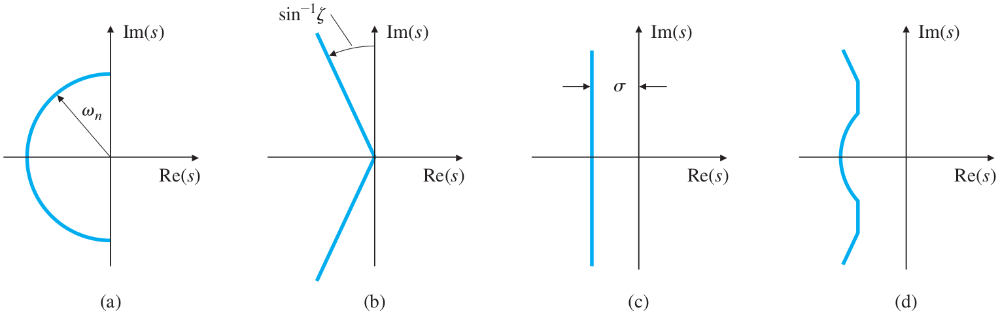
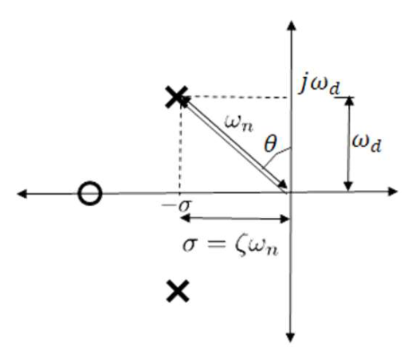
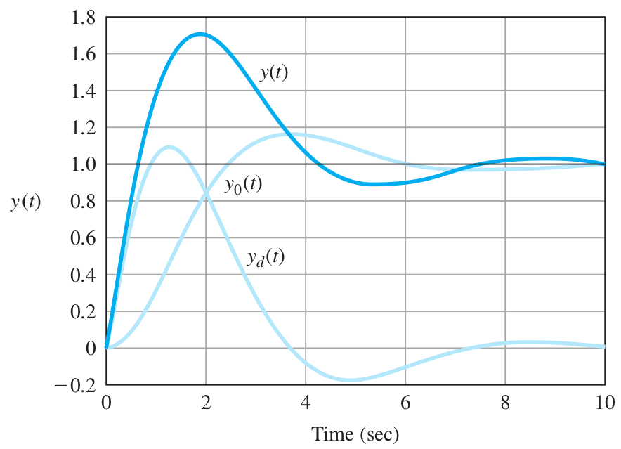
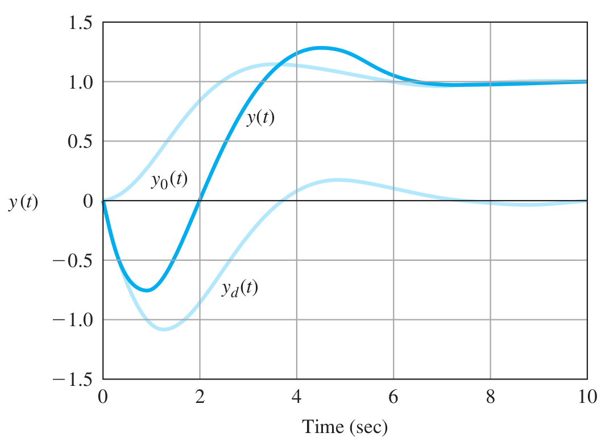
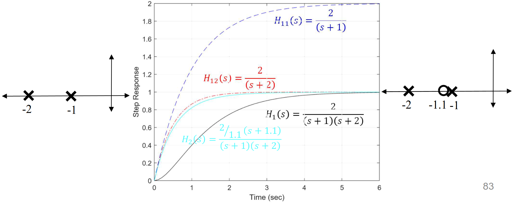
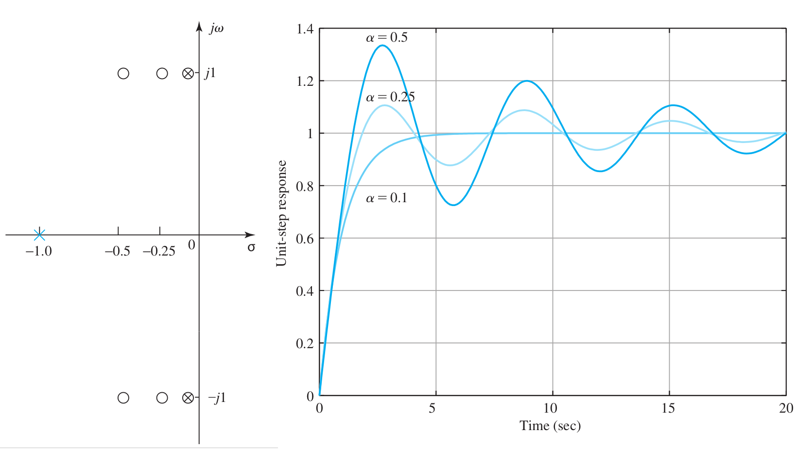

# Lecture 11, Feb 12, 2024

## Second Order System Response (Continued)

* We can now generalize our system to $H(s) = \frac{K\omega _n^2}{s^2 + 2\zeta\omega _n s + \omega _n^2}$
	* In this case $K$ is the DC gain
* Without any zeroes, we have 3 parameters $K, \omega _n, \zeta$ to fully specify the system's behaviour
	* In practice, we look for regions in the $s$ plane where we can put the poles
	* e.g. if we want to specify a maximum rise time $t_{rd}$, settling time $t_{sd}$ and overshoot (corresponding to some damping $\zeta _d$), then we have:
		* $\omega _n \geq \frac{1.8}{t_{rd}}$
		* $\zeta \geq \zeta _d$
		* $\sigma \geq \frac{4.6}{t_{sd}}$
		* Combining these 3 requirements, we see that the allowed region for the pole is indicated in the figure below

{width=80%}

## Effect of Zeroes

* Consider the system $m\ddot y(t) + b\dot y(t) + ky(t) = kf(t)$ with initial conditions given by $y(0^-) = \frac{k}{b}y_0, \dot y(0^-) = 0, f(t) = 0$; consider $y_0$ as the system input
	* Laplace transform the system: $m(s^2Y(s) - sy(0^-) - \dot y(0^-)) + b(sY(s) - y(0^-)) + kY(s) = kF(s)$
	* $Y(s) = \frac{s + \frac{b}{m}}{s^2 + \frac{b}{m}s + \frac{k}{m}}y(0^-)$
	* Again let $\omega _n = \sqrt{k}{m}, \zeta = \frac{b}{2\sqrt{km}}$
	* Notice that the system now has a zero
	* $\frac{Y(s)}{y_0} = \frac{\frac{\omega _n}{2\zeta}(s + 2\zeta\omega _n)}{s^2 + 2\zeta\omega _ns + \omega _n^2}$
	* In the underdamped case $0 \leq \zeta < 1$, the poles are $-\zeta\omega _n \pm j\omega _n\sqrt{\zeta^2 - 1} = -\sigma \pm j\omega _d$ with a zero at $z_1 = -2\zeta\omega _n = -2\sigma$
	* Normalize by $\omega _n$: $\frac{Y(s)}{y_0} = \frac{\frac{1}{2\zeta}\frac{s}{\omega _n} + 1}{\left(\frac{s}{\omega _n}\right)^2 + 2\zeta\frac{s}{\omega _n} + 1}$
		* By doing this we can ignore $\omega _n$
* More generally, $H(s) = \frac{\frac{1}{\alpha\zeta}s + 1}{s^2 + 2\zeta s + 1}$
	* The DC gain is still 1
	* We have generalized the 2 to $\alpha$ and replaced $\frac{s}{\omega _n}$ by $s$ (equivalent to $t \gets \omega _n t$)
	* For this system the zero is at $z = -\alpha\sigma$
	* We can write this as $H(s) = H_p(s) + \frac{1}{\alpha\zeta}sH_p(s)$ where $H_p = \frac{1}{s^2 + 2\zeta s + 1}$
		* $H_p(s)$ is a second-order transfer function with no zeroes
		* We see that the effect of a zero is equivalent to adding $s$ times the transfer function
		* In time domain, this is equivalent to adding the derivative of the response to itself (since multiplication by $s$ is differentiation)
	* The DC gain of the system is $y_{ss} = \lim _{s \to 0} H(s) = \lim _{s \to 0}H_p(s)$
		* The DC gain of the original transfer function is not changed by adding a zero
		* The steady-state response is unaffected by adding zeroes

{width=25%}

{width=40%}

* The effect of adding a zero is to add the derivative of the response to itself, resulting in a shorter rise/peak time and larger overshoot
	* With increasing $\alpha$, the system gets closer to the response without a zero
	* Increasing alpha means the zero moves further into the negative
		* In general, the further the zero gets from the poles, the less its effect will be
	* For $\zeta$ values of 0.5 or above, any value of $\alpha$ larger than 4 will have a negligible effect
	* Note adding a zero may inadvertently affect the initial conditions of the system
		* By the initial value theorem we can find $y(0)$ by taking the limit as $s \to \infty$
		* Adding zeros can make $y(0)$ nonzero

{width=40%}

* What if $\alpha$ is negative, so the zero is in the right hand plane?
	* This doesn't make the system unstable (since only the pole locations determine system stability)
	* The effect is now subtractive, so the system slows down and the rise/peak time is increased
		* The overshoot is far less than the case where the zero is in the LHP (however it is still more than the case of having no zeroes)
	* The system may start in the "wrong direction" -- moving in the opposite direction as the equilibrium initially
		* This is often undesirable
	* These systems are called *nonminimum-phase zeroes*
* If a zero is close to a pole, it can "neutralize" the effect of the pole
	* We can deliberately place zeros to neutralize poles to change the system behaviour
	* Consider $H_1(s) = \frac{2}{(s + 1)(s + 2)} = \frac{2}{s + 1} - \frac{2}{s + 2}$ and $H_2(s) = \frac{\frac{2}{1.1}(s + 1.1)}{(s + 1)(s + 2)} = \frac{0.18}{s + 1} + \frac{1.64}{s + 2}$
		* Same characteristic equation and DC gain, but the second has a zero very close to a pole
		* Notice in $H_2$, the part corresponding to the second pole at $s = -2$ stayed roughly the same, while the first pole at $s = -1$ diminished significantly
	* In the figure below, the response of $H_2$ is much closer to the first-order system $H_{12}$ than $H_1$
	* Mathematically we can use a zero on the RHP to neutralize an unstable pole, but this should never be done in practice because we never know where exactly the pole is, so the zero may not overlap perfectly
		* This also applies for LHP poles that are close to being unstable

{width=80%}

* Now consider the effect of complex poles on the system
	* Example: $H_1(s) = \frac{1.01}{\alpha^2 + \beta^2} \cdot \frac{(s + \alpha)^2 + \beta^2}{(s + 1)[(s + 0.1)^2 + 1]}$
		* The term in the front normalizes the DC gain to 1
		* The zeroes are at $z_1, z_2 = -\alpha \pm j\beta$
		* The poles are at $p_1 = -1, p_2, p_3 = -0.1 \pm j1$
		* The closer the poles get to the zeroes, the less their effect becomes

{width=70%}

## Higher Order Systems

* Generally, the higher the system order, the more complex it is and the more lag we will see in the system
* The rise and peak times will generally increase and overshoot deceases as we add more poles
* The transient response is slowed down but they have little effect on the settling time
* Additional poles are more effective the closer they are to the existing second-order poles
	* Generally if they are 4 or more times further, their effect can be ignored
* The overall system response is the sum of terms due to each pole/pair of poles
	* Poles having a real part closer to zero will have a much more pronounced effect on the system
* The effect of the poles is determined by:
	* The real part of the pole, $\sigma$, determines both the stability and the system time constant (rate of decay)
	* The imaginary part of pole, $\omega _d$, determines the damped frequency
	* The magnitude of the pole determines the natural frequency of the system
	* The argument/angle of the pole determines the damping ratio
* Based on these, we can approximate the system and reduce its order to make it easier to analyze

\noteSummary{For a second-order system with no finite zeroes, the transient response can be characterized approximately by 3 characteristics:
\begin{itemize}
	\item Rise time: $t_r \approx \frac{1.8}{\omega _n}$ (if the rise time is too long, increase the natural frequency)
	\item Overshoot: $M_p = e^{-\frac{\pi\zeta}{\sqrt{1 - \zeta^2}}}$ (if there is too much overshoot, increase the damping ratio)
	\item Settling time: $t_s \approx \frac{4.6}{\sigma}$ (if the system takes too long to settle, move the pole to the left)
\end{itemize}
Real zeroes in the LHP will significantly increase the overshoot but decrease the rise time (if it is within a factor of 4 of the real part of the complex poles);
real zeroes in the RHP (nonminimum-phase zeroes) will reduce the overshoot, but may cause the system to start in the wrong direction.
Zeroes close to poles may cancel out their effects on the system.

Additional real poles in the LHP will significantly increase the rise time but decrease the overshoot (again, if it is within a factor of 4 of the real part of existing poles).}

