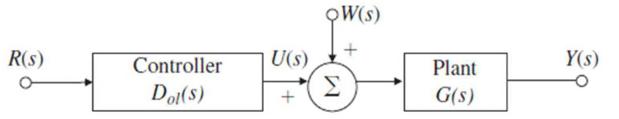

# Lecture 13, Feb 27, 2024

## Control System Performance

* In open-loop control, we control the plant without using feedback from its output
* For open-loop control, $Y_{ol} = GD_{ol}R + GW$
	* $E_{ol} = R - Y_{ol} = (1 - GD_{ol})R - GW$
	* Assuming no disturbance so $W(s) = 0$, we can define the open-loop transfer function
	* $T_{ol}(s) = \frac{Y(s)}{R(s)} = G(s)D_{ol}(s)$

{width=40%}

* For closed-loop control, $Y_{cl} = \mathcal TR + G\mathcal SW - H\mathcal TV$
	* $E_{cl} = R - Y_{cl} = (1 - \mathcal T)R - G\mathcal SW + H\mathcal TV$
		* Notice the negative sign in front of the $W$ term, since the output is subtracted from reference
	* In this case, $V(s)$ is noise in our sensor measurements, which we separate from $W(s)$
		* $W(s)$ is usually low-frequency
		* $V(s)$ is usually high-frequency
	* Since we have an LTI system, we can consider the input and sources of noise separately
		* Assuming $W(s) = V(s) = 0$ we can define the closed-loop transfer function
			* $\mathcal T(s) = \frac{Y(s)}{R(s)} = \frac{G(s)D_{cl}(s)}{1 + H(s)G(s)D_{cl}(s)} = T_{cl}(s)$
		* Assuming $R(s) = V(s) = 0$ we can define the transfer function for process noise
			* $\frac{Y(s)}{W(s)} = G(s) \cdot \frac{1}{1 + H(s)G(s)D_{cl}(s)} = G(s)\mathcal S(s)$
			* Recall that $\mathcal S(s)$ is the *sensitivity* transfer function
		* Assuming $R(s) = W(s) = 0$ we can define the transfer function for measurement noise
			* $\frac{Y(s)}{V(s)} = -H(s) \cdot \frac{D_{cl}(s)G(s)}{1 + H(s)D_{cl}(s)G(s)} = -H(s)\mathcal T(s)$

### Stability

* Consider an unstable plant $G(s) = \frac{b(s)}{a(s)}$, i.e. $a(s)$ has roots in the RHP; how can we design our controller to make the system stable?
	* Let the controller be $\frac{c(s)}{d(s)}$
	* For the open loop control we have $T_{ol} = \frac{b(s)}{a(s)}\frac{c(s)}{d(s)}$
		* Theoretically we can design $c(s)$ to cancel the unstable roots of $a(s)$, but as previously mentioned, this is impractical
		* We can make the same argument for cancelling bad zeroes (zeroes with small real part causing large overshoot)
			* For a nonminimum-phase zero, we can't do this at all because we'd need an unstable pole in the controller
		* Therefore in practice we can't use open-loop control to stabilize a plant
	* For closed-loop controllers, assume $H(s) = 1$ for the sensor, then $T_{cl} = \frac{b(s)c(s)}{a(s)d(s) + b(s)c(s)}$
		* Now we have a lot more options for eliminating the unwanted poles
* Example: Inverted pendulum (segway)
	* $\twopiece{(m_t + m_p)\ddot x + b\dot x - m_pl\ddot\theta _0 = u}{(I + m_pl^2)\ddot\theta - m_pgl\theta - m_pl\ddot x = 0}$
		* $m_t, m_p$ are the masses of the cart and pendulum, $I$ is the moment of inertia of the pendulum, $l$ is the length of the pendulum, $x$ is the cart's displacement and $\theta$ is the angle of the pendulum from normal
	* $G(s) = \frac{\Theta(s)}{U(s)} = \frac{m_pls}{((m_t + m_p)(I + m_pl^2) - m_p^2l^2)s^3 + b(I + m_pl^2)s^2 - m_pgl(m_t + m_p)s - m_pgbl}$
	* If we assume $b = 0$ then we get a send order system with $((m_t + m_p)(I + m_pl^2) - m_p^2l^2)s^2 - m_pgl(m_t + m_p)$ in the denominator
		* We can immediately tell that this is unstable by the RH criterion since since the $s^1$ term is missing
	* Assume $m_p = \SI{1}{kg}, I = \SI{1}{kgm^2}, l = \SI{1}{m}, m_t = 0$ then we get $G(s) = \frac{1}{s^2 - 10} = \frac{1}{(s + 3.16)(s - 3.16)}$
	* Consider a controller $D_{cl}(s) = \frac{K(s + \gamma)}{s + \delta}$ and $H(s) = 1$
		* Choosing $\gamma = -3.16$ cancels the RHP pole, but this is impractical
		* Choose $\gamma = +3.16$ cancels the stable pole, leaving $\frac{K}{(s - 3.16)(s + \delta) + K}$
		* Now we can choose $\delta$ and $K$ to move both poles of this second-order system to the LHP

### Tracking

* We want to make the output follow the reference input as closely as possible, in effect having a unity transfer function from reference to output
* For open-loop control, we again have $T_{ol} = \frac{b(s)}{a(s)}\frac{c(s)}{d(s)}$
	* Designing the controller to cancel the plant's transfer function is only possible under the constraints:
		* The plant needs to be stable (and stable poles cannot be too close to the imaginary axis)
			* Trying to cancel out stable poles close to the imaginary axis may make the system too sensitive and cause unstable transients
		* The plant should have no zeroes in the RHP (since we'd need an RHP pole to cancel that)
		* The controller transfer function must be proper so it can be physically realized (it must be causal)
			* If the plant is strictly proper, this can be an issue since the controller would have to be improper
			* Digital controllers may be an exception
		* The controller cannot go beyond the plant's actuation limit (the response can't be too fast, or excite plant's resonance modes)
			* This will cause the system to be no longer linear
* For a closed-loop control system, most of the same restrictions apply, but we have more freedom to tune the response

### Regulation

* Regulation is the ability of the control system to keep the error small when the input is constant, with added disturbances/noise
* In the open-loop case, the controller has no influence whatsoever on the effect of $W(s)$ on the output
* For the closed-loop controller: $E_{cl} = (1 - \mathcal T)R - G\mathcal SW + H\mathcal TV$
	* $E_{cl} = \frac{1 + G(s)D_{cl}(s)(H(s) - 1)}{1 + H(s)G(s)D_{cl}(s)}R - \frac{G(s)}{1 + H(s)G(s)D_{cl}(s)}W + \frac{H(s)G(s)D_{cl}(s)}{1 + H(s)G(s)D_{cl}(s)}V$
	* Notice that if $D$ is large, the second term is small so effect of $W$ is small, but the third term gets closer to 1, so the effect of $V$ is not reduced
	* Conversely if $D$ is small we have less effect of $V$ but more of $W$
	* To address this, we can design $D_{cl}(s)$ to have large values at low frequencies and small values at high frequencies, since $W$ is often low frequency and $V$ is often high

### Sensitivity

* The robustness of the system against variations in the plant behaviour
* Assume that the plant transfer function can change from $G(s)$ to $G(s) + \delta G(s)$
* The *sensitivity* of the (overall) system transfer function $T$ to plant $G$ is defined as $\mathcal S_G^T = \frac{\frac{\delta T}{T}}{\frac{\delta G}{G}} = \frac{G}{T} \cdot \frac{\delta T}{\delta G}$
	* This is the ratio of the normalized change to the overall transfer function to the normalized change to the plant transfer function
* For open-loop control:
	* $T_{ol} + \delta T_{ol} = D_{ol}(G + \delta G) = D_{ol}G + D_{ol}\delta G = T_{ol} + D_{ol}\delta G = T_{ol} + \frac{T_{ol}}{G}\delta G \implies \delta T_{ol} = \frac{T_{ol}}{G}\delta G$
		* $\frac{\delta T_{ol}}{T_{ol}} = \frac{\delta G}{G}$ so the sensitivity is 1
	* i.e. whatever change happens in the plant, it will be immediately reflected in the entire system
* For closed-loop control, $\mathcal S_G^{T_{cl}} = \frac{G}{T_{cl}}\frac{\delta T_{cl}}{\delta G} = \frac{G}{T_{cl}} \cdot \diff{T_{cl}}{G}$
	* We can show that $\mathcal S_G^{T_{cl}} = \frac{1}{1 + HGD_{cl}}$
		* This is why we define the sensitivity transfer function as $\mathcal S = \frac{1}{1 + HGD_{cl}}$
		* The sensitivity is not 1 but is mitigated by the additional term in the denominator
		* The larger the controller $D_{cl}$, the more robust it is to changes in the plant
	* The complementary sensitivity transfer function is $\mathcal T = \frac{GD_{cl}}{1 + HGD_{cl}}$
		* Notice that this is just the closed-loop transfer function
		* This is named so because for the case of a perfect sensor $H(s) = 1$, $\mathcal S + \mathcal T = 1$

