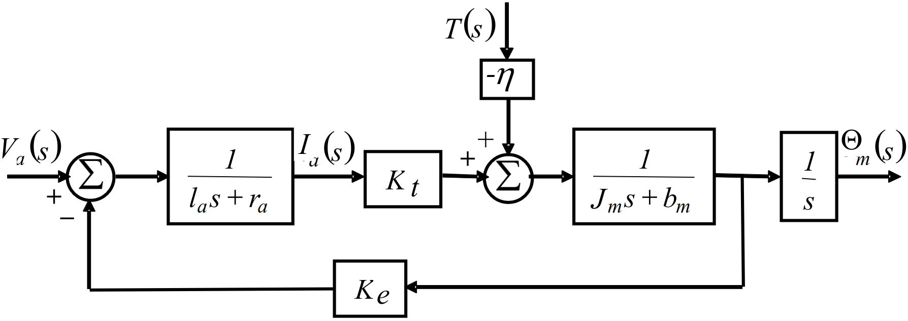
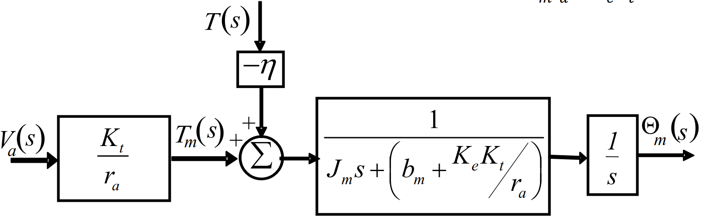

# Lecture 15, Mar 4, 2024

## PID Controllers

* For the following analyses we will assume unity feedback, but this is easily extended to other kinds of feedback

### Proportional Control (P)

* The simplest controller simply applies a gain to the error feedback: $u(t) = k_Pe_a(t) \implies D_{cl} = k_P$
* Consider a second order plant $G(s) = \frac{K\omega _n^2}{s^2 + 2\zeta\omega _n s + \omega _n^2} \implies GD_{cl}(s) = \frac{k_PK\omega _n^2}{s^2 + 2\zeta\omega _ns + \omega _n^2}$
	* No poles at the origin in the open-loop transfer function, therefore this is a type 0 system
* Closed loop transfer function: $\frac{Y(s)}{R(s)} = \frac{GD_{cl}(s)}{1 + GD_{cl}(s)} = \frac{k_PK\omega _n^2}{s^2 + 2\zeta\omega _ns + (1 + k_PK)\omega _n^2}$
	* Notice that the new natural frequency is $\omega _n' = \sqrt{1 + k_PK}\omega _n^2$, which is increased
	* The new damping ratio is $\zeta' = \frac{\zeta}{\sqrt{1 + k_PK}}$, which is decreased (obtained by comparing $2\zeta'\omega _n'$ with $2\zeta\omega _n$)
	* Increased natural frequency leads to shorter rise time (faster system), but decreased damping leads to more overshoot
* For $R(s) = \frac{1}{s}$, we have $e_{ss} = \lim _{s \to 0} s\frac{1}{1 + GD_{cl}}\frac{1}{s} = \frac{1}{1 + k_PK}$
	* The steady-state error in the step response is reduced, but not eliminated entirely
* The same analysis can be made for the disturbance regulation

### Integral Control (I)

* The integral controller applies $u(t) = k_I\int _0^t e_a(\tau)\,\dtau$
	* Instead of the error itself, the control signal is proportional to the area underneath the error curve
* The controller transfer function is $\frac{U(s)}{E_a(s)} = D_{cl}(s) = \frac{k_I}{s}$
* Consider the same second-order plant $G(s) = \frac{K\omega _n^2}{s^2 + 2\zeta\omega _n s + \omega _n^2}$:
* Closed loop transfer function: $\frac{Y(s)}{R(s)} = \frac{k_IG(s)}{s + k_IG(s)} = \frac{k_IK\omega _n^2}{s^3 + 2\zeta\omega _ns^2 + \omega _n^2s + k_IK\omega _n^2} = \mathcal T(s)$
	* Notice that this system is now third order; the increased order of the system makes it more sluggish, so the rise time increases and overshoot decreases
	* Taking $s \to 0$ we see that the DC gain is 1, so there is no more steady-state error
	* Unlike the second-order system, we can no longer conclude that the system is always stable, since this is a third-order system
	* Using the Routh criterion, we find that $k_I < \frac{2\zeta\omega _n}{K}$ is the maximum value of $k_I$ for the system to be stable
		* The integral controller can destabilize the system!
	* The removal of steady-state error is a robust property, holding regardless of the value of $k_I$ and plant parameters
		* We can find the sensitivity transfer function and show that this always goes to 0 as $s \to 0$
* $GD_{cl}(s) = \frac{k_IK\omega _n^2}{s(s^2 + 2\zeta\omega _n s + \omega _n^2)}$; $E_{cl}(s) = \frac{1}{1 + GD_{cl}}R(s)$
	* There is one pole at the origin, so this is a type 1 system
	* This can now follow a position setpoint with no error, and a velocity setpoint with constant error
	* Note we only get zero error for position setpoints when we have unity feedback!
	* The velocity constant is $K_v = \lim _{s \to 0} sGD_{cl}(s) = k_IK \implies e_{ss} = \frac{1}{k_IK}$

### Derivative Control (D)

* The derivative controller applies $u(t) = k_D\dot e_a(t) \implies \frac{U(s)}{E_a(s)} = D_{cl}(s) = k_Ds$
	* Derivative control tends to speed up the system, since it anticipates future behaviour of the system
* The closed-loop transfer function is $\frac{k_DK\omega _n^2s}{s^2 + (2\zeta + k_DK\omega _n)\omega _ns + \omega _n^2}$ for the second-order plant
	* The additional zero speeds up the system and increases the overshoot
	* However, the damping ratio is increased to $\zeta' = \zeta + \frac{1}{2}k_DK\omega _n$, which decreases the overshoot
	* Overall, the combination leads to increased system speed and decreased overshoot
	* Furthermore, increased damping ratio and constant natural frequency moves the poles away from the imaginary axis, enhancing stability
* $GD_{cl}(s) = \frac{k_DK\omega _n^2s}{s^2 + 2\zeta\omega _ns + \omega _n^2}$
	* No poles at zero, therefore the system is type 0 and maintains constant error for a step input
	* The position constant is $K_p = \lim _{s \to 0} GD_{cl}(s) = 0$
	* The steady state error is $e_{ss} = \frac{1}{1 + K_p} = 1$
		* This means that the output ultimately converges to zero, i.e. the derivative controller can't do anything about the steady state error
* Generally, derivative control enhances the transient behaviour of the system but does nothing to its long-term behaviour
* The transfer function for the controller is not causal
	* This means we can't implement it with analog controllers
	* We can still implement this digitally, but taking numerical derivatives highly amplifies noise
	* Therefore, in reality derivative controllers may not be practical
	* Practically, we use another technique called lead functions instead of derivatives
* Derivative control can be used to damp the control response, so we don't get sharp reactions to suddenly changing signals
	* If there is a sudden jump in the output due to transient effects, there will be a jump in error and also $u(t)$, which is not desirable
	* A derivative feedback path will correct for this

### Proportional-Integral Control (PI)

* $u(t) = k_Pe_a(t) + k_I\int _0^t e_a(\tau)\,\dtau \implies D_{cl}(s) = k_P + \frac{k_I}{s}$
* The closed-loop transfer function is $\frac{(k_Ps + k_I)K\omega _n^2}{s^3 + 2\zeta\omega _ns^2 + (1 + k_PK)\omega _n^2s + k_IK\omega _n^2}$
	* We still increase the system order, but also added a zero, which counteracts the slowdown effect
		* The final system can be faster than the initial plant
	* There is a zero that we can use to cancel a stable pole, which would make the system behave like second-order, making it easier to analyze and control
* $GD_{cl}(s) = \frac{(k_Ps + k_I)K\omega _n^2}{s(s^2 + 2\zeta\omega _ns + \omega _n^2)}$
	* The system is type 1, with $K_v = k_IK$ and steady-state error $e_{ss} = \frac{1}{k_IK}$
	* Also type 1 in regulation
* Stability criterion: $k_I < \frac{2\zeta\omega _n(1 + k_PK)}{K}$
* Note that we only have two adjustable parameters $k_P$ and $k_I$, but there are 3 roots, so our ability to control the characteristic equation is limit
* Generally used to allow for a faster response compared to a pure integral controller

### Proportional-Derivative-Integral Control (PID)

* $u(t) = k_Pe_a(t) + k_I\int _0^t e_a(\tau)\,\dtau + k_D\dot e_a(t) \implies D_{cl}(s) = k_P + \frac{k_I}{s} + k_Ds$
* Second-order closed loop: $\frac{(k_Ds^2 + k_Ps + k_I)K\omega _n^2}{s^3 + (2\zeta + k_DK\omega _n)\omega _ns^2 + (1 + k_PK)\omega _n^2s + k_IK\omega _n^2}$
	* We can fully control the location of the poles since there are 3 poles and we have 3 parameters
* $GD_{cl}(s) = \frac{(k_Ds^2 + k_Ps + k_I)K\omega _n^2}{s(s^2 + 2\zeta\omega _ns + \omega _n^2)}$
	* The system is type 1, and has $k_v = k_IK \implies e_{ss} = \frac{1}{k_IK}$
* Stability criterion: $k_I < \frac{(2\zeta + k_DK\omega _n)(1 + k_PK)\omega _n}{K}$

## Example System: DC Servo Motor

* Consider the DC motor system derived earlier
* $l_a\diff{i_a}{t} + r_ai_a = v_a - K_e\dot\theta _m \implies (l_as + r_a)I_a(s) = V_a(s) - K_es\theta _m(s)$
	* This models the back EMF and inductive/resistive effects of the motor coil
* $J_m\ddot\theta _m + b_m\dot\theta _m = K_ti_a - \eta T \implies (J_ms + b_m)s\Theta _m(s) = K_tI_a(s) - \eta T(s)$
	* This models torque on the shaft, including friction and an external resisting force
* $V_a(s)$ is the input to the system, $T(s)$ is a disturbance, and $\Theta _m(s)$ is the final output
	* $V_a(s)$ first passes through a transfer function to get $I_a(s)$, then this is multiplied by $K_t$ to get a torque
	* This is summed with the torque from the disturbance and passes through the mechanical transfer function to get $\dot\theta _m$
	* A final integrator gets us $\Theta _m(s)$
	* The back EMF introduces a feedback path with constant gain $K_e$

{width=80%}

* The system has two inputs ($V_a$ and $T$), since it is linear we can consider one at a time to get transfer functions
	* $\frac{\Theta _m(s)}{V_a(s)} = \frac{K_t}{s((l_as + r_a)(J_ms + b_m) + K_cK_t)}$
	* $\frac{\Theta _m(s)}{T(s)} = \frac{-\eta(l_as + r_a)}{s((l_as + r_a)(J_ms + b_m) + K_eK_t)}$
* We can again make the simplifying assumption that the electrical part of the system operates on a much faster time scale than the mechanical part, so the inductance $l_a$ can be taken to 0
	* $\frac{\Theta _m(s)}{V_a(s)} = \frac{\frac{K_t}{r_a}}{s\left(J_ms + \left(b_m + \frac{K_eK_t}{r_a}\right)\right)} = \frac{K}{s(\tau s + 1)}$
	* $\frac{\Theta _m(s)}{T(s)} = \frac{-\eta}{s\left(J_ms + \left(b_m + \frac{K_eK_t}{r_a}\right)\right)} = \frac{C}{s(\tau s + 1)}$
	* $\tau = \frac{J_mr_a}{b_mr_a + K_eK_t}$
	* $K = \frac{K_t}{b_mr_a + K_eK_t}$
	* $C = \frac{-\eta r_a}{b_mr_a + K_eK_t}$
	* We can now build a much simpler block diagram

{width=60%}

* Now we close the loop, with a feedback transfer function $H(s) = hs$ and controller $D_{cl}(s)$
	* We can do this for either a position or velocity controller
	* Since we have non-unity feedback, we can no longer only look at the poles to tell the system type and must use brute force
* For position control: $\frac{\Theta _m(s)}{\Theta _{mr}(s)} = \frac{KD_{cl}(s)}{s(\tau s + 1) + KhD_c(s)}$, $\frac{\Theta _m(s)}{T(s)} = \frac{-K\eta}{s(\tau s + 1) + KhD_c(s)}$
	* Consider a PID controller: $D_{cl}(s) = k_P + \frac{k_I}{s} + k_Ds$
	* $\mathcal T(s) = \frac{\Theta _m(s)}{\Theta _{mr}(s)} = \frac{Kk_P + \frac{Kk_I}{s} + Kk_Ds}{\tau s^2 + s + Khk_P + \frac{Khk_I}{s} + Khk_Ds} = \frac{\frac{1}{\tau}(Kk_Ds^2 + Kk_Ps + Kk_I)}{s^3 + \frac{1}{\tau}(Khk_D + 1)s^2 + \frac{1}{\tau}Khk_Ps + \frac{1}{\tau}Khk_I}$
	* $T_w(s) = \frac{\Theta _m(s)}{T_s(s)} = \frac{-K\eta}{\tau s^2 + s + Khk_P + \frac{Khk_I}{s} + Khk_Ds} = \frac{-\frac{1}{\tau}K\eta s}{s^3 + \frac{1}{\tau}(Khk_D + 1)s^2 + \frac{1}{\tau}Khk_Ps + \frac{1}{\tau}Khk_I}$
* For tracking: $\alignedeqntwo[t]{E(s)}{\Theta _{mr}(s) - \Theta _m(s)}{(1 - \mathcal T(s))\Theta _{mr}(s)}{\left(\frac{s^3 \frac{1}{\tau}(Khk_D + 1)s^2 + \frac{1}{\tau}Khk_Ps + \frac{1}{\tau}Khk_I - \frac{1}{\tau}Kk_Ds^2 - \frac{1}{\tau}Kk_Ps - \frac{1}{\tau}Kk_I}{s^3 + \frac{1}{\tau}(Khk_D + 1)s^2 + \frac{1}{\tau}Khk_Ps + \frac{1}{\tau}Khk_I}\right)\Theta _{mr}(s)}$
	* For a step $\Theta _{mr}(s) = \frac{1}{s}$, so $e_{ss} = \lim _{s \to 0} sE(s) = \frac{\frac{1}{\tau}Kk_I(h - 1)}{\frac{1}{\tau}Khk_I} = \frac{h - 1}{h}$
	* We have a constant error, so this system is only type 0
	* Even though we have an integral term, the error was not reduced to 0 because the system is not unity feedback
		* If the system was unity feedback, then $h = 0$ and we would have a type 1 system
* For regulation: $\alignedeqntwo[t]{E(s)}{\Theta _{mr}(s) - \Theta _m(s)}{-\Theta _m(s)}{-T_wT(s)}$
	* For a step disturbance $T(s) = \frac{1}{s}$
		* $e_{ss} = \lim _{s \to 0} sE(s) = \lim _{s \to 0} -T_w(s) = 0$
		* This system is higher than type 0
	* For a ramp disturbance $T(s) = \frac{1}{s^2}$
		* $e_{ss} = \lim _{s \to 0} -sT_w(s) = \frac{\frac{1}{\tau}K\eta}{\frac{1}{\tau}Khk_I} = \frac{\eta}{hk_I}$
		* Therefore this system is type 1 with respect to regulation
		* The velocity constant is $\frac{1}{e_{ss}} = \frac{hK_I}{\eta}$
* In summary, the system is type 0 with respect to tracking and type 1 with respect to regulation for PID
	* For PI, we have the same type 0 in tracking and type 1 in regulation
	* For P, we have type 0 in both regulation and tracking
* The same analysis can be applied for velocity control, where our feedback will be taken from $\Omega _m(s)$, the speed of the shaft
	* Construct the same transfer functions for regulation and tracking
	* For velocity control, we also have the same types with the controllers
* In general, for PI and PID control the system type is usually the same

