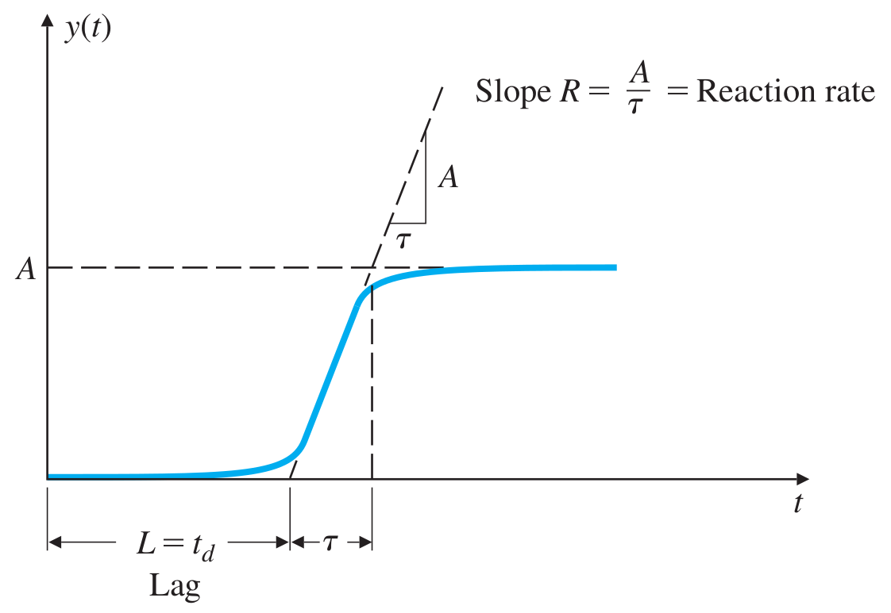

# Lecture 16, Mar 7, 2024

## PID Controllers, Continued

### Ziegler-Nichols Tuning Method

* While we can find gain values through theoretical analysis of a system, we don't often know the transfer functions perfectly, so fine-tuning on top of theoretical gains is often needed
* For PID tuning, we rely on mostly heuristic methods (instead of rigorous theoretical methods)
* For a PID controller, do the following in order:
	* Use $k_P$ to decrease the rise time
	* Use $k_D$ to reduce the overshoot and settling time
	* Use $k_I$ to eliminate the steady-state error (while keeping the system stable)

{width=70%}

{width=50%}

{width=50%}

* The *Ziegler-Nichols* method is an empirical tuning method that gives a set of gains from empirical observations of the system only
	* This works well for plants that don't have poles at the origin, or dominant complex poles near the origin
		* This is because these plants are stable, and oscillatory components of the response are not dominant
	* The plant's behaviour should be well approximated by $\frac{Y(s)}{U(s)} = \frac{Ae^{-t_ds}}{\tau s + 1}$
		* The $e^{-t_ds}$ is a delay by $t_d$
		* This is saying that the step response first has some delay $L = t_d$ , and then rises with an approximate slope $R = \frac{A}{\tau}$ until it reaches the DC gain of $A$
		* This is known as a *process reaction curve* and is characterized by $L$ and $R$
* Given a plant, we can inject it with a step input and measure its response and derive $L$ and $R$
	* The Ziegler-Nichols method gives a set of PID gains based on $L$ and $R$ only
	* The gains of a PID controller $D_{cl}(s) = k_P\left(1 + \frac{1}{T_Is} + T_Ds\right)$ can be looked up in the table
* This method doesn't apply for all plants, especially not those that are unstable
* Theoretically, we can show that Ziegler-Nichols creates a system response with 25% decay ratio (ratio of the first overshoot to the second overshoot), about equivalent to $\zeta \approx 0.21$ for a second-order system
	* This damping ratio leads to around 50% overshoot
	* We can usually reduce $k_P$ by 50% after tuning to reduce overshoot/oscillations without affecting the other properties much
* The method was first derived purely empirically, but it can be shown that the resulting gain values are close to those derived from optimal control, where we minimize the energy of the controller
* If it's impractical to observe the system's step response (e.g. unstable system), we can instead use the *ultimate sensitivity* method
	1. Close the loop with only a proportional controller with gain $k_P$, so the system is stable
	2. Increase $k_P$ until the system enters a steady oscillation in response to a step input
		* The gain at which this happens is the *ultimate gain* $K_u$, and the oscillation period is the *ultimate period* $P_u$
	3. Look up values for the system gains based on the ultimate gain and ultimate period from the table
		* Again we can often reduce $k_P$ by half to reduce oscillations

{width=50%}

* Example: heat exchanger; we control a valve which varies the amount of steam into the tank, which adjusts the temperature of the water at the tank exit
	* Typical fluids systems are similar to underdamped second-order systems
	* Assume $T_m = T_w(t - t_d)$ (a delay) so $\frac{T_m(s)}{A_s(s)} = \frac{Ke^{-t_ds}}{(\tau _1 s + 1)(\tau _2 s + 1)}$
		* $a_s(t)$ is the amount that we open the valve by
	* Assume that we give a step input to the plant and its output is shown in the figure below
		* $L \approx 13$ (very short delay)
		* $R \approx \frac{1}{90}$
			* If we take the tangent when the response is increasing, it takes about 90 seconds to hit 1
		* For P control we have $k_P = \frac{1}{RL} = 6.92$
		* For PI control $k_P = \frac{0.9}{RL} = 6.22, T_I = \frac{L}{0.3} = 43.3$
	* Assume that we use a P controller and increased the gain until we saw steady oscillations in the figure below
		* $K_u \approx 15.3, P_u \approx 42$
		* For P control $k_P = 0.5K_u = 7.65$
		* For PI control $k_P = 0.45K_u, T_I = \frac{P_u}{1.2} = 35.0$
		* Notice that the PI controller gains derived from this method resulted in a response with more oscillation

{width=40%}

{width=80%}

{width=40%}

{width=80%}

### Feedforward Control

* Using only P doesn't eliminate steady-state error, but using PI to eliminate the error makes the system sluggish, decreases damping and degrades stability
* Another way to eliminate steady-state error is to use a *feedforward controller*, where we first multiply the reference by the inverse DC gain of the plant
	* Equivalent to having $(G^{-1}(s) + D_c(s))E_a(s)$ instead of just $D_c(s)E_a(s)$ to the plant
	* $Y(s) = G(s)(D_c(s)E(s) G^{-1}(0)R(s)) \implies \frac{Y(s)}{R(s)} = \frac{(D_c(s) + G^{-1}(0))G(s)}{1 + D_c(s)G(s)}$
	* Now when we take $s \to 0$ we get a DC gain of $\frac{D_c(0)G(s) + G^{-1}(0)G(0)}{1 + D_c(0)G(0)} = 1$, so there is no steady-state error
* Practically we don't always know $G^{-1}(0)$ exactly, which is why we still need a P/PI controller; the system with just a feedforward is not robust

{width=60%}

