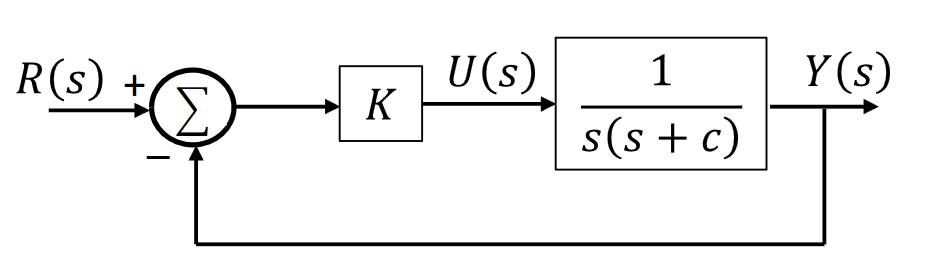
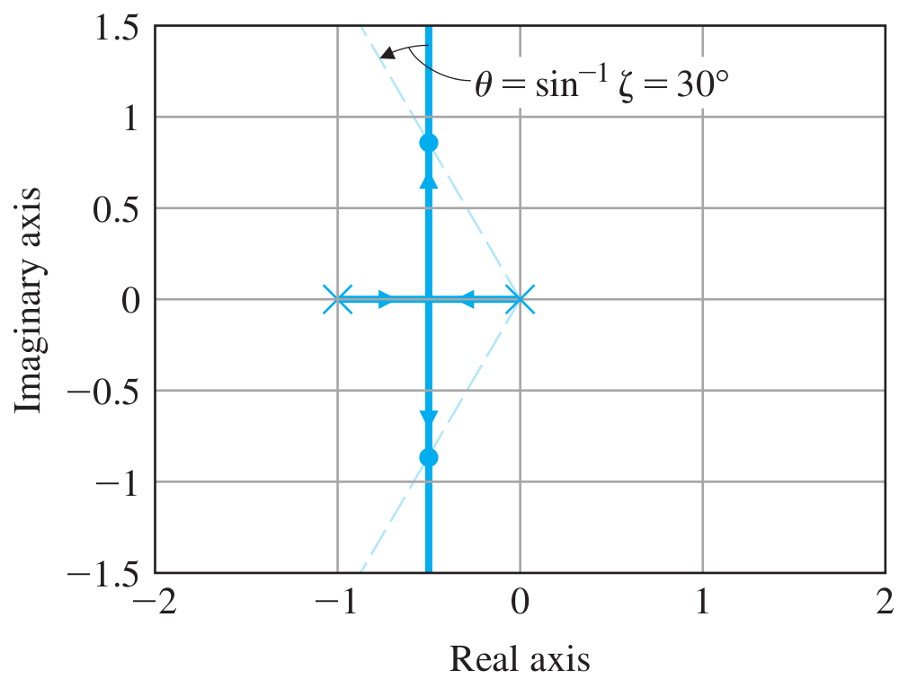
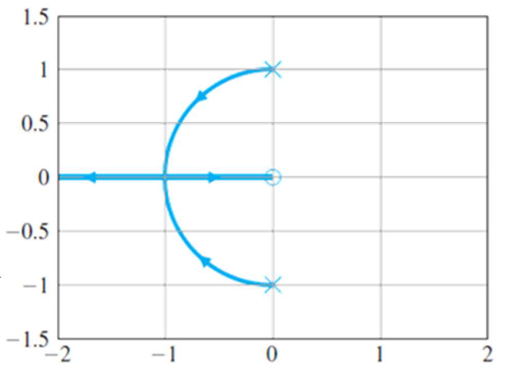
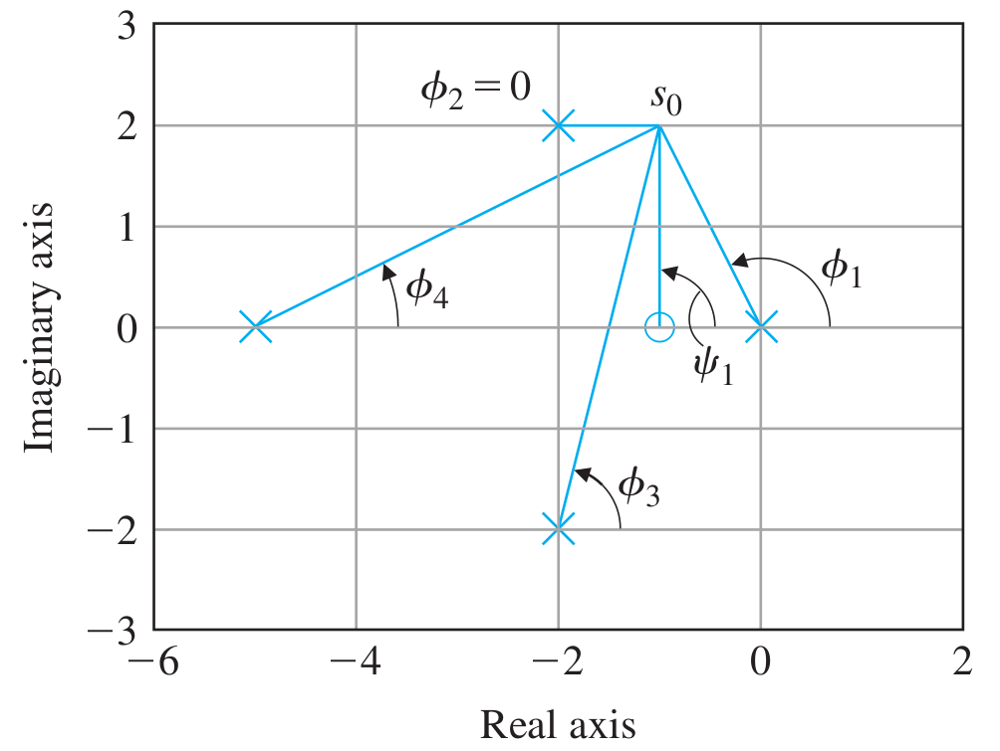

# Lecture 17, Mar 11, 2024

## Root-Locus Design Method

* A graphical method (set of rules) for finding the *locus* (set of locations on a line) of the roots of a system's characteristic equation, as a result of changing parameters
	* Allows us to find how the roots of a system move as a result of variation in some system parameter
	* e.g. we can find how the poles move as a result of changing the gain, so we can assess the system's stability, speed, etc
	* The *root locus* is the set of all locations that a root can take as a result of changing some parameter
	* Note the parameter must affect the characteristic equation linearly
* In controls, we use this to find how the roots of the characteristic equation (i.e. the poles) are affected by changing system gains
* Consider the closed-loop transfer function $\frac{Y(s)}{R(s)} = \mathcal T(s) = \frac{D_c(s)G(s)}{1 + D_c(s)G(s)H(s)}$
	* Rewrite the characteristic equation into the form of $1 + D_c(s)G(s)H(s) = a(s) + Kb(s) = 0$
	* Then we have $1 + K\frac{b(s)}{a(s)} = 0 \implies 1 + KL(s) = 0$ where $L(s) = \frac{b(s)}{a(s)} = -1\frac{1}{K}$
		* Writing $L(s) = \frac{b(s)}{a(s)}$ is known as the root-locus or *Evans form*
	* Now our poles are locations where $L(s) = -\frac{1}{K}$, which is often a negative real number
	* Since the original poles are at $D_c(s)G(s)H(s) = -1$, $KL(s) = D_c(s)G(s)H(s)$, the open-loop transfer function
		* Sometimes we will just refer to the open-loop transfer function as $L(s)$ and ignore the $K$
	* Most often $K$ is a positive real number since it is a gain, but in rare cases we can also deal with $K < 0$
* The roots of the characteristic equation are located where the open-loop transfer function of the system becomes a real negative value
	* Therefore we can plot the location of all possible roots $s$ of the characteristic equation by varying $K$; this is the root locus
	* The root locus allows us to select the best controller gains and study the effect of potentially adding additional poles and zeros
* Let $b(s) = s^m + b_1s^{m - 1} + \dots + b_m = \prod _{i = 1}^m (s - z_i), a(s) = s^n + a_1s^{n - 1} + \dots + a_n = \prod _{i = 1}^n (s - p_i)$
	* $z_i$ are the open-loop zeroes, $p_i$ are the open-loop poles
	* Note $n \geq m$ because $L(s) \propto D_c(s)G(s)H(s)$ is causal
* Let $a(s) + Kb(s) = \prod _{i = 1}^n (s - r_i)$ (note $n \geq m$ so the summation ends at $n$)
	* The $r_i$ are the closed-loop poles; note this is not the same as the open-loop poles
	* Our goal is to draw all the possible locations of $r_i$ for different values of $K$
* Example: $D_c(s) = K$, $G(s) = \frac{1}{s(s + c)}$ and consider $c = 1$; plot the root locus with respect to $K$
	* $G(s)D_c(s) = \frac{K}{s^2 + s} \implies \mathcal T(s) = \frac{K}{(s^2 + s) + K} = \frac{K}{a(s) + Kb(s)}$
	* We have $b(s) = 1, a(s) = s^2 + s \implies m = 0, n = 2, z_i = \emptyset, p_i = \set{0, -1}, r_i = -\frac{1}{2}\pm \frac{\sqrt{1 - 4K}}{2}$
	* $L(s) = \frac{b(s)}{a(s)} = \frac{1}{s(s + 1)}$
	* For $K = 0$, we have two real roots $r_1 = -1, r_2 = 0$
		* Notice that these are the same as the open-loop poles, since $K = 0 \implies a(s) + Kb(s) = a(s)$
	* For $K = \frac{1}{4}, r_1 = r_2 = -\frac{1}{2}$
	* For $K > \frac{1}{4}$ the roots will be imaginary, and the pair of poles will move up further from the real axis
	* The two directions that the poles move in are the 2 *branches*
		* The branches start at the open loop poles, which are the *start points*
		* The locus has one *breakaway point*, where the two poles join and separate
			* Note breakaway points are when the poles move in from the real axis
	* Suppose we want $\zeta = 0.5$, geometrically we can draw out a line at an angle $\sin^{-1}\zeta = 30\degree$ from the origin, and find where it intersects with the root locus

{width=40%}

{width=50%}

* Example: root locus of the previous system with respect to $c$
	* $\mathcal T(s) = \frac{1}{s^2 + 1 + cs} = \frac{1}{a(s) + cb(s)} \implies \twopiece{b(s) = s}{a(s) = s^2 + 1}, L(s) = \frac{s}{s^2 + 1}$
	* The roots are $z_i = 0, p_i = \pm j$
	* $a(s) + cb(s) = s^2 + cs + 1 = 0 \implies r_1, r_2 = -\frac{c}{2} \pm \frac{\sqrt{c^2 - 4}}{2}$
	* For $c = 0$ we have $r_1, r_2 = \pm j$, giving the start of the plot
	* For $c = 2$ the two roots meet at $r_1 = r_2 = -1$
	* As $c \to \infty$, one of the poles moves to $-\infty$ while the other converges to 0
	* The circle on the diagram indicates the location of $z_1 = 0$
	* This root locus has 2 start points, 2 branches, and 1 *break-in point* (where the poles meet and separate, but they come from the imaginary axis)

{width=45%}

## Root Locus Determination

\noteDefn{A \textit{root locus} is the set of all possible values of $s$ for which the characteristic equation $1 + KL(s) = 0$ holds, as the real parameter $K$ varies from $0$ to $\infty$ (sometimes $-\infty$).
In controls, the characteristic equation is typically for a closed-loop system, so the roots of the locus are the system poles.}

* If $K$ is real and positive, then $L(s)$ must be real and negative, so its phase must be $+180\degree$ (*positive locus*)
	* In rare cases $K$ is negative, then $L(s)$ has a phase of 0 (*negative locus*)
* We can alternatively define the root locus as the set of points in the $s$-plane where the phase of $L(s)$ equals $180\degree$ for positive loci, or $0\degree$ for negative loci
	* This will help us plot the locus
* Recall that for $L(s) = \frac{b(s)}{a(s)}$ the phase of $L(s)$ is equal to the phase of $b(s)$ minus the phase of $a(s)$
* Consider a test point $s_0$
	* To find the phase of $L(s_0)$, we need to find the phase of $b(s_0)$ and $a(s_0)$
	* $\angle b(s) = \sum _{i = 1}^m \angle(s_0 - z_i)$ and $\angle a(s) = \sum _{i = 1}^n \angle(s_0 - p_i)$
	* We need to check that $\sum _{i = 1}^m \angle(s_0 - z_i) - \sum _{i = 1}^n \angle(s_0 - p_i) = 180\degree + 360\degree(l - 1)$
	* The phase of each $s_0 - z_i$ is the angle from each open-loop zero to $s_0$; the phase of each $s_0 - p_i$ is the angle from each open-loop pole to $s_0$
	* Therefore we take the sum of the angles of $s_0$ from the open-loop zeros, denoted $\phi _i$, and subtract the sums of the angles of $s_0$ from the open-loop poles, denoted $\phi _i$

{width=50%}

