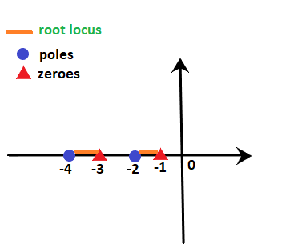
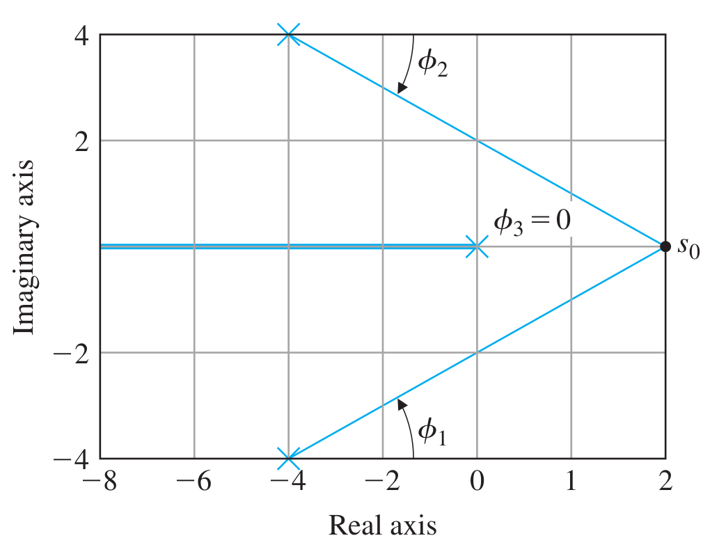
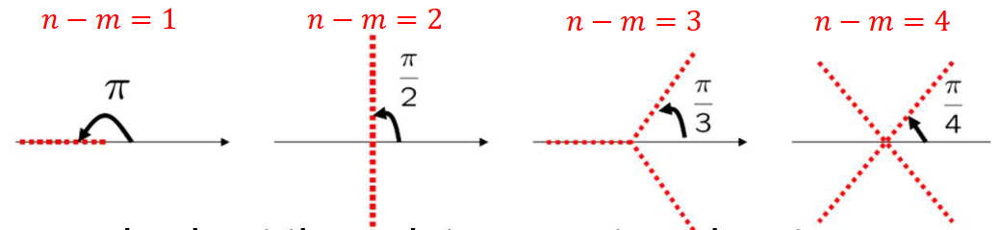
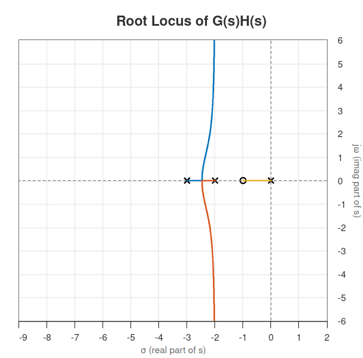
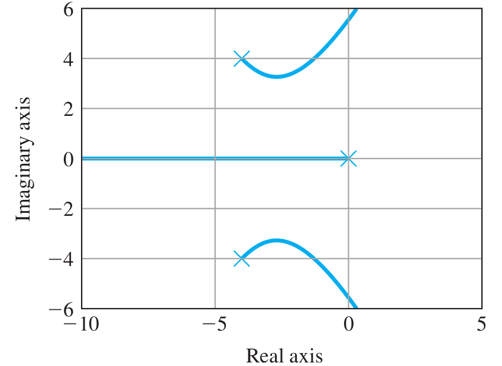
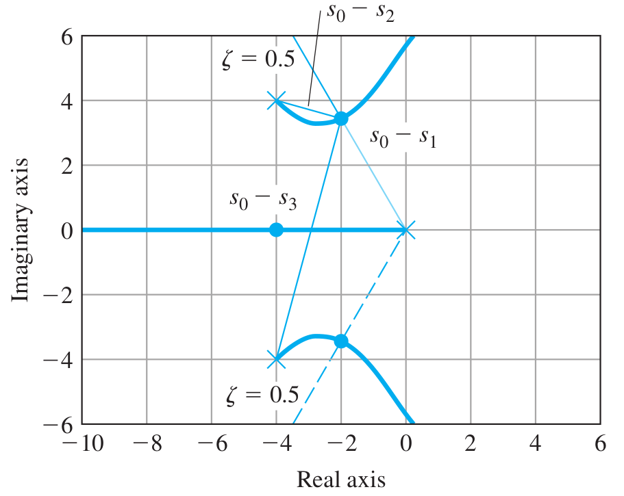

# Lecture 18, Mar 14, 2024

## Root Locus Determination

* Note due to complex conjugate roots, the locus is always symmetric about the real axis
* Given $L(s) = \frac{b(s)}{a(s)} = \frac{\prod _{i = 1}^n (s - z_i)}{\prod _{i = 1}^m (s - p_i)}$, a positive root locus follows the following rules:
	1. There are $n$ branches each starting from the open-loop poles; $m$ of these branches will end at the open-loop zeros of $L(s)$, while the rest go to infinity
		* $K \to 0$ means $a(s) + Kb(s) = 0$ is satisfied for $a(s) = 0$, hence the poles start at the open-loop poles
		* $K \to \infty$ means $L(s) = \frac{b(s)}{a(s)} = -\frac{1}{K}$ is satisfied for $b(s) \to 0$ or $a(s) \to \infty$
			* $m$ poles go to the open-loop zeros where $b(s) \to 0$
			* For the other $n - m$ poles, $b(s)$ does not have a zero, so we need $a(s) \to \infty$ to have $L(s) \to 0$
				* $a(s)$ will always outgrow $b(s)$ since the degree $n > m$ for causal systems
		* When poles and zeros are repeated, there are multiple branches departing from or arriving at these poles/zeros, one for each degree of multiplicity
	2. The segments of the locus on the real axis are always to the left of an odd number of real poles and zeros (on the real axis)
		* For any point on the real axis, the phase angles of conjugate poles or zeros cancel each other, so we need not consider them
		* For poles and zeros on the real axis, having a point to the left of an odd number of them gives a total phase of $180\degree$
			* Having one pole to the right gives a phase from that pole to the point of $180\degree$ as required
			* A pole and a zero on the right of the point cancel each other out in phase
			* Two poles or two zeros add to a phase of $\pm 360\degree$ and doesn't matter
		* This gives us all segments of the real axis included in the root locus
	3. For the $n - m$ poles that must go to infinity, their asymptotes are lines radiating from the real axis at $s = \alpha$ at angles $\phi _l$, where:
		* $\alpha = \frac{\sum _i p_i - \sum _i z_i}{n - m}$
		* $\phi _l = \frac{180\degree + 360\degree(l - 1)}{n - m}$
		* $l = 1, 2, \dots, n - m$ is the branch number
		* Geometrically this means that the asymptotes evenly divide the $360\degree$ and are always symmetric about the real axis; for an odd number of branches, there is always an asymptote towards the negative real axis
	4. Each branch departs at an angle of $\phi _{l, d} = \sum _i \psi _i - \sum _{i \neq l} \phi _i - 180\degree$ from an open-loop pole, where $\psi _i$ are the angles from zeros to the pole, and $\phi _i$ are angles from the other poles to the pole
		* Note this is exactly the phase condition we need for a point to be on the root locus
		* If the pole is repeated $q$ times, $q\phi _{l, d} = \sum _i \psi _i - \sum _{i \neq l} \phi _i - 180\degree - 360\degree(l - 1)$ for $l = 1, 2, \dots, q$
			* The directions are again spaced evenly apart
		* Similarly, the angles of arrival at a zero are $q\psi _{l, a} = \sum \phi _i - \sum _{i \neq l} \psi + 180\degree + 360\degree(l - 1)$
	5. At points where branches intersect (where the characteristic polynomial has repeated roots), if $q$ branches intersect at the point, then their departure angles are $\frac{180\degree + 360\degree(l - 1)}{q}$ plus an offset; together the $q$ branches arriving and $q$ branches departing should form an array of $2q$ evenly spaced rays
		* If the intersection is on the real axis, use Rule 2 to determine the orientation, otherwise use Rule 4
		* Note that it doesn't matter which branch breaks out at which angle
	6. The breakaway/break-in points of the locus (i.e. intersection points) are among points where $\diff{L(s)}{s} = 0$
		* Note that some of the solutions are not actually the breakaway/break-in points, so we need to test
		* To determine which of the solutions are actually intersection points, we can use geometry or check with the phase angle method for whether the point is on the locus
		* We can also substitute into $L(s)$ and check that we have a negative real result
		* If the multiplicity of the root of $\diff{L(s)}{s} = 0$ is $r$, then the multiplicity of the corresponding root in the closed-loop characteristic equation is $q = r + 1$ (i.e. $r + 1$ branches meet)

{width=40%}

{width=50%}

{width=65%}

* Example: characteristic equation $1 + K\frac{s + 1}{s(s + 2)(s + 3)} = 0$
	* $b(s) = s + 1, m = 1, z_1 = -1$
	* $a(s) = s(s + 2)(s + 3), n = 3, p_1 = 0, p_2 = -2, p_3 = -3$
	* From rule 1, there are 3 branches, starting from $s = 0, s = -2, s = -3$; one of the branches ends at $s = -1$ while the others go to infinity
	* From rule 2, the segments of the locus on the real axis are at $[-1, 0]$ and $[-3, -2]$
		* Note that the segment $[-1, 0]$ starts at a pole and ends at a zero, so we've found an entire branch
	* From rule 3:
		* Asymptotes radiate from $\alpha = \frac{\sum _i p_i - \sum _i z_i}{n - m} = \frac{0 - 2 - 3 + 1}{3 - 1} = -2$
		* Angles are $\phi _l = \frac{180\degree + 360\degree(l - 1)}{n - m} = 90\degree + 180\degree(l - 1) = 90\degree, 270\degree$
		* We have two asymptotes, one pointing vertically upward and one downward, intersecting the real axis at $s = -2$
	* From rule 5: departure angles are $\frac{180\degree + 360\degree(l - 1)}{2} = 90\degree, 270\degree$
	* From rule 6: $\diff{L}{s} = \frac{-2s^3 - 8s^2 - 10s - 6}{(s(s + 2)(s + 3))^2} = 0 \implies s = -2.46, -0.77 \pm j0.79$
		* From simple geometric intuition we see that $s = -2.46$ is the real breakaway point, but we can also check the other points and find that $K$ is not real

{width=40%}

### Example: Control Gain Selection

* Consider the open-loop transfer function $L(s) = \frac{1}{s((s + 4)^2 + 16)}$
* $b(s) = 1, m = 0, z_i = \emptyset$ and $a(s) = s^3 + 8s^2 + 32s, n = 3, p_i = 0, -4 \pm j4$
* In root locus form the characteristic equation is $1 + K\frac{1}{s((s + 4)^2 + 16)} = 0$
* Rule 1:
	* We can now mark out the start points of the root locus at $s = 0, s = -4 \pm j4$
	* All 3 branches go to infinity, since we have no zeros
* Rule 2:
	* The segment $(-\infty, 0]$ on the real axis is on the root locus since $p_1 = 0$; this is the complete branch for $p_1$
* Rule 3:
	* $\alpha = \frac{0 - 4 + j4 - 4 - j4}{3 - 0} = -2.67$
	* $\phi _l = \frac{180\degree + 360\degree(l - 1)}{n - m} = 60\degree, 180\degree, 300\degree$
* Rule 4:
	* $\phi _{1,d} = \sum _i \psi _i - \sum _{i \neq 1} \phi _i - 180\degree = 0 - (-45\degree + 45\degree) - 180\degree = -180\degree$
		* This matches what we had earlier; the entire branch of $p_1$ consists of the segment going left to minus infinity on the real axis
	* Similarly $\phi _{2,d} = -45\degree, \phi _{3,d} = +45\degree$
* Rule 6: omitted here, but if we take $\diff{L}{s} = 0$ we will find that none of the solutions are points on the locus, so there are no intersections
* Note that these 6 rules don't give us the complete shape, but we gain enough of an intuition about the behaviour of the roots for design

{width=50%}

* Now we want to select $K$ such that the system behaves like having $\zeta = 0.5$
	* This means the phase angle of the closed-loop poles should be $\sin^{-1}\zeta = 30\degree$ (or $\phi _{s_0} = 90\degree + 30\degree = 12\degree$)
	* Using this, we find the intersection with the root locus to find $s_0$
	* Now we can find $K$ as $K = \frac{1}{\abs{L(s_0)}} = \abs{s_0 - s_1}\abs{s_0 - s_2}\abs{s_0 - s_3}$

{width=50%}

* Note that this is a third-order system; the additional pole will increase the system's rise time and decrease its overshoot, since it makes the system more sluggish
	* When we select $\zeta = 0.5$, we are designing for the worst case of the overshoot

