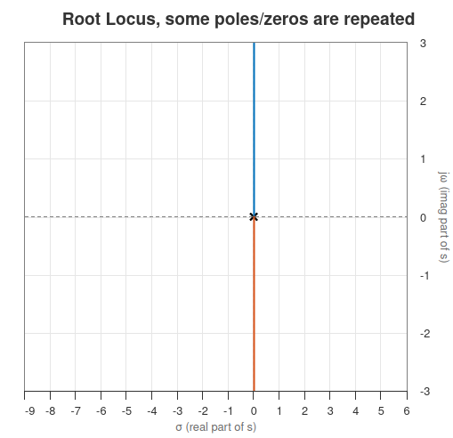
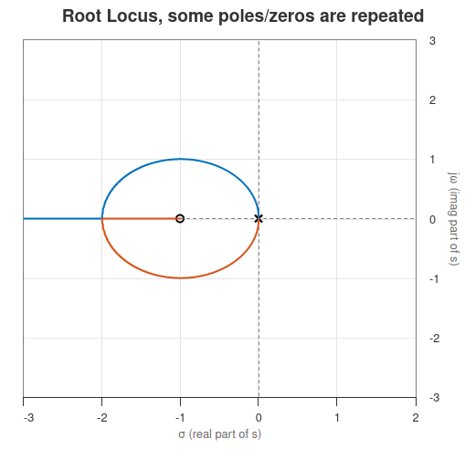
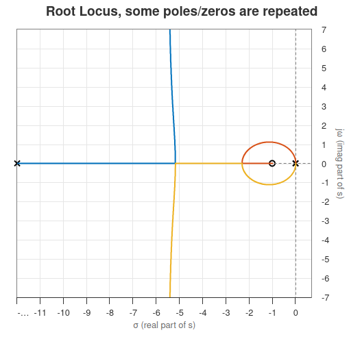
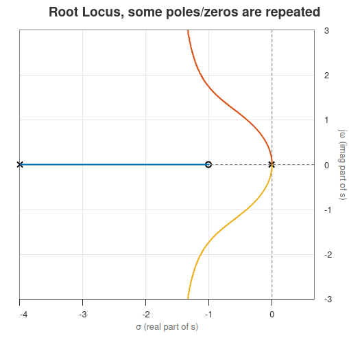
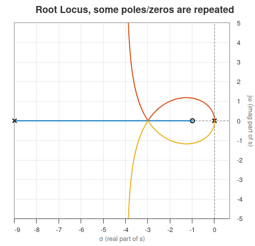

# Lecture 19, Mar 18, 2024

## Gain Selection from Root Locus

* Once we found a point on the root locus, $s_0$, that meets our requirements, we can find its value of $K$
* Since $L(s) = -\frac{1}{K}$ is the condition for the locus, $K = \frac{1}{\abs{L(s)}} = \frac{\abs{\prod _{i = 1}^n (s_0 - p_i)}}{\abs{\prod _{i = 1}^m (s_0 - z_i)}} = \frac{\prod _{i = 1}^n \abs{s_0 - p_i}}{\prod _{i = 1}^m \abs{s_0 - z_i}}$
	* These magnitudes of the difference of $s_0$ from the poles and zeros can be obtained geometrically by measuring the distance of $s$ from the roots and zeroes
* Once we have $K$, we can now solve for the values of $s$ that make $L(s) = -\frac{1}{K}$ to find all the roots of the closed-loop system (since we only get one root initially)
* To identify $s_0 = -\sigma + j\omega$ given $\zeta$:
	* We know $\frac{\omega}{\sigma} = \tan(\sin^{-1} \zeta)$
	* Substitute $s_0$ into $L(s) = -\frac{1}{K}$ and solve for the value of $K$
	* This will give us two equations, one for the real part (containing $K$), and another one for the imaginary part (which should equal 0)
	* Using the relation between $\sigma$ and $\omega$ we can solve for their values using the imaginary equation
	* Substitute these values back into the real equation to solve for $K$

## Example: 1-DoF Satellite Attitude Control

* Consider planar angular control of a satellite with a thruster generating a force $F_c$, and a disturbance $M_D$ causing an unwanted moment
* $T_C + M_D = F_Cd + M_D = I\ddot\theta$ where $d$ is the distance from the centre of mass to the thruster and $I$ is the satellite's moment of inertia
* Transfer function: assume $M_D = 0$, so $\frac{\Theta(s)}{T_C(s)} = G(s) = \frac{1}{Is^2} = \frac{A}{s^2}$
	* This a double-integrator
* Now consider an instrument attached to the satellite via a flexible boom, which can bend and vibrate
	* The total system has two degrees of freedom, the rotation of the satellite and the rotation of the instrument boom
	* The boom is modelled as a (rotational) spring-dashpot system between two discs
	* Bottom disc (attached to satellite): $T_C = I_1\ddot\theta _1 + b(\dot\theta _1 - \dot\theta _2) + k(\theta _1 - \theta _2)$
	* Top disc (attached to instrument): $0 = I_2\ddot\theta _2 + b(\dot\theta _1 - \dot\theta _1) + k(\theta _2 - \theta _1)$
	* We will simplify the system and assume $b = 0$
* Laplace transform:
	* $T_C = (I_1s^2 + k)\Theta _1(s) - k\Theta _2(s)$
	* $0 = -k\Theta _1(s) + (I_2s^2 + k)\Theta _2(s)$
* For this system, we can have two cases: either we want to control the attitude of the satellite, or the attitude of the instrument
	* $\frac{\Theta _1(s)}{T_C(s)} = \frac{I_2s^2 + k}{I_1I_2s^2\left(s^2 + \frac{k}{I_1} + \frac{k}{I_2}\right)}$
		* Here we are controlling the side attached to the satellite
		* This is the case of *collocated control*: both the actuator and the sensor dynamics are on one body
	* $\frac{\Theta _2(s)}{T_C(s)} = \frac{k}{I_1I_2s^2\left(s^2 + \frac{k}{I_1} + \frac{k}{I_2}\right)}$
		* Here we are controlling the instrument boom
		* This is the *non-collocated* case: the actuator and sensor are not on the body we want to control
	* Notice that the collocated case has 2 zeros, which the non-collocated case misses -- we will later see that the zeros in the first case make the control a lot simpler
* Consider a proportional controller $D_c(s) = k_P$ to control only the satellite without the boom, $\frac{\Theta}{T_C} = \frac{A}{s^2}$
	* Closed loop TF: $\frac{k_P\frac{1}{s^2}}{1 + k_P\frac{1}{s^2}}$ with characteristic equation $1 + k_P\frac{1}{s^2} = 0$
	* This is already in root locus form; $L(s) = \frac{1}{s^2} \implies b(s) = 1, a(s) = s^2$
	* Root locus determination:
		1. Two branches, both starting at $s = 0$, both going to infinity since there are no open-loop zeros
		2. No segments on the real axis; since both open-loop poles are at $s = 0$, for $s < 0$ we are on the left of 2 poles, and for $s > 0$ we are on the left of none
		3. Two asymptotes, intersecting at $\alpha = 0$ and at angles $\pm 90\degree$
		4. Branches have departure angles from $s = 0$ of $\pm 90\degree$ (one goes up, one goes down)
	* Notice that now all poles are on the imaginary axis -- no matter what we do, we get oscillations with no damping

{width=40%}

* Now consider using a PD controller $D_c(s) = k_P + k_Ds$
	* Closed loop TF: $\frac{(k_P + k_Ds)\frac{1}{s^2}}{1 + (k_P + k_Ds)\frac{1}{s^2}}$ with characteristic equation $1 + (k_P + k_Ds)\frac{1}{s^2} = 0$
	* Assume $k_D = K$ and $\frac{k_P}{k_D} = 1$, the characteristic equation is $1 + K\frac{s + 1}{s^2} = 0$
		* The derivative gain introduced an open-loop zero to the system
	* Root locus:
		1. Two branches, both starting at $s = 0$, one of them going to the zero at $s = -1$, and the other going to $\infty$
		2. On the real axis, everywhere to the left of $s = -1$ is a part of the root locus, since that is to the left of 2 poles and 1 zero
		3. One asymptote along the negative real axis
		4. Departure angles from double pole at $s = 0$ are $\pm 90\degree$
		5. Two branches on the real axis meet at $\pm 90\degree$
		6. Break-in point at $s = -2$
	* Notice that the additional zeros has "pulled" the root locus to the left, adding damping and allowing us to have a response that does not oscillate forever

{width=40%}

* However, in the real world any controller using a derivative gain is non-casual; implementing it in software will greatly amplify the noise in the system
	* To remedy this, we can try to add a denominator to the controller to make it casual
	* We add a factor in the denominator of $\frac{s}{p} + 1$
		* If we choose $p$ to be large, this will have little effect on the system response, but we can make the system causal and practically workable
		* We make the order of the denominator as small as possible to reduce sluggishness
* PD controller with *lead compensator*: $D_c(s) = k_P + \frac{k_Ds}{\frac{s}{p} + 1}$
	* $D_c(s) = k_P + \frac{pk_Ps}{s + p} = \frac{(k_P + pk_D)s + k_Pp}{s + p} = \frac{(k_P + pk_D)\left(s + \frac{k_Pp}{k_P + pk_D}\right)}{s + p}$
	* Let $k_P + pk_D = K$ and $\frac{k_Pp}{k_P + pk_D}$ so $D_c(s) = K\frac{s + z}{s + p}$
		* With the large $p$, the pole it introduces is very far in the negative real axis, so it has a very small effect on the overall system
	* Characteristic equation: $1 + D_c(s)G(s) = 1 + K\frac{s + z}{s^2(s + p)} = 0$
	* Consider the following cases of $p$ and $z$:
		* $z = 1$ and $p = 12$:
			* Root locus determination:
				1. 3 branches, two starting at $s = 0$, one starting at $s = -12$, one branch ends at $s = -1$, two at infinity
				2. Real axis $-12 \leq s \leq -1$ is on the locus
				3. 2 asymptotes centered at $-\frac{11}{2}$ at angles $\pm 90\degree$
				4. Departure angles at $s = 0$ are $\pm 90\degree$, at $s = -12$ is $0\degree$
				5. Break-in point at angle of $\pm 90\degree$
				6. Break-in point at $s = -2.3$ for the two branches starting at $s = 0$; two other branches depart at $s = -5.2$
			* We see that the root locus is close to that of just a PD controller
		* $z = 1$ and $p = 4$:
			* Now the root locus branches are pushed to the right, causing oscillatory responses
			* The pole being much closer means that it now starts to matter
		* $z = 1$ and $p = 9$:
			* For this in-between value we see that the new pole does impact the root locus, but the impact is smaller
		* As the pole gets closer to the zero, the branches begin to merge together
		* The pole should always be placed as far away as possible from the zero, but this has tradeoffs

{width=40%}

{width=40%}

{width=40%}

