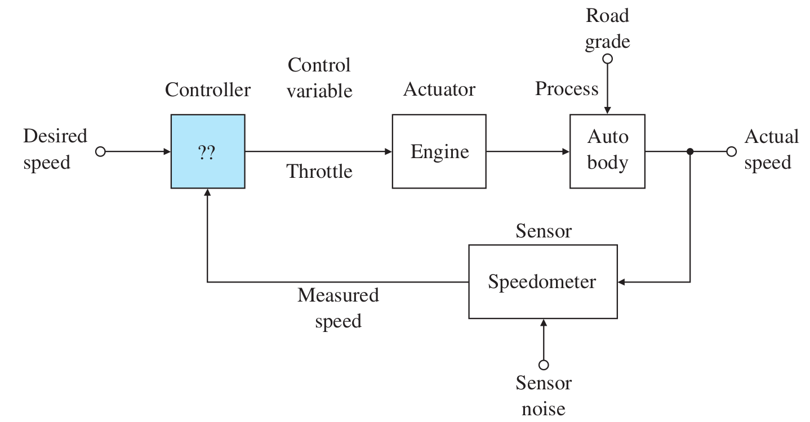
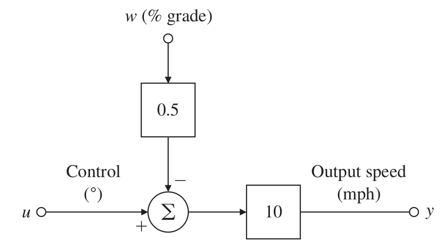
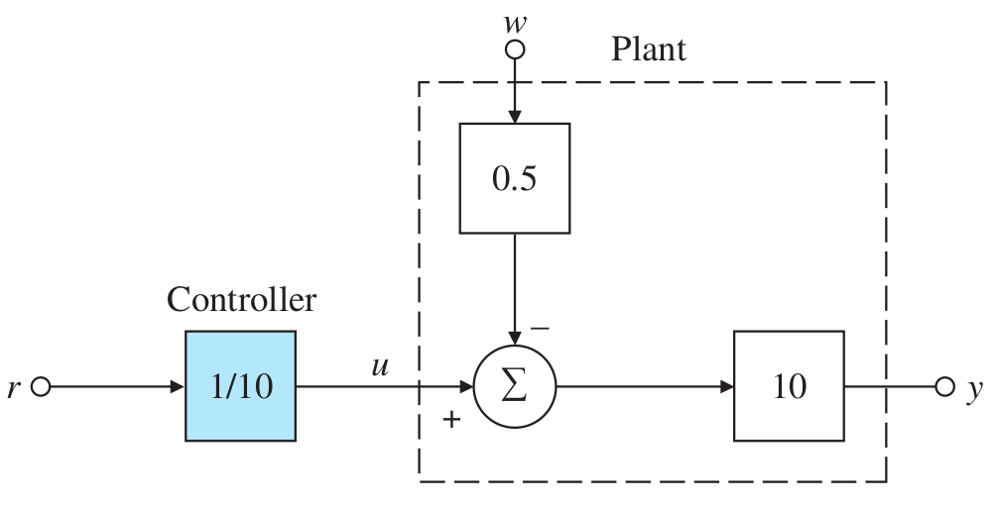
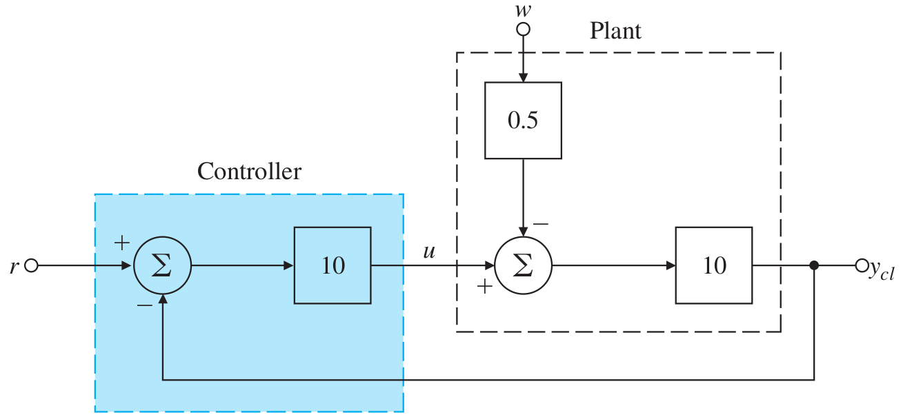

# Lecture 2, Jan 11, 2024

## Classic Feedback Control Example: Cruise Control

{width=60%}

{width=40%}

* This is an example of a *regulation* problem since we wish to maintain a fixed speed
* Simplified linear model: at a nominal speed of 60 mph, a 1 degree change in throttle angle (control command $u$) causes a 10 mph change in speed (output $y$)
	* Disturbance model: road grade change of 1% causes speed decrease of 5 mph (i.e. half the effect of a 1 degree throttle change)
	* Sensor model: speedometer is accurate and without noise, i.e. we get perfect measurements

{width=40%}

* Using open-loop control, we can simply scale down the setpoint by a factor of 10 since that is the plant gain
	* $y_{ol} = 10(u - 0.5w)$ so if we substitute $y_{ol} = \frac{r}{10}$, $y = r - 5w$
	* If there is no disturbance, the output is perfect, but if there is a road grade change, then we will always be off
	* Define the error as $e_{ol} = r - y_{ol} = 5w$
	* The percentage error is $\frac{e}{r} \times 100\%$
* For open-loop control, if $w \neq 0$, or if we don't know the plant gain exactly or the plant gain changes, then we will have error

{width=60%}

* Using closed-loop control:
	* $y_{cl} = 10(u - 0.5w) = 10(10(r - y_{cl}) - 0.5w) \implies y_{cl} = \frac{100}{101}r - \frac{5}{101}w$
	* Notice that the factor in front of $w$ is decreased significantly, so we are a lot less susceptible to disturbances
		* If we increase the gain, the effect of noise will be even smaller
	* However, with $w = 0$, we don't have $y_{cl} = r$, but it gets close
	* The error is $e = \frac{1}{100}r$, which reduces if we increase the gain
	* Generally, for a feedback system, we want to increase the gain which would generally decrease the error; however, for many systems increasing the gain makes the transient behaviour worse or even make the system unstable, which holds us back
* The *open-loop gain* of a system is the overall gain of the system (disregarding feedback), often equal to the product of the controller and plant gains
* We want to increase this gain as much as possible, but this involves a tradeoff between decreasing error and getting desirable transient behaviour/stability

## System Modelling

* *System*: A collection of components of interest, demarcated by a boundary, interacting through certain physical principles
	* *System parameters* $C$ are properties that define the components of the system
		* e.g. the resistance of a resistor, the mass of an object
	* *State variables* $X$ is the minimal set of variables that completely identify the "state" of the system at each moment
		* The minimality of this set is important!
		* Given system parameters, by knowing the input and state variables, the output can always be identified
		* For many systems, the output are the same as the state variables
		* e.g. positions and velocities of rigid bodies; voltages of nodes and currents through elements
* *Static systems* are where the output $Y(t)$ only depends on the input $U(t)$ at any time $t$, i.e. the state variables do not change; otherwise the systems are *dynamic*
	* Formulated as $Y(t) = H(U(t), C) \iff y_i(t) = h_i(u_1(t), \dots, u_m(t); c_1, \dots, c_k)$
	* When we given a input to a static system at time $t_1$, we get the output immediately also at time $t_1$
	* Dynamics systems' output also depend on the history of the input
	* Example: circuit with $R_1$ in series with $R_2, R_3$ in parallel; take output to be the voltage across $R_2, R_3$
		* The parameters are the resistance values
		* $y(t) = \frac{R_2R_3}{R_1(R_2 + R_3) + R_2R_3}u(t)$
		* Since the relationship does not depend on any state variables, the system is static
	* Static systems do not have any energy storage or dissipation elements; they don't have "memory"
* *Dynamic systems* are where the current value of the output depends on the past history as well as the present input; we can think of this as the state variables changing through time
	* $Y(t) = H(U(\tau), C), 0 \leq \tau \leq t \iff Y(t) = H(U(t), X(t), t, C)$
		* *Acausal* dynamic systems have outputs that can also depend on future inputs; however all physical systems are causal so we will not worry about this
	* Example: RC circuit
		* System parameters are $C$ and $R$
		* $y(t) = \frac{1}{C}\int i(t)\,\dt \implies i(t) = C\diff{y}{t}$
		* We can form an ODE $y(t) + RC\diff{y}{t}u(t)$
		* Assuming capacitor starts uncharged, $y(t) = u(t)\left(1 - e^{-\frac{t}{RC}}\right)$
* A *system model* is a simplified representation (or abstraction) of a physical system
	* A complete/universal model is often impossible and unnecessary, so in system modelling we abstract away certain details
	* An effective model is the simplest model that does the job
	* Modelling is useful for conceptual analysis (of the problem), controller design, and detailed simulation for verification (whether the model is correct) and validation (whether the design works in the real world) etc

