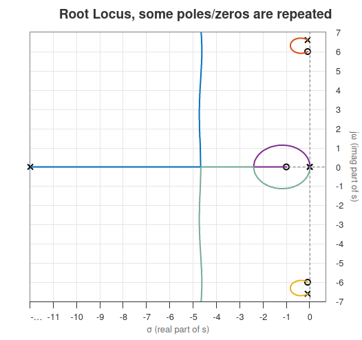
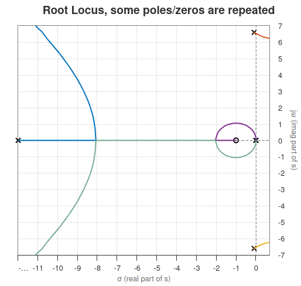
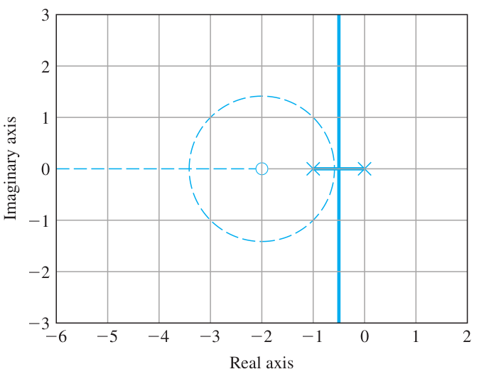
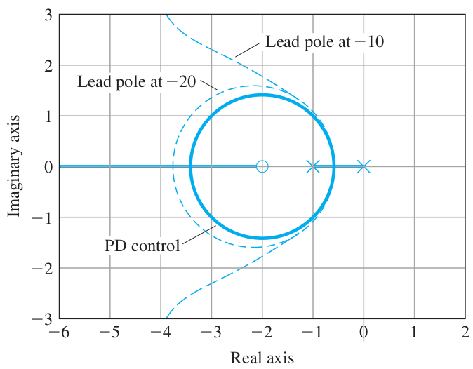

# Lecture 20, Mar 21, 2024

## Example: 1-DoF Satellite Attitude Control (Continued)

* Consider the case of collocated control ($\Theta _1$), with the previous lead compensator at $z = 1, p = 12$
	* The characteristic equation is $1 + K\frac{s + 1}{s + 12}\frac{(s + 0.1)^2 + 6^2}{s^2((s + 0.1)^2 + 6.6^2)} = 0$
	* The flexible mode adds two additional branches, but since it also has two zeros, the two new branches go to the new zeros
	* Even though the 2 new poles are closer to the imaginary axis and have less damping, because they are very close to zeros, they are mostly cancelled out
	* Therefore the response of the system is still mostly dominated by the same two poles as in the double-integrator case
		* The actual response will exhibit very small oscillations (added to the normal response) caused by the flexible modes
			* Since these are almost undamped, they will stay for a very long time
		* If the gain is very large, the dominating poles are now on the asymptote
	* Overall, the single flexible mode brings lightly damped roots
* Note that in the above we assumed that the open-loop zeroes are the same as the closed-loop zeros, which is only true when we have a unity feedback system

{width=40%}

* In the non-collocated case ($\Theta _2$), we are missing the two zeros
	* Because we don't have the zeros, the new branches now go to infinity instead of their zeros; the asymptotes make the poles go into the RHP, introducing instability
	* These poles are still barely in the LHP, so the system can still be stable for some gain values, but it is now unstable for larger gains
	* Furthermore these poles are no longer cancelled out by zeros, so they will dominate the system and introduce very high overshoot
	* This is why the non-collocated system is much harder to control

{width=40%}

## Design for Dynamic Compensation

* Lead compensator: $D_c(s) = K\frac{s + z}{s + p}$ where $z < p$
	* For a sinusoidal input, its output leads the input (output phase shift is positive)
	* Note that due to causality, the output doesn't start earlier than the input; but with a sustained sinusoidal input, the phase shift gradually approaches positive
	* This comes at a cost of some amplitude
	* Approximates PD control; speeds up response (lowering rise time) and decreases overshoot
* Lag compensator: $D_c(s) = K\frac{s + z}{s + p}$ where $z > p$
	* For a sinusoidal input, the output lags the input (negative phase shift)
	* The amplitude of the output is now larger than the input
	* Approximates PI control, decreasing steady-state controller
* Notch compensator: $D_c(s) = K\frac{s^2 + 2\zeta\omega _0s + \omega _0^2}{(s + \omega _0)^2}$
	* Attenuates the input around some unwanted frequency, acting as a band-stop filter
	* Enhances stability for plants with lightly damped flexible modes (cancels them out)
	* Typically has two complex zeros, which can capture problematic poles
		* Also has two real poles, but typically $\omega _0$ is large, so they are far out in the LHP and usually has little effect
* Note that all 3 compensator do not have any poles at the origin, so the type of the plant is unchanged by adding a compensator
* Consider the example plant $G(s) = \frac{1}{s(s + 1)}$, e.g. a servo mechanism

{width=40%}

{width=40%}

* Example: lead compensation
	* We typically start with the simplest possible controller first
	* Consider P control: $D_c(s) = K$
		* Since the asymptote is close to the imaginary axis, the damping is very low
		* If we want a certain $\omega _n$ for a certain rise time, we will have a large overshoot
		* e.g. for $\omega _n = 2 \implies \zeta = 0.25$
	* Now consider PD control: $D_c(s) = K(s + 2)$
		* Now for the same value of $\omega _n$, our poles will be on the circle, and $\zeta$ is significantly larger, improving damping without sacrificing speed
		* e.g. for $\omega _n = 2 \implies \zeta  = 0.75$
	* Now the lead compensator $D_c(s) = K\frac{s + 2}{s + p}$
		* As we've seen previously, depending on the location of the pole relative to the zero, we can get very different behaviour
		* For small $K$, the lead compensator approximates PD control well, regardless of where the pole is
		* For large $p$, the lead compensator also behaves like PD control
		* The additional pole slightly lowers damping (for the same $\omega _n$ we see that $\zeta$ is smaller)
			* This effect is negligible for low $K$ and large $p$
		* Typically, we place the zero near the desired closed-loop $\omega _n$ (0.25 to 1 times $\omega _n$) and the pole 5 to 25 times the value of the zero
			* The further $p$ is, the closer we get to PD; we get slightly better performance, but noise will increase

