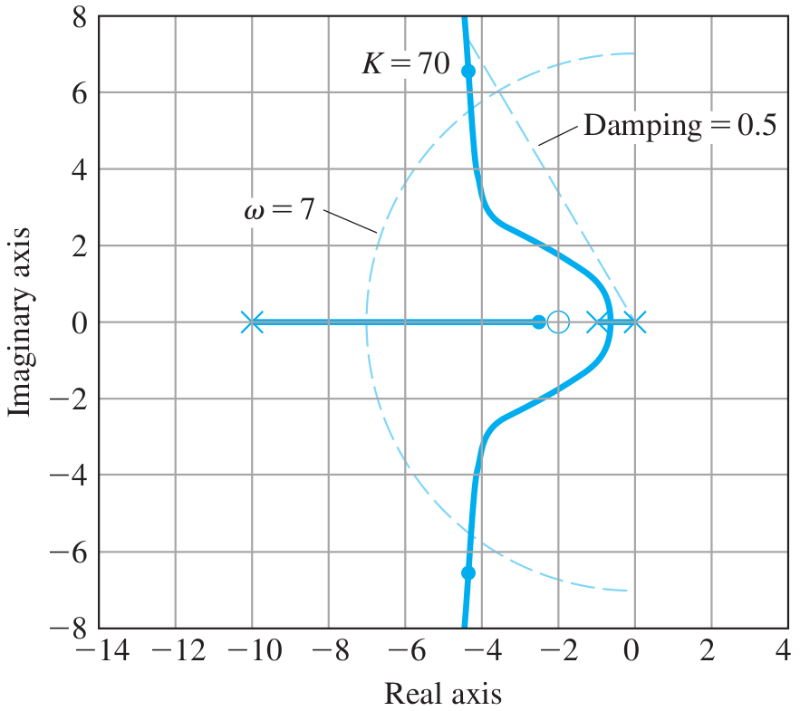
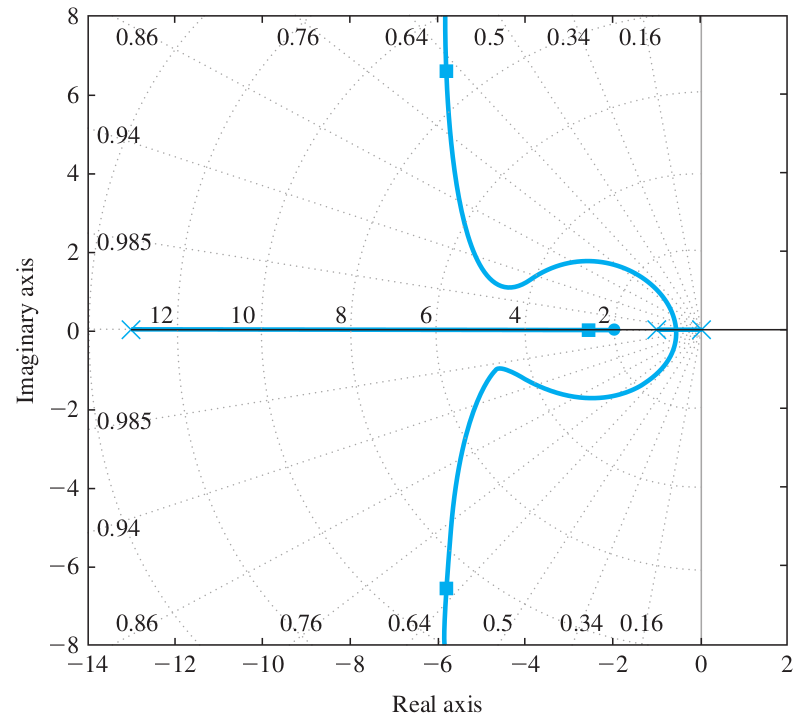
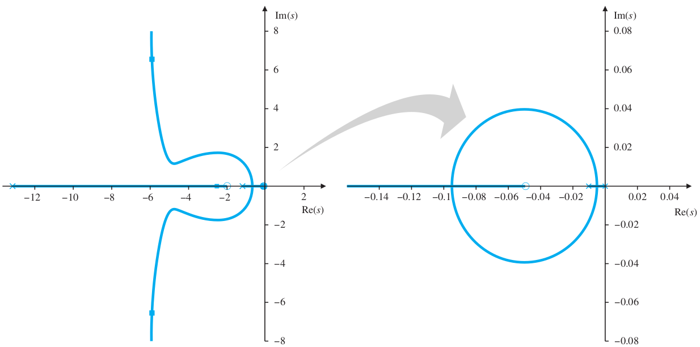
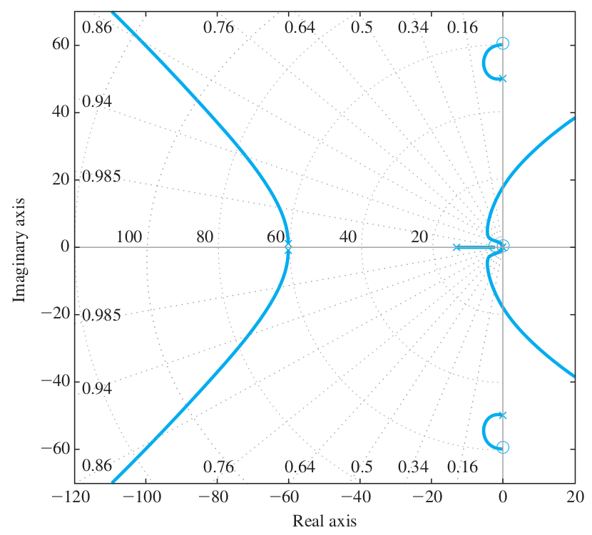
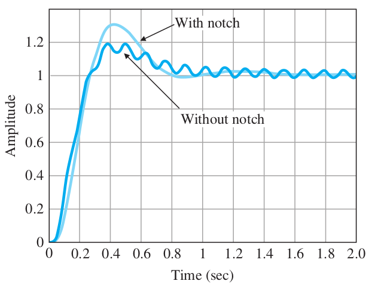

# Lecture 21, Mar 25, 2024

## Design for Dynamic Compensation (Continued)

### Lead Compensator

* Example: $G(s) = \frac{1}{s(s + 1)}$; design a lead compensator for the position control system to provide an overshoot of no more than 20% and rise time of no more than 0.3 seconds
	* This gives us a required damping ratio of $\zeta \geq 0.5$ and $\omega _n \geq \SI{6}{rad/s}$; we will choose $\omega _n \geq 7$ for some margin
	* Initial trial with $D_c(s) = K\frac{s + 2}{s + 10}$
		* We start with a zero at $s = -2$, since this is in the range of 1/4 to 1 times the natural frequency we want
		* Start with a pole of 10, at 5 times the location of the zero (recall rule of thumb was 5 to 25 times)
		* By drawing out the circle corresponding to $\omega _n = 7$ and the angle for $\zeta = 0.5$, we find a small segment on the root locus that gives the desired response
		* Note that the additional pole on the real axis is very close to a closed-loop zero (which are the same as the open-loop zeros due to unity feedback), so its effects are small
		* However, when we plot the response for $K = 70$ we see an overshoot of 22%
			* From here, we can try to lower $K$, but this is not the best option
			* We can increase the pole slightly, so the response is closer to that of a PD controller
			* We could also try to increase the zero, but we chose to increase the pole first since we have more range on it
	* Second trial with $D_c(s) = K\frac{s + 2}{s + 13}$
		* Now with a gain of $K = 91$ we have a controller with rise time of 0.19 seconds and overshoot of 17%

{width=40%}

{width=40%}

* In general when designing a closed-loop system, we typically start with a lead compensator:
	1. Determine where the closed-loop roots need to be to meet the desired physical response characteristics
	2. Create a root locus with only a proportional controller
	3. If more damping is needed, choose $z$ to be 1/4 to 1 times the desired $\omega _n$ and pick $p$ to be 5 to 25 times $z$
	4. If less damping is needed, decrease $p$; if more damping is needed, increase $p$ and/or decrease $z$
		* The ratio $p / z$ should be as low as possible (less than 25) in order to minimize the effects of noise from a derivative controller
	5. When values of $z$ and $p$ are found so that the root locus passes through the desired region, select the value of $K$ and check the step response
	6. Determine if the value of $K$ meets the steady-state error requirements; if a value of $K$ that meets the requirements cannot be found, add integral control or a lag compensator
* The lead compensator will make the steady-state error worse (for the same value of $K$)
	* The position constant is $K_p = \lim _{s \to 0} K\frac{s + z}{s + p}G(s) = K\frac{z}{p}\lim _{s \to 0} G(s)$
	* Since $p > z$, overall this makes $K_p$ smaller, making $e_{ss}$ larger
	* In order to reduce the steady-state error again, we want to introduce another term $\frac{s + z_2}{s + p_2}$ where $z_2 > p_2$, so the position constant is increased
		* This is the idea behind the lag compensator

### Lag Compensator

* Lag compensation has a similar effect as an integrator in decreasing the steady-state error at low frequencies, without affecting the transient response created by the lead compensator
	* The position/velocity/acceleration constant is increased by a factor equal to $z / p$ per the above discussion
	* The ratio $z / p$ is typically between 3 to 10; anything more than this could affect the transient response
	* We choose the value of $p$ and $z$ to be extremely small (100-200 times smaller than the closed-loop $\omega _n$), so $\frac{s + z}{s + p} \approx 1$ for any nonzero $s$, therefore it won't affect the transient response
	* Note that we need to be mindful of the resolution of our controller; if $z$ and $p$ are too small, it may not be practically implementable
* Example: Increase $K_v$ for the previous system to decrease the steady-state error, without changing its transient response
	* Lag compensator $D_{c2}(s) = \frac{s + z}{s + p}$ where $z > p$
	* Uncompensated $K_v = \lim _{s \to 0} sD_{c1}(s)G(s) = 14$ so $e_{ss} = \frac{1}{14}$
	* Suppose we want to increase $K_v$ to 70, so we need $\frac{z}{p} = \frac{70}{14} = 5$
	* Choose $z = 0.05, p = 0.01$
	* On the root locus, this adds a very small circle near the origin; the overall root locus is almost unchanged

{width=70%}

* Lag compensator design process:
	1. Determine the amount of gain amplification we want to achieve the desired error constant, and determine the ratio $z / p$
	2. Select the value of $z$ to be approximately 100 to 200 times smaller than the system's dominant natural frequency
	3. Plot the resulting root locus and verify that it is still satisfactory and adjust $z$ and $p$ as necessary
	4. Plot the step input to verify that the time domain response is still satisfactory
		* If the slow root of the lag compensator is too slow, increase $z$ and $p$ while keeping their ratio constant
		* Note that the closer $z$ and $p$ are to the dominant poles, the more effect they will have on the transient response

### Notch Compensator

* A notch compensator is used to dampen the oscillation at some specific resonant frequency, e.g. due to a flexible mode in non-collocated control
	* The overall system response will have been handled by the other controllers; the notch compensator acts like a filter
	* Has form $\frac{s^2 + 2\zeta\omega _0s + \omega _0^2}{(s + \omega _0)^2}$
	* The two real zeros cancel out the undesirable oscillatory poles in the system
	* The real poles are introduced so that the controller is causal and has a DC gain of 1, so the steady-state response is unaffected
	* Choose $\omega _0$ to be very large as to not affect the transient response
* The position of the zero relative to the undesirable pole needs to be chosen to ensure that the resulting root locus is entirely in the LHP
	* Whether the zero should above or below the pole depends on the system
* Example: assume that the system has a flexible mode, so $G(s) = \frac{1}{s(s + 1)} \cdot \frac{2500}{(s^2 + s + 2500)}$
	* The poles that were added are approximately $-0.5 \pm j50$; they are dominant and very lightly damped
	* Assume that we have the same lead-lag compensator from before
	* Add notch compensation $D_{c3}(s) = \frac{s^2 + 2\zeta\omega _0s + \omega _0^2}{(s + \omega _0)^2} = \frac{s^2 + 0.8s + 3600}{(s + 60)^2}$
		* The zeros are at approximately $-0.4 \pm j60$
			* Notice that zero is close to the pole but not exactly on it
			* The imaginary part is above the undesirable pole so that the root locus is entirely in the LHP
			* Typically the zero is chosen to be a little bit closer to the imaginary axis than the undesirable pole
		* The new poles we introduced at $s = -60$ are very far so they do not have any effect
* In practice, a notch compensator will often increase the overshoot, so we may need to iterate on the design
* Note practically, we design lead first, then notch, and finally lag, because the notch compensator affects the design of the lag compensator

{width=40%}

{width=40%}

### Example: Quadrotor Drone Control (Pitch Axis)

* $G(s) = \frac{1}{s^2(s + 2)}$
	* The double integrator represents a delay
* From the root locus we can see that with a proportional controller, the system is unstable for any value of $K$, since we have two branches going into the RHP
	* Adding a lead compensator $D_c(s) = K\frac{s + 1}{s + 10}$ pushes the root locus to the left, making the system stable
* Consider non-collocated behaviour where there is flexibility between the actuators and the body, so we introduce a flexible mode
* $G(s) = \frac{1}{s^2(s + 5)} \cdot \frac{225}{((s + 0.1)^2 + 15^2)}$
* Goal: $t_r \leq \SI{1}{s}, M_p \leq 40\%, t_s \leq \SI{10}{s}, K_a \geq \SI{12}{rad}$ without high frequency oscillations in response
	* We can recognize that the system is type 2 due to the $s^2$ in the denominator, and adding compensators does not change the system type
* This translate to $\omega _n \geq \SI{1.8}{rad/s}, \zeta \geq 0.3, \sigma \geq 0.46$; we also need a lag and notch filter
* Proportional controller is again unstable with any gain
* Lead compensator: choose $z = 0.5$ (approximately $0.3\omega _n$), $p = 10$ (20 times the zero) so $D_{c1}(s) = \frac{s + 0.5}{s + 10}$
	* From the root locus we see that $K = 80$ is appropriate
	* Plotting the step response gives us a satisfactory overshoot and rise time
* Notch compensator: $D_{c3}(s) = \frac{(s + 0.05)^2 + 16^2}{(s + 16)^2}$
	* This cancels out the unwanted oscillations but slightly affects the transient response
	* Modify the lead compensator slightly to compensate
	* $K_a = \lim _{s \to 0}s^2D_{c1}(s)D_{c3}(s)G(s) = 0.58$
* Lag compensator: need a ratio $\frac{z}{p} \geq \frac{12}{0.58} = 20.7$ so choose $D_{c2}(s) = \frac{s + 0.02}{s + 0.001}$
	* Modify the control gain as necessary

