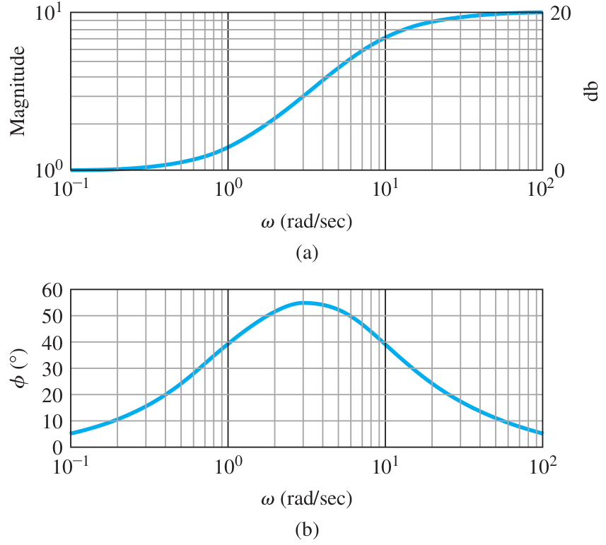
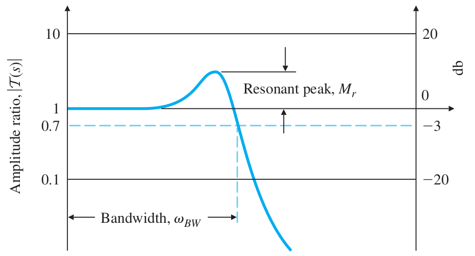

# Lecture 22, Mar 28, 2024

## Frequency Response Design Method

* For a (stable) LTI system $G(s)$, the steady-state response to an input $u(t) = A\sin(\omega _0t)1(t)$ is given by $y_{ss}(t) = A\abs{G(j\omega _0)}\sin(\omega _0t + \angle G(j\omega _0))$
	* The response is a sinusoid of the same frequency, scaled by a factor of $\abs{G(j\omega _0)}$ (the magnitude of the transfer function, known as the *gain* or *amplitude/magnitude ratio*), with a phase shift of $\angle G(j\omega _0)$ (the phase of the transfer function)
	* Knowing the magnitude $M(\omega)$ and phase $\phi(\omega)$ of $G(j\omega)$ for all possible frequencies $\omega$ fully specifies the transfer function
* In general, the complete response is the sum of a number of exponentials and a sinusoid; since the system is stable, all the exponentials decay to 0 as $t \to \infty$ and we are only left with the sinusoid
* Example: RC circuit, output $y(t)$ is the voltage across the capacitor, input $\mathcal Ku(t)$ is an input voltage that is sinusoidal
	* $RC\diff{y}{t} + y(t) + \mathcal Ku(t) \implies \diff{y}{t} + ky(t) = u(t)$ where $k = \frac{1}{RC}$, assuming $\mathcal K = RC$
	* $G(s) = \frac{1}{s + k}$
	* Given $u(t) = \sin(10t)1(t)$, $U(s) = \frac{10}{s^2 + 100}$
	* At $s = j10$, $\abs{G(j10)} = \frac{1}{\sqrt{1^2 + 10^2}}$ and $\angle G(j10) = -\tan^{-1}\left(\frac{10}{1}\right)$
	* Therefore the response is $y(t) = \frac{1}{\sqrt{101}}\sin(10t - \tan^{-1}(10))$
* Example: lead network $D_c(s) = K\frac{T_s + 1}{\alpha T_s + 1}$ for $\alpha < 1$
	* Note that this is mathematically identical to the form of the lead compensator we had before, but this form is more common and convenient for frequency response design
		* The zero is at $\frac{1}{T}$, the pole at $\frac{1}{\alpha T}$ and the gain is $\frac{K}{\alpha}$
	* Frequency response: $D_c(j\omega) = K\frac{T_j\omega + 1}{\alpha Tj\omega + 1}$
	* Gain: $M = \abs{K}\frac{\sqrt{1 + \omega^2T^2}}{\sqrt{1 + \alpha^2\omega^2T^2}}$
	* Phase: $\phi = \tan^{-1}(\omega T) - \tan^{-1}(\alpha\omega T)$
	* For $\omega \to 0$, we have $M \to \abs{K}$ and $\phi \to 0$
	* For $\omega \to \infty$ we have $M \to \abs*{\frac{K}{\alpha}}$ and $\phi \to 0$

{width=50%}

* The gain and phase for a range of values of $\omega$ can be summarized in a *Bode plot*
	* The top plot is the magnitude plot; the bottom plot is the phase plot
	* The bode plot is log-log for magnitude and semi-log for phase
		* Using a log-log plot for gain allows us to cover a wide range of $\omega$ and gain, and also allows us to simply add up the magnitude plots of transfer functions to get the final plot, since multiplication of gains is just addition of logs
	* The vertical axis of the magnitude plot often uses decibels, $\si{dB} = 20\log\abs{G(j\omega)}$
* Note in MATLAB, `bode(sys, w)` gives `[mag, phase]`, which we can plot to get the Bode plot
	* Use `logspace()` to get the points for `w`

### System Behaviour From Frequency Response

* The gain and phase of the system's frequency response completely determines the behaviour of the system; we design using it just like we design using the root locus
	* The root locus is to the root locus design method as the Bode plot is to the frequency design method
* Typical closed-loop systems exhibit a low-pass filter behaviour
	* The gain is close to 1 at lower frequencies, i.e. the output follows the input well
	* Beyond a certain frequency, the gain deviates from 1; for most systems, it increases first before decreasing
	* For most systems when the frequency gets very large the gain approaches 0, i.e. the output stops following the input at all
* The *bandwidth* $\omega _{BW}$ is defined as the highest frequency $\omega$ where the output still tracks the (sinusoidal) input in a satisfactory manner
	* Traditionally we define this to be when the gain hits $\sqrt{2}/2 = 0.707$
	* This is known as the *half-power point*; if the gain is a voltage gain, then at this point, the power of the response will be only half
	* A higher bandwidth means a faster response -- the larger $\omega _{BW}$ is, the larger $\omega _n$ is and the shorter our rise and peak times
* The *resonant peak* $M_r$ is the maximum value of the amplitude ratio
	* $M_r$ has a direct relationship with $\zeta$, so we can estimate the damping and overshoot of the system from $M_r$
* When we design a controller, we examine its bode plot and tune the gains to get the desired bandwidth and resonant peak, just like we identify pole locations on a root locus

{width=50%}

