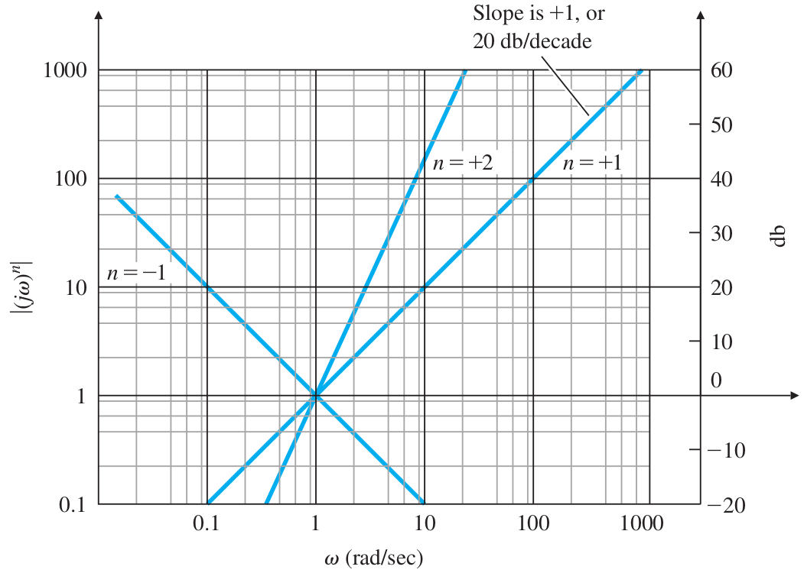
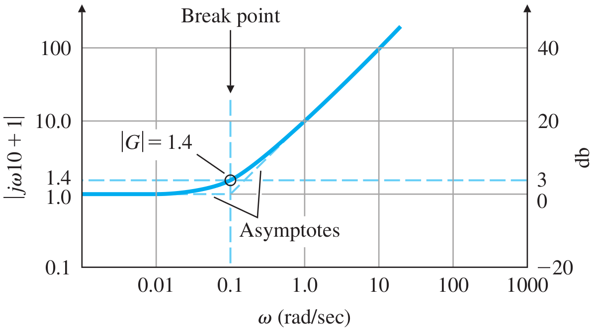
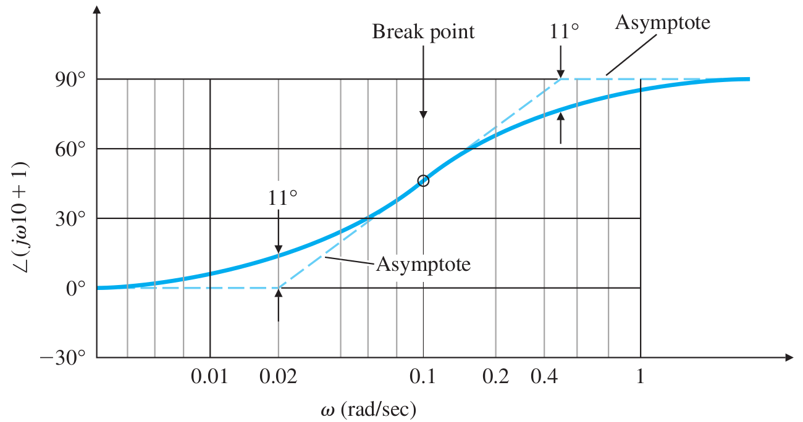
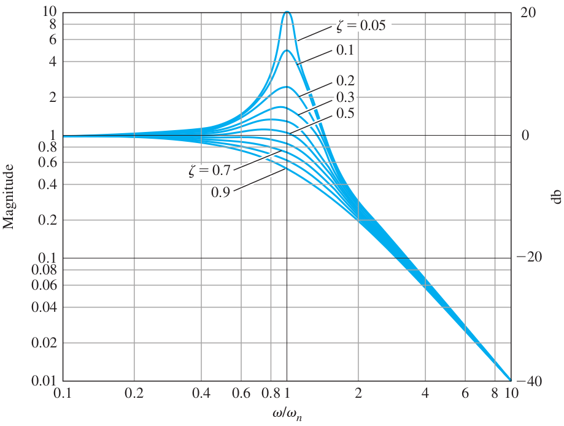
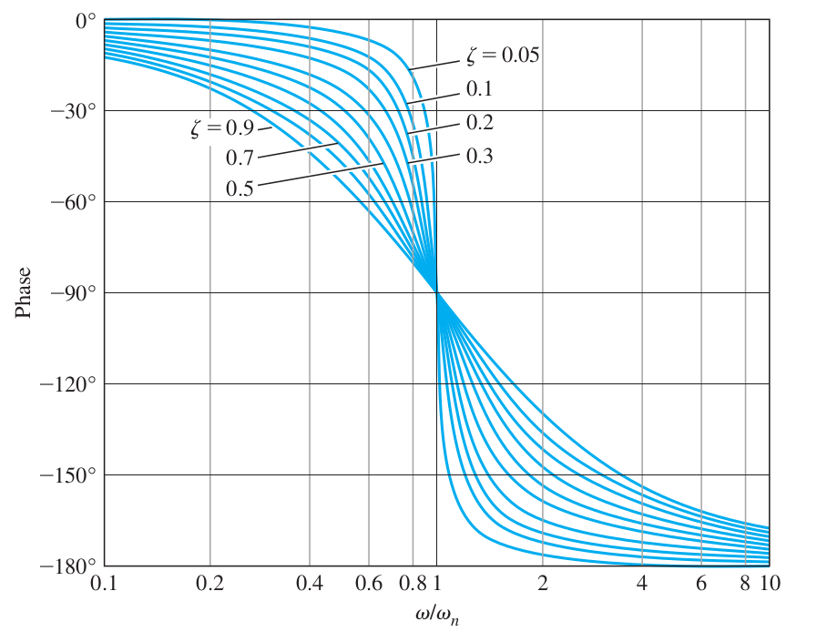
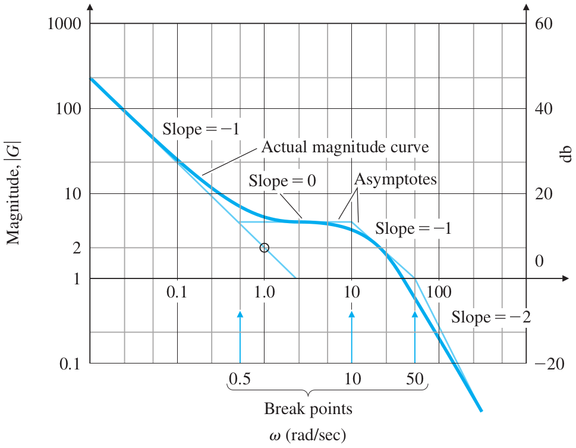
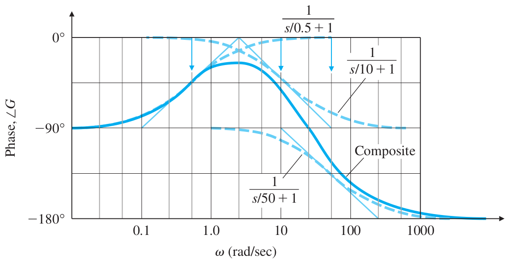
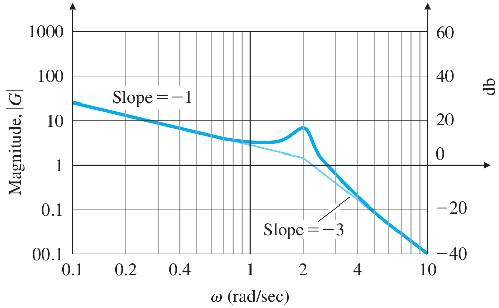
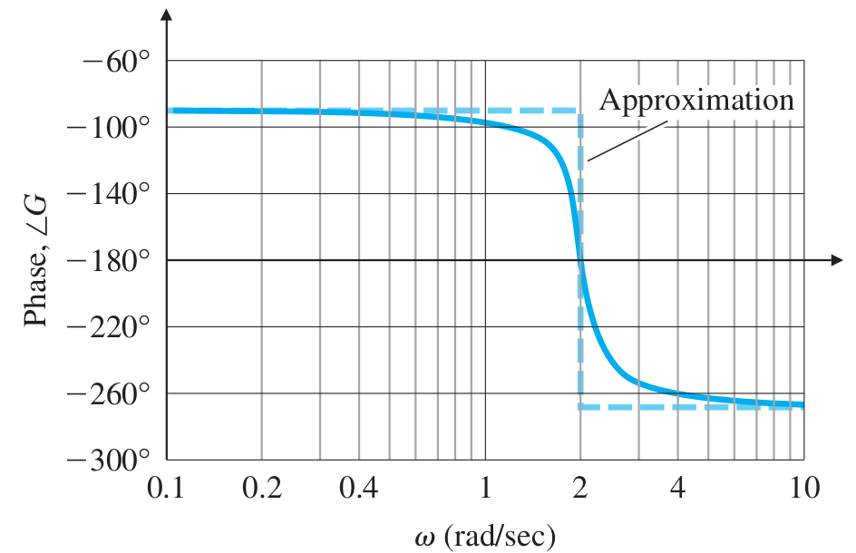

# Lecture 23, Apr 1, 2024

## Plotting Bode Plots

* Consider a general transfer function $G(s) = K\frac{(s + z_1)\dots(s^2 + 2\zeta _1\omega _{n1}s + \omega _{n1}^2)\dots}{(s + p_1)\dots(s^2 + 2\zeta _a\omega _{na}s + \omega _{na}^2)}$
	* $z_i$ and $p_i$ are real; the complex poles and zeros are in the quadratic factors, represented by their natural frequencies and damping ratios
* Rearrange as $G(s) = K_0s^n\frac{(\tau _1s + 1)(\tau _2s + 1)\dots\left(\left(\frac{s}{\omega _{n1}}\right)^2 + 2\zeta _1\left(\frac{s}{\omega _{n1}}\right) + 1\right)\dots}{(\tau _as + 1)(\tau _bs + 1)\dots\left(\left(\frac{s}{\omega _{na}}\right)^2 + 2\zeta _a\left(\frac{s}{\omega _{na}}\right) + 1\right)\dots}$
	* We factor out the poles and zeros at the origin to $s^n$, where $n$ could be positive or negative
	* $\tau _1, \tau _2, \dots$ correspond to the real zeros, $\tau _a, \tau _b, \dots$ correspond to the real poles
	* $\omega _{n1}, \omega _{n2}, \dots$ and $\zeta _1, \zeta _2$ correspond to the complex zeros; $\omega _{na}, \omega _{nb}, \dots$ and $\zeta _a, \zeta _b$ correspond to the complex poles
	* Substitute $s = j\omega$: $G(s) = K_0(j\omega)^n\frac{(j\omega\tau _1 + 1)(j\omega\tau _2 + 1)\dots\left(\left(\frac{j\omega}{\omega _{n1}}\right)^2 + 2\zeta _1\left(\frac{j\omega}{\omega _{n1}}\right) + 1\right)\dots}{(j\omega\tau _a + 1)(j\omega\tau _b + 1)\dots\left(\left(\frac{j\omega}{\omega _{na}}\right)^2 + 2\zeta _a\left(\frac{j\omega}{\omega _{na}}\right) + 1\right)\dots}$
	* This is the *Bode form* of the transfer function
* The Bode form is a composite of simpler transfer functions of the 3 classes:
	1. $K_0(j\omega)^n$ where $n \in \integers$
	2. $(j\omega\tau + 1)^{\pm 1}$ (if the power is 1, then it is numerator class 2, while power -1 is denominator class 2)
	3. $\left(\left(\frac{j\omega}{\omega _n}\right)^2 + 2\zeta\left(\frac{j\omega}{\omega _n}\right) + 1\right)^{\pm 1}$ (power 1 \textrightarrow{} numerator class 3; -1 \textrightarrow{} denominator class 3)
* To find the bode plot of a composite transfer function, we plot the Bode plots of each of the individual classes, and sum them up, since multiplication is addition of logs
* Class 1: $K_0(j\omega)^n$
	* Magnitude: $\log K_0\abs{(j\omega)^n} = \log K_0 + n\log\omega$
		* The magnitude plot is a straight line with slope $n$ (or $n$ times 20 decibels per decade)
			* For $\omega = 1$, the value of the gain is $\log K_0$
		* For very low values of $\omega$ we will see that this is the only class that affects the slope of the Bode plot
	* Phase: $\angle K_0(j\omega)^n = n \cdot 90\degree$
		* The phase plot is a constant value, determined by $n$

{width=60%}

* Class 2: $(j\omega\tau + 1)^{\pm 1}$
	* For $\omega\tau \ll 1$, $(j\omega\tau + 1)^{\pm 1} \approx 1$
	* For $\omega\tau \gg 1$, $(j\omega\tau + 1)^{\pm 1} \approx (j\omega\tau)^{\pm 1}$
	* The *break point* is defined as $\omega = \frac{1}{\tau}$
	* Magnitude:
		* Below the break point, the gain is approximately a constant 1
		* Above the break point, the gain behaves like a class 1 term of $\tau^{\pm 1}(j\omega)^{\pm 1}$
			* The slope is a constant 1 or -1 (or $\pm 20$ decibels per decade) for this asymptote
			* The intercept is at $\tau^{\pm 1}$
		* At the break point, the gain is a factor of 1.41 (or 3 decibels) above for numerator class 2, or 0.707 (or -3 decibels) below for denominator class 2
			* At the break point, $\abs{j\omega\tau + 1}^{\pm 1} = \abs{j + 1}^{\pm 1} = \sqrt{2}^{\pm 1}$
	* Phase:
		* Below the break point, the phase is $\angle 1 = 0\degree$
		* Above the break point, the phase is $\angle (j\omega\tau)^{\pm 1} = \pm 90\degree$
		* At the break point, the phase is $\angle (j + 1)^{\pm 1} = \pm 45\degree$
		* The middle asymptote intersects the lower and upper asymptotes at 5 times above and below the break point
		* At the intersection of asymptotes, the actual phase deviates from the asymptotes by about $\angle (j/5 + 1)^\pm 1 = \pm 11\degree$
	* For very low frequencies, class 2 gives a gain of 1 and phase of 0, so it has no effect on the Bode plot of the composite function
		* Rule of thumb is to ignore for $\omega$ a factor of 10 or more below the break point

{width=50%}

{width=60%}

* Class 3: $\left(\left(\frac{j\omega}{\omega _n}\right)^2 + 2\zeta\left(\frac{j\omega}{\omega _n}\right) + 1\right)^{\pm 1}$
	* The break point is $\omega = \omega _n$
	* For $\omega \ll \omega _n$, $\left(\left(\frac{j\omega}{\omega _n}\right)^2 + 2\zeta\left(\frac{j\omega}{\omega _n}\right) + 1\right)^{\pm 1} \approx 1$
	* For $\omega \gg \omega _n$, $\left(\left(\frac{j\omega}{\omega _n}\right)^2 + 2\zeta\left(\frac{j\omega}{\omega _n}\right) + 1\right)^{\pm 1} \approx \left(\frac{j\omega}{\omega _n}\right)^{\pm 2}$
	* Magnitude:
		* For $\omega \ll \omega _n$ the gain is again approximately 1
		* For $\omega \gg \omega _n$ the gain behaves like a class 1 term of $\frac{1}{\omega _n^{\pm 2}}(j\omega)^{\pm 2}$
			* The slope is a constant $\pm 2$ (or $\pm 40$ decibels per decade)
		* The transition between the two asymptotes depends on $\zeta$
			* At the break point, the magnitude is a factor of $(2\zeta)^{\pm 1}$ above/below a gain of 1
				* For $\omega = \omega _n$, $(j^2 + 2\zeta + 1)^{\pm 1} = (2\zeta)^{\pm 1}$
			* For a power of $+1$ the magnitude goes down at the break point, while for $-1$ the magnitude goes up
		* The peak has a magnitude of $\frac{1}{2\zeta\sqrt{1 - \zeta^2}}$ and occurs at $\omega _r = \omega _n\sqrt{1 - 2\zeta^2}$
			* This can be obtained by differentiating the expression for the magnitude
			* For values of $\zeta > \frac{1}{\sqrt{2}}$, the resonant peak does not exist
			* The smaller $\zeta$ is, the closer the peak is to $\omega _n$ and the larger the magnitude of the peak
	* Phase:
		* For $\omega \ll \omega _n$, $\angle 1 = 0\degree$
		* For $\omega \gg \omega _n$, $\angle(j\omega)^{\pm 2} = \pm 180\degree$
		* For $\omega \approx \omega _n$, $\angle (\pm j2\zeta) = \pm 90\degree$
		* The smaller the $\zeta$, the faster the phase will transition between $0\degree$ and $\pm 180\degree$
			* For $\zeta = 0$, the transition is essentially a step function and the change is an instantaneous jump
			* For $\zeta = 1$, we just have a multiplication of two class 2 terms with the same break point

{width=55%}

{width=55%}

* Process for plotting a composite Bode plot:
	1. Manipulate the transfer function into Bode form to identify all break point frequencies
	2. Plot the low-frequency asymptote: Determine the value of $n$ for the class 1 term and plot its magnitude as a line with slope of $n$ passing through $K_0$ at $\omega = 1$
	3. Draw the asymptotes for the magnitude plot: Extend the low-frequency asymptote until the next break point, then change the slope by $\pm 1$ or $\pm 2$ depending on the class of the break point and whether it is numerator or denominator; repeat until all break points are accounted for
	4. Correct the magnitude values at break points:
		* For class 2, increase the magnitude by a factor of $1.41$ (numerator) or decrease by a factor of $0.707$ (denominator)
		* For class 3, change by a factor of $(2\zeta)$ (numerator) or a factor of $\frac{1}{2\zeta}$ (denominator)
		* Note these values may change of break points are close together; if break points are less than a factor of 10 away, the break point offsets are inaccurate
	5. Plot the low-frequency asymptote of the phase curve: $\phi = n \cdot 90\degree$
	6. Draw the horizontal asymptotes for phase: Change the value of the phase asymptote by $\pm 90\degree$ for class 2 break points and $\pm 180\degree$ for class 3 break points for each break point in ascending order
	7. Determine intermediate asymptotes for each break point
	8. Add each phase curve together graphically
* Example: $G(s) = \frac{2000(s + 0.5)}{s(s + 10)(s + 50)}$
	* $G(s) = 2s^{-1}\frac{\left(\frac{s}{0.5} + 1\right)}{\left(\frac{s}{10} + 1\right)\left(\frac{s}{50} + 1\right)}$
	* Class 1: $2(j\omega)^{-1}$
	* Class 2: $\left(\frac{j\omega}{0.5} + 1\right)$ with break point $0.5$, $\left(\frac{j\omega}{10} + 1\right)^{-1}$ with break point $10$, $\left(\frac{j\omega}{50} + 1\right)^{-1}$ with break point $50$
	* Steps:
		1. Bode form: $2(j\omega)^{-1}\frac{\left(\frac{j\omega}{0.5} + 1\right)}{\left(\frac{j\omega}{10} + 1\right)\left(\frac{j\omega}{50} + 1\right)}$
		2. From the class 1 term: At $\omega = 1$, the gain is 2; the slope is -1
		3. Continue the slope of $-1$ until the first break point $0.5$, then increase slope by 1 (to 0); next break point is at $10$, decrease slope by 1 (to -1); next break point is at $50$, decrease slope by 1 (to -2)
		4. Increase magnitude by a factor of $1.41$ at break point $0.5$; decrease by a factor of $0.707$ at break point $10$; decrease by a factor of $0.707$ at break point $50$
		5. Low-frequency phase asymptote: $\phi = -90\degree$
		6. Increase phase by $90\degree$ at $\omega = 0.5$ (to $0\degree$), decrease by $90\degree$ at $10$ (to $-90\degree$), decrease by another $90\degree$ at $50$ (to $-180\degree$)
		7. Draw the phase curves for the individual terms
		8. Graphically add the individual phase curves to obtain the final phase plot

{width=60%}

{width=65%}

* Example: $G(s) = \frac{10}{s(s^2 + 0.4s + 4)}$
	1. Bode form: $G(j\omega) = 2.5(j\omega)^{-1}\frac{1}{\left(\left(\frac{j\omega}{2}\right)^2 + 2(0.1)\left(\frac{j\omega}{2}\right) + 1\right)}$
	2. Class 1 term: $2.5(j\omega)^{-1}$
		* First asymptote with slope of -1 having a value of $2.5$ at $\omega = 1$
	3. Class 3 term: $\omega _n = 2$ and $\zeta = 0.1$, denominator
		* Decrease the asymptote slope by 2 at $\omega = 2$
	4. Increase magnitude by a factor of $\frac{1}{2(0.1)} = 5$ at the break point, and plot the magnitude
	5. Low-frequency asymptote at $\phi = -90\degree$
	6. Decrease phase by $-180\degree$ at $\omega = 2$ (to $-270\degree$)
	7. Draw the phase plot

{width=50%}

{width=50%}

