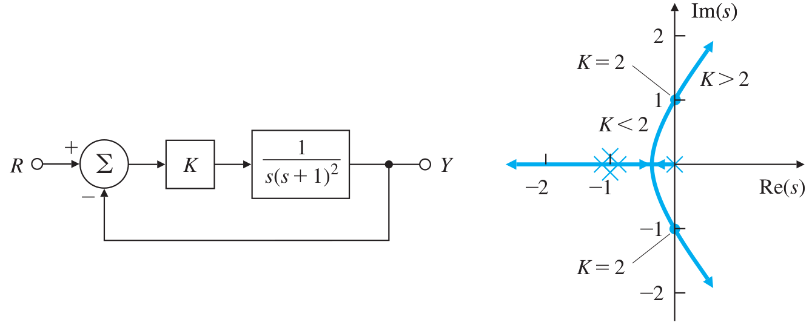
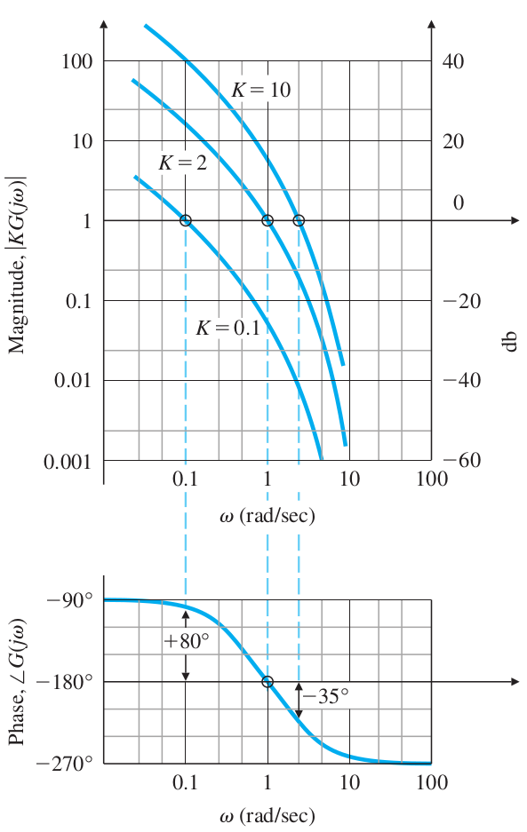
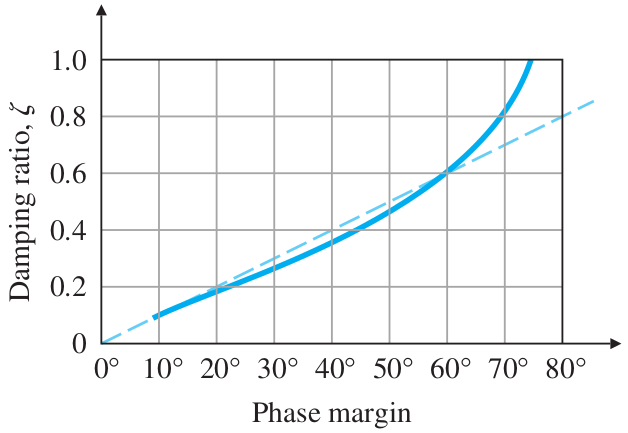
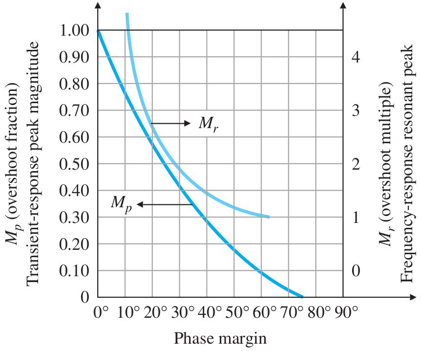
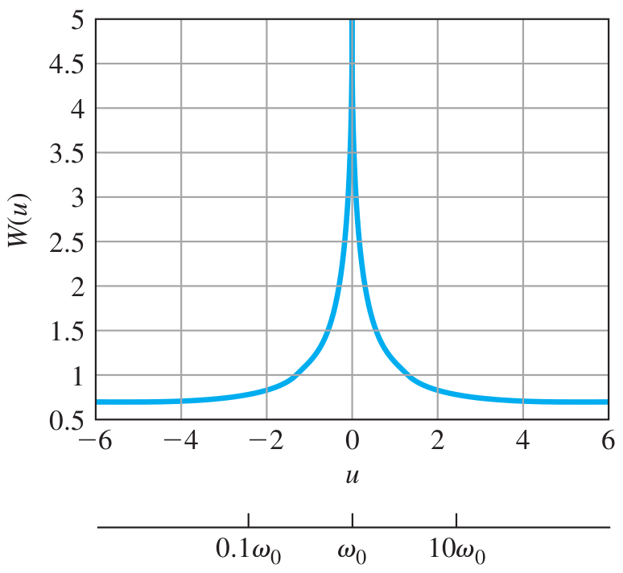
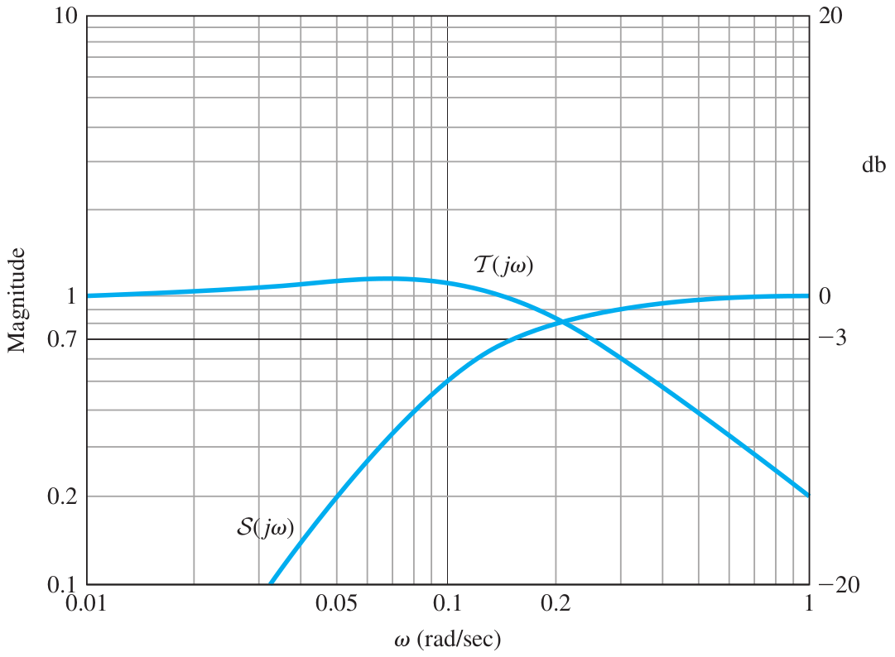

# Lecture 24, Apr 4, 2024

## System Response from Frequency Response

{width=70%}

{width=40%}

* Consider a unity feedback system with open-loop transfer function $L(s) = KG(s)$
* A typical root locus starts with all poles on the left hand side, and as $K$ increases, the locus crosses the imaginary axis at some point and the system becomes unstable
* The Bode plot of $KG(j\omega _c)$ has a magnitude plot that is simply shifted vertically, and a phase plot that is identical as $G(j\omega _c)$
	* Multiplying by $K$ increases the magnitude by a constant factor at all frequencies and has a phase of 0
* The conditions for marginal/neutral stability are $\abs{KG(j\omega _c)} = 1$ and $\angle G(j\omega _c) = -180\degree$
	* These are the same conditions as having the closed-loop poles being on the imaginary axis for a root locus
	* We can look at the phase plot to see the $\omega _c$ that gives a phase of $-180\degree$, and then look at the value of $K$ that gives magnitude 1 at $\omega _c$
* For most systems, decreasing $K$ from the neural stability value will make the system stable, while increasing it will make the system unstable
	* Therefore if $\abs{KG(j\omega) < 1}$ at $\angle G(j\omega) = -180\degree$ then the system is stable; otherwise it is unstable
	* Note this does not apply if the open loop Bode plot crosses $\abs{KG(j\omega)} = 1$ more than once
		* For such systems we need to use techniques to shift the plot so it crosses unity only once
* The degree of stability is how far we are from the value of $K$ that gives marginal stability; we measure this through two quantities:
	* *Gain margin* (GM): the factor by which $K$ can be increased before the system becomes unstable
		* On a Bode plot, this is how much we can move the magnitude plot up before we reach $\abs{KG(j\omega)} = 1$
		* This is the value of $\frac{1}{\abs{KG(j\omega)}}$ where $\angle G(j\omega) = -180\degree$
			* On a decibel scale this is the vertical distance between the value of the magnitude plot and the 0 decibel line
		* On a root locus, this is the ratio of the $K$ value that puts the closed-loop poles on the imaginary axis and the $K$ value that gives the poles given
		* $GM < 1$ (or negative in decibels) indicates an unstable system
	* *Phase margin* (PM): the amount by which the phase $G(j\omega)$ exceeds $-180\degree$ (less negative) when $\abs{KG(j\omega)} = 1$
		* On a Bode plot, find the value of $\omega$ that gives a magnitude of 1, and the phase margin is the value of the phase at this point minus $-180\degree$
		* $PM < 0$ indicates an unstable system
			* A value of $PM = 30\degree$ is typically regarded as the lowest value for a safe stability margin
			* In design we try to go for an ideal value of $PM = 90\degree$ but usually we have to compromise
		* The PM for any value of $K$ can be obtained directly from the Bode plot for $G(j\omega)$ (i.e. $K = 1$), by finding the $\omega$ that gives $\abs{G(j\omega)} = 1/K$ and taking the phase at this frequency, subtracting $-180\degree$
			* This is because $\abs{G(j\omega)} = 1/K \implies \abs{KG(j\omega)} = 1$
			* We can also go backwards; for a value of PM, note the required $\omega$, find the value of $\abs{G(j\omega)}$ and take $K = 1/\abs{G(j\omega)}$
* The (gain) *crossover frequency* $\omega _c$ is the frequency at which the open-loop magnitude is unity
	* This is highly correlated with the closed-loop bandwidth and hence the system response speed
	* $PM = \angle L(j\omega _c) - (-180\degree)$
* PM is more commonly used than GM in practice:
	* For a typical second order system $GM = \infty$ since phase reaches $-180\degree$ only at $\omega \to \infty$, at which point $\abs{G(j\omega)} \to 0$
	* PM is also closely related to the system damping ratio
* Consider $G(s) = \frac{\omega _n^2}{s(s + 2\zeta\omega _n)} \implies \mathcal T(s) = \frac{\omega _n^2}{s^2 + 2\zeta\omega _ns + \omega _n^2}$, a typical closed-loop system
	* We can derive $PM = \tan^{-1}\left(\frac{2\zeta}{\sqrt{\sqrt{1 + 4\zeta^4} - 2\zeta^2}}\right)$
		* $G(j\omega) = \frac{\omega _n^2}{(j\omega)(j\omega + 2\zeta\omega _n)}$
		* $\abs{G(j\omega _c)} = 1 \implies \frac{\omega _n^2}{\omega _c\sqrt{\omega _c^2 + 4\zeta^2\omega _n^2}} = 1 \implies \omega _c^2 = -2\zeta^2\omega _n^2 \pm \sqrt{4\zeta^4\omega _n^4 + \omega _n^4} \implies \omega _c = \omega _n\sqrt{\sqrt{1 + 4\zeta^4} - 2\zeta^2}$
		* $\alignedeqntwo[t]{PM}{\angle G(j\omega _c) - (-180\degree)}{\angle \omega _n^2 - \angle (j\omega _c) - \angle (j\omega _c + 2\zeta\omega _n) + 180\degree}{0 - 90\degree - \tan^{-1}\left(\frac{\omega _c}{2\zeta\omega _n}\right) + 180\degree}{90\degree - \tan^{-1}\left(\frac{\omega _c}{2\zeta\omega _n}\right)}{90\degree - \tan^{-1}\left(\frac{\sqrt{\sqrt{1 + 4\zeta^4} - 2\zeta^2}}{2\zeta}\right)}{\tan^{-1}\left(\frac{2\zeta}{\sqrt{\sqrt{1 + 4\zeta^4} - 2\zeta^2}}\right)}$
	* For $PM < 65\degree$, we can use a linear approximation $\zeta \approx \frac{PM\degree}{100}$
		* This is used as a rule of thumb for other systems as well
	* The resonant peak $M_r$ and overshoot $M_p$ can be obtained from $PM$ as well since both are related to $\zeta$
		* This can also serve as a rough estimate for systems other than the second-order closed-loop system we have

{width=40%}

{width=50%}

* For any stable minimum phase system (i.e. no poles or zeros in the RHP), the phase of $G(j\omega)$ is uniquely related to the magnitude of $G(j\omega)$
	* $\angle G(j\omega _0) = \frac{1}{\pi} \intinf \diff{M}{u}W(u)\,\du$ where $\threepiece{M = \log \abs{G(j\omega)}}{u = \log(\omega / \omega _0)}{W \approx \frac{\pi^2}{2}\delta(u)}$
		* The phase is related to the slope of the magnitude plot on a log-log scale, near the frequency $\omega _0$ we want to study
		* $\delta(u)$ is a weighting function (plot shown below)
			* This applies a much higher weight to values near $u = 0$
			* Even though the integral goes to infinity on both sides, the weighting makes it insignificant
	* If the slope of the gain is nearly constant around $\omega _0$, we can take out $\diff{M}{u}$
	* $\angle G(j\omega _0) \approx \frac{\pi}{2}\diff{M}{u} = n \cdot 90\degree$ if $\diff{M}{u}$ is constant for a decade around $\omega _0$

{width=40%}

* This means that if we can manage $\abs{KG(j\omega)}$ to have a constant slope of -1 for a decade around the crossover frequency $\omega _c$ (i.e. where $\abs{KG(j\omega)} = 1$), we will get a phase of $-90\degree$ at $\omega _c$, which gives a PM of $90\degree$, guaranteeing good stability of the system and a high $\zeta$ to reduce overshoot
	* This is the rule of thumb for design
	* We can adjust the value of $K$ to shift the plot so that the slope is -1 at unity gain, or we can add compensators to change the slope for the same value of $K$

### Example: Spacecraft Attitude Control

* Find a suitable $KD_c(s)$ to provide $M_p < 15\%$ and a bandwidth of $\SI{0.2}{rad/s}$ for the plant $G(s) = \frac{1}{s^2}$ and determine the frequency where the sensitivity function $\abs{\mathcal S} = 0.7$
	* $\frac{1}{s^2}$ is class 1, so the phase plot is a constant $-180\degree$, and the system is always unstable; the slope of the magnitude plot is -2 which is also not good
* We want to increase the slope, so we want to add a numerator class 2 term
	* Use a PD controller: $KD_c(s) = K(T_Ds + 1)$
* Start with the bandwidth of $\SI{0.2}{rad/s}$ which gives us a hint for $\omega _c$; we choose $\omega _c = 0.2$
* The break point of the controller is $\frac{1}{T_D}$
	* We need to put this break point sufficiently before $\omega _c$, so we have a sufficiently constant slope around $\omega _c$
	* Choose the break point to be $1/4$ of $\omega _c$, so have $\omega _1 = 0.05$ and $T_D = 20$
* Plot $\abs{D_cG(j\omega)}$ for $K = 1$, and notice the magnitude at $0.2$ -- in this case we have 100
* Therefore we choose $K = \frac{1}{\abs{D_cG(j\omega _c}} = 0.01$
* Validate our assumption that the bandwidth is around $0.2$:
	* $\abs{\mathcal T(j\omega)} = \frac{\abs{KD_cG}}{\abs{1 + KD_cG}}$
	* From the plot we can see that the bandwidth is around $0.25$ (when magnitude reaches around 0.7), which is close to $\omega _c$
* For a unity feedback system, $\mathcal S(s) = \frac{E(s)}{\Theta(s)}$ (in general $1 - \mathcal T(s)$)
	* We want the sensitivity function to be low at the frequencies we work with, so the system is insensitive to an error in the reference
* The *disturbance rejection bandwidth*, $\omega _{DRB}$, is the max frequency at which the disturbance rejection (i.e. sensitivity $\mathcal S$) is below a certain amount, usually -3 decibels
	* We always want to maximize this

{width=50%}

