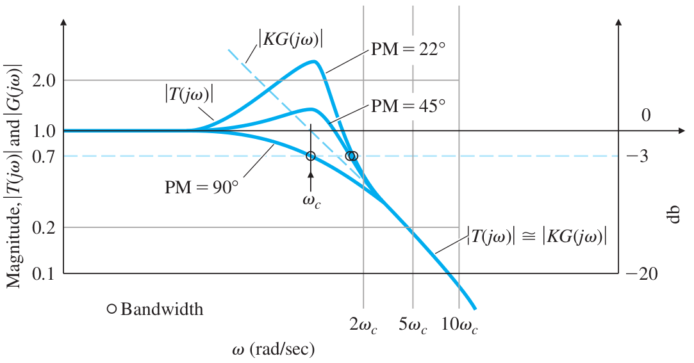
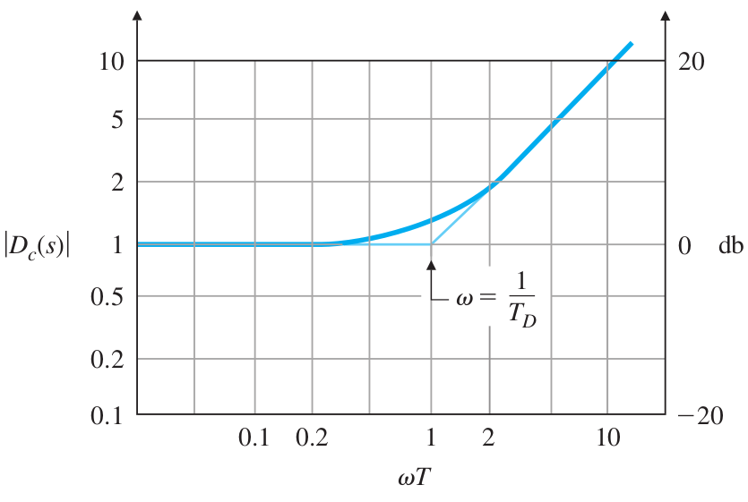
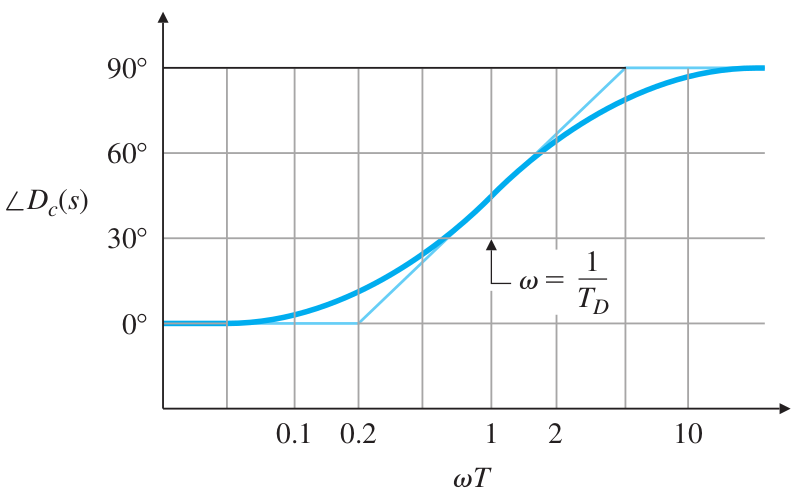
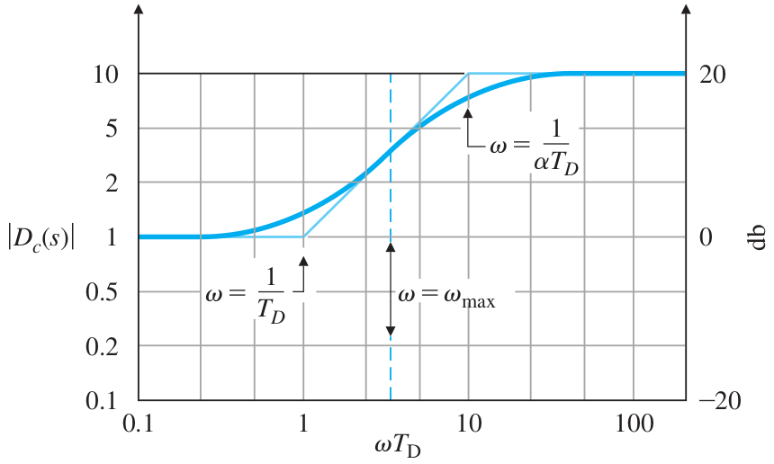
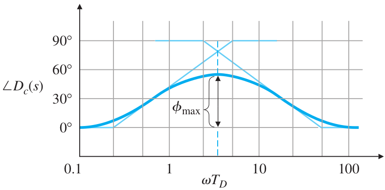
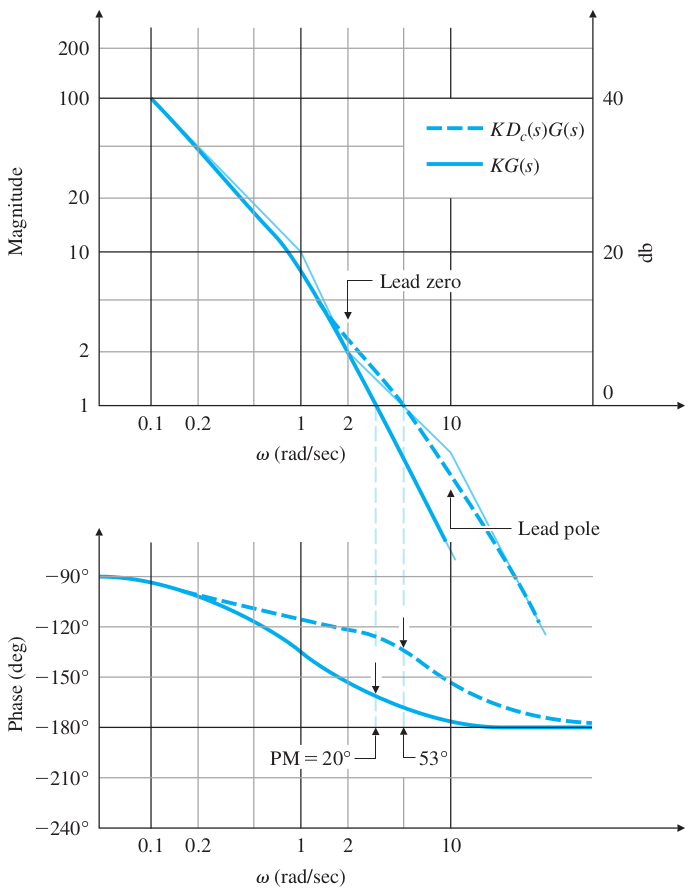
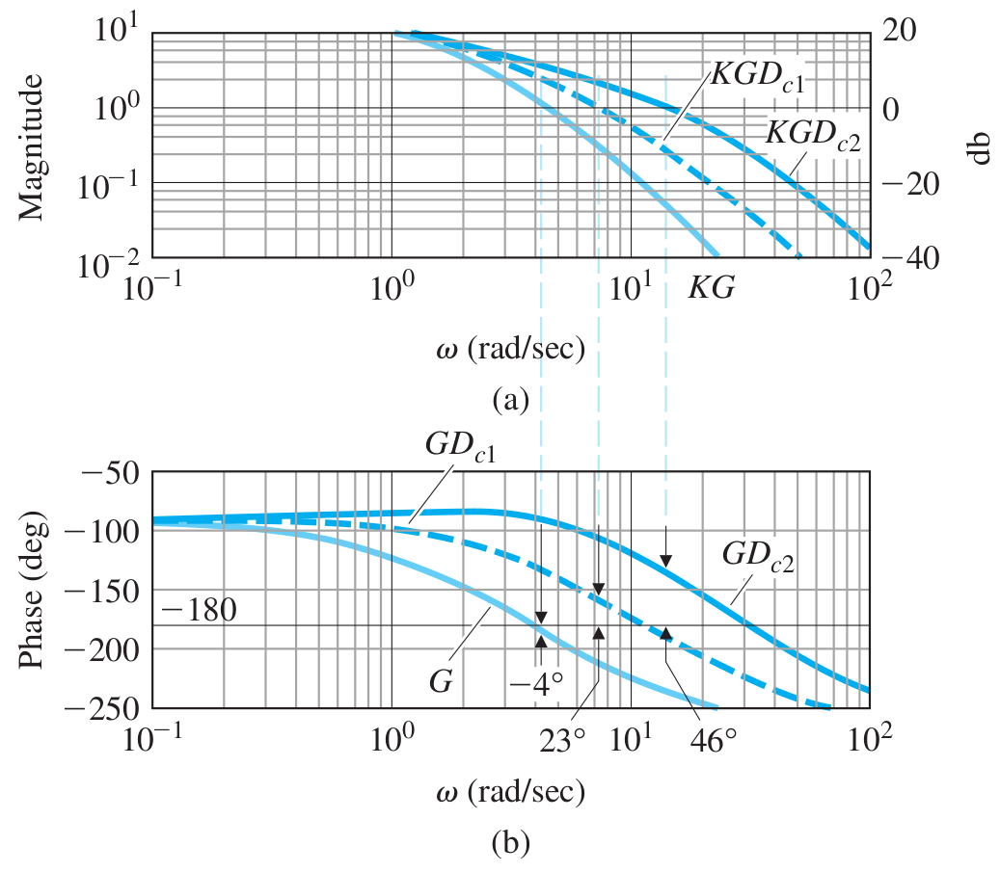

# Lecture 25, Apr 8, 2024

## Dynamic Response from Frequency Response

* For common systems, typically the open-loop transfer function has $\abs{KG(j\omega)} \gg 1$ for $\omega \ll \omega _c$ and $\abs{KG(j\omega)} \ll 1$ for $\omega \gg \omega _c$
	* Therefore at $\omega \ll \omega _c$, $\abs{\mathcal T(j\omega)} \approx 1$, and at $\omega \gg \omega _c$, $\abs{\mathcal T(j\omega)} \approx \abs{KG(j\omega)}$
	* The magnitude of the closed-loop gain near $\omega _c$ is closely related to the phase margin
		* Note again that this peak is not exactly at $\omega _c$
	* e.g. for $K = 1$, if $PM = 45\degree$, then $\angle G(j\omega _c) = -180\degree + PM = -135\degree$, and $\abs{G(j\omega _c)} = 1$ by definition, then $\abs{\mathcal T(j\omega _c)} = \abs*{\frac{G(j\omega _c)}{1 + G(j\omega _c)}} = \frac{1}{\abs{\sqrt{(1 + \cos(-135\degree))^2 + \sin^2(-135\degree)}}} = 1.31$

{width=60%}

* By the above calculation, $PM = 90\degree$, then $\omega _c = \omega _{BW}$ exactly; if $PM < 90\degree$, then $\omega _c \leq \omega _{BW} \leq 2\omega _c$
	* $\omega _{BW}$ is always within 1 *octave* of $\omega _c$
	* Bandwidth is roughly equal to the natural frequency of the system, again within 1 octave
	* We typically define a closed-loop system by its bandwith and phase margin
		* $\zeta \approx \frac{PM\degree}{100}$ for $PM < 65\degree$ and $\omega _n \approx \omega _{BW}$
* We can find system type in the frequency response; for a unity feedback system:
	* A type 0 system's open-loop magnitude plot starts with a slope of 0 at low frequencies
		* To have a slope of 0 at low frequencies means our class 1 term has a power of $n = 0$, so it does not contribute an initial slope, so this means no poles at the origin and thus type 0
		* The low-frequency gain, $K_0$, is equal to the position constant $K_p$, since $K_p = \lim _{s \to 0} KD_cG(s) = \lim _{\omega \to 0} \abs{KD_cG(j\omega)}$
		* We can control the steady-state error by controlling the gain $K$ -- we are shifting the entire plot up or down, which changes the low-frequency gain
	* A type 1 system's open-loop magnitude plot starts with a slope of -1
		* Now $K_v = \lim _{s \to 0} sKD_cG(s) = \lim _{\omega \to 0} \omega\abs{KD_cG(j\omega)}$ so at low frequencies, $\abs{KD_cG(j\omega)} \approx \frac{K_v}{\omega}$
		* We can find $K_v$ by going to $\omega = 1$ and finding the intersection of the initial asymptote with the vertical line $\omega = 1$
	* A type 2 system's open-loop magnitude plot starts with a slope of -2
		* At low frequencies, $\abs{KD_cG(j\omega)} \approx \frac{K_a}{\omega^2}$
		* Similarly, we can find $K_a$ by finding the intersection of the initial slope $-2$ asymptote with the vertical line $\omega = 1$

### Lead Compensator Design

* Consider a PD controller, $D_c(s) = (T_Ds + 1)$, which is added to improve stability and dynamic response
	* This is a numerator class 2 term, which steps up the slope of the magnitude plot at the break point $\frac{1}{T_D}$
	* This essentially increases $\omega _c$, which increases $\omega _{BW}$ and therefore $\omega _{n}$ which speeds up the system
	* This also increases the phase (since it's a denominator term), which increases the phase margin, which increases damping
	* Shortcomings:
		* At low frequencies the gain is 1, so this doesn't do much to the steady-state response
		* At high frequencies (i.e. noise), the gain is very high, so the noise is amplified
			* Instead, we often use a lead compensator, which has a gain that flattens at higher frequencies, to avoid noise amplification
	* Specify the break point so that the amount of increased phase desired happens near the crossover, so we can increase the PM
		* From the design requirements and the Bode plot of the uncompensated system, we can see how much additional PM we need

{width=40%}

{width=40%}

* Practically, we use a lead compensator, $D_c(s) = \frac{T_Ds + 1}{\alpha T_Ds + 1}$ where $\alpha < 1$, with corner frequencies $\omega _l = \frac{1}{T_D}$ (low) and $\omega _h = \frac{1}{\alpha T_D}$ (high)
	* The additional denominator class 2 term steps the slope down at higher frequencies (so the magnitude plot becomes flat), so we avoid amplifying high frequency noise
	* This comes at the cost of having the phase going up and then back down (instead of staying at $+90\degree$ like the PD controller); the corner frequencies need to be chosen carefully so we get the maximum amount of increase to the PM
		* We typically choose $\omega _h \gg \omega _l$, typically $\omega _h > 5\omega _l$
	* The phase increase is $\phi = \angle D_c(j\omega) = \tan^{-1}(T_D\omega) - \tan^{-1}(\alpha T_D\omega)$
		* This gives $\phi _{max} = \tan^{-1}\left(\frac{1}{\sqrt{\alpha}}\right) - \tan^{-1}(\sqrt{\alpha})$ occurring at $\omega _{max} = \frac{1}{T_D\sqrt{\alpha}}$ (by differentiation)
		* $\sin\phi _{max} = \frac{1 - \alpha}{1 + \alpha} \implies \alpha = \frac{1 - \sin\phi _{max}}{1 + \sin\phi _{max}}$
			* This gives us a simpler form to find $\alpha$ from $\phi _{max}$
			* In design, we decide how much $\phi _{max}$ to use, and then we obtain $\alpha$
		* $\frac{1}{\alpha}$ is the *lead ratio*; the higher the lead ratio, the more we approach a PD compensator
			* Selecting this is a tradeoff between a desired PM (for good damping) and an acceptable level of high-frequency noise amplification
			* Rule of thumb is to have have a lead compensator contribute no more than $70\degree$ to the phase; if we need even more, a double lead compensator can be used

{width=40%}

{width=40%}

* Both PD controller and lead compensator have no poles at the origin, so the system type is not changed
* Example: for the plant $\frac{1}{s(s + 1)}$, design a lead compensator to obtain a response to a unit-ramp input with an overshoot $M_P < 25\%$ and steady-state error of no more than $0.1$
	* The open-loop transfer function is type 1 (we couldn't have changed it with a lead compensator anyway)
	* Open loop TF: $L(s) = K\frac{T_Ds + 1}{\alpha T_Ds + 1} \cdot \frac{1}{s(s + 1)}$
	* For $R(s) = \frac{1}{s^2}$, $e_{ss} = \lim _{s \to 0} \frac{1}{s + KD_c(s)\frac{1}{(s + 1)}} = \frac{1}{KD_c(0)}$, therefore we need $K_v = KD_c(0) \geq 10$ from the steady-state error requirement
		* This yields a value of $K = 10$, since the lead compensator always has $D_c(0) = 1$
		* Since we don't have a lag compensator we have to use $K$ for the steady-state response; if we had one we could save $K$ to optimize the dynamic response
	* For $M_P < 25\%$, we use the direct relation to get $PM = 45\degree$
	* PM of the uncompensated system is only $20\degree$, so we need to add more than $25\degree$
		* The phase increase needs to be more than $25\degree$, since the compensator zero increases $\omega _c$ due to the increase in slope, and the overall trend in phase is decreasing
		* We need to add a safety margin
	* For $\phi _{max} = 40\degree$ of lead, $\frac{1}{\alpha} = 5$
	* To get $T_D$ we normally look at the desired $\omega _c$ (which influences system speed)
		* For this question we don't have a restriction on speed
		* $\frac{1}{T_D} = \omega _{max}\sqrt{\alpha}$
		* By trial and error selecting $\omega _{max}$, we find $T_D = 0.5$
	* The final controller is $D_c(s) = 10\frac{\frac{s}{2} + 1}{\frac{s}{10} + 1}$

{width=50%}

* For a lead compensator, we specify the parameters from design requirements as follows:
	* The crossover frequency $\omega _c$, which determines the bandwidth hence and speed of response
	* The phase margin PM, which determines the damping ratio and overshoot
	* The low-frequency gain $K$, which determines the steady-state error
	* In general, lead compensation increases the ratio $\frac{\omega _c}{KD_cG(0)}$
* Design procedure for lead compensator:
	1. Determine $K$ to satisfy error or bandwidth requirements
		* For error, pick $K$ to satisfy the error constant
		* For bandwidth, pick $K$ so that $\omega _c$ is within a factor of two below the desired closed-loop bandwidth
	2. Evaluate the PM of the uncompensated system using this $K$
	3. Find the amount of PM increase we need (add a safety margin, usually $5\degree$ or more)
	4. Determine $\alpha = \frac{1 - \sin\phi _{max}}{1 + \sin\phi _{max}}$
	5. Pick the desired crossover frequency and make $\omega _{max}$ there, and determine $T_D$ using $\frac{1}{T_D} = \omega _{max}\sqrt{\alpha}$
	6. Draw the compensated frequency response and check that the PM requirement is satisfied; iterate if not
* Example: type 1 servo mechanism, $KG(s) = K\frac{10}{s(s/2.5 + 1)(s / 6 + 1)}$; design a lead compensator to obtain $PM = 45\degree$ and $K_v = 10$
	1. $\frac{1}{K_v}  = \frac{1}{10} = \lim _{s \to 0} s\frac{1}{1 + KD_c(s)G(s)}\frac{1}{s^2} \implies K = 1$
	2. Uncompensated PM is $-4\degree$ at $\omega _c \approx 4$
	3. We want the lead to add $\phi _{max} = 54\degree$ (with a safety margin of $5\degree$)
	4. Use formulas to get $\alpha = 0.1$
	5. Choose a desired $\omega _c$, e.g. $6$ (in this case we have no hard speed requirement), giving $T_D = \frac{1}{\omega _c\sqrt{\alpha}} \approx 0.5$
	6. Draw the new Bode plot for $D_{c1}(s) = \frac{s/2 + 1}{s/20 + 1} = 10\frac{s + 2}{s + 20}$
		* We see that the PM requirement is not satisfied!
		* More iterations show that a single lead compensator cannot meet this PM requirement due to the high-frequency slope of -3
	7. Double the lead compensator; on examination this gives $PM = 46\degree$, meeting the requirements

{width=60%}

