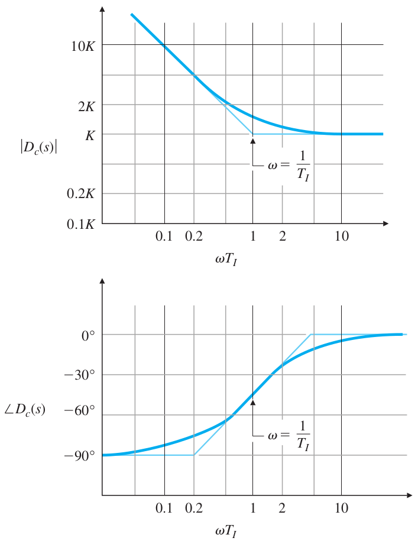
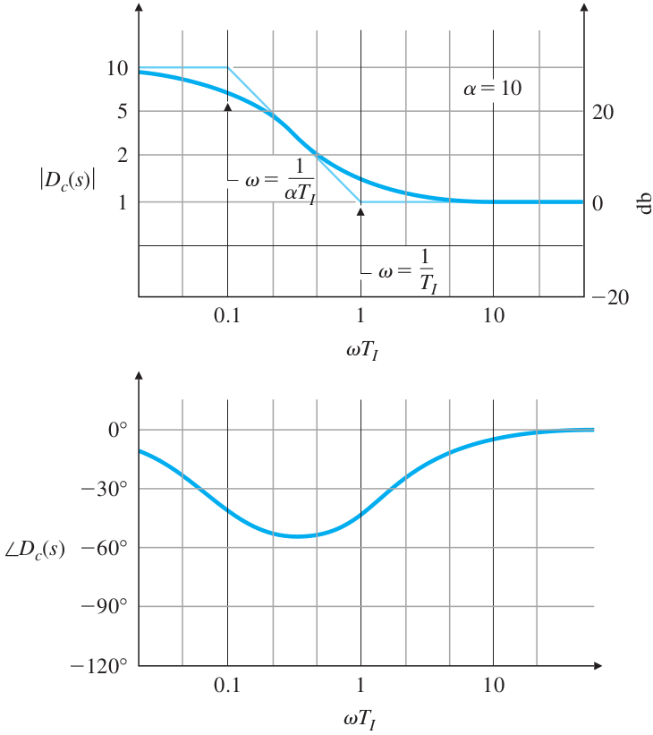

# Lecture 26, Apr 12, 2024

## Design for Dynamic Compensation

* For PI control, $D_c(s) = 1 + \frac{1}{T_Is}$, the steady-state error of the system is reduced with minimal impact on the bandwidth
	* The gain is high at low frequencies, which reduces the steady-state error
		* This increases the system type
	* However, it causes the reduction of phase margin at frequencies lower than the breakpoint $\frac{1}{T_I}$, which degrades stability
		* This makes sense since we know that an integral controller may destabilize the system
	* We usually place the break point $\frac{1}{T_I}$ at a frequency substantially less (one octave to multiple decades) than the crossover frequency, so that the impact on PM is minimal
	* The main practical problem of PI control is *integral windup* (aka *overflow*), leading to saturation of the system
		* A sudden change in the reference causes the integral term to accumulate too much
		* This leads to a very sluggish controller

{width=40%}

* We typically use a lag compensator instead, $D_c(s) = \alpha\frac{T_Is + 1}{\alpha T_Is + 1}$, where $\alpha > 1$, so the pole has a lower break point than the zero
	* This can decrease the steady-state error without lowering the crossover frequency
	* The magnitude no longer increases to infinity at lower frequencies and instead converges to $\alpha$, however the phase at low frequencies now converges to 0, instead of the $-90\degree$ before
		* This allows us to still reduce the steady-state error, without sacrificing too much phase margin
	* We choose the poles and zero relatively close together, and well below (one octave to multiple decades) the crossover frequency (i.e. choose a large $T_I$)
		* Having the corner frequencies far from the break point minimizes the reduction in phase margin

{width=40%}

* Lag compensator design procedure:
	1. Determine the gain $K$ required to get the desired PM without compensation, with a $5\degree$ to $10\degree$ margin to account for the PM reduction of the compensator
	2. Draw the Bode plot of the uncompensated open-loop TV and check the low-frequency gain, which gives the steady-state error
	3. Determine the value of $\alpha$ to meet the steady-state error requirement -- $\alpha$ is how much more we need to multiply the low-frequency gain by in order to meet the steady-state error requirement
	4. Choose the upper corner frequency $\frac{1}{T_I}$ (the zero) to be one octave to multiple decades below the uncompensated $\omega _c$
	5. Iterate on the design and verify that it meets requirements
* Example: $G(s) = \frac{115}{(s + 1)(s + 3)(s + 28)}$, design a lag compensator to get an overshoot of less than 15% and a steady-state error of less than 2%
	* $M_P < 15\% \implies PM = 56\degree$ from the plots; having a margin gives $PM = 66\degree$
	* We have no restrictions on $\omega _c$ so pick it so that we get $PM = 66\degree$
		* Plot the Bode plot and find that $\omega _c = 2.5$ gives us the desired PM; at this value, the gain is currently $0.38$
		* We get $K = 2.63$ to get us the desired $\omega _c$
	* Using this value of $K$, the uncompensated $K_p$ is 3.6 (same as the value of the magnitude plot at $\omega = 0$)
	* We want $e_{ss} = \frac{1}{1 + K_p} < 0.02 \implies K_p > 49$ instead; choose $K_p = 50$ for some margin
		* Therefore $\alpha = \frac{50}{3.6} = 14$
	* Choose $\frac{1}{T_I}$ one decade below the crossover frequency, and double check that requirements are satisfied
* A PID compensator $D_c(s) = K(T_Ds + 1)\left(1 + \frac{1}{T_Is}\right)$ can be used to improve both transient and steady-state responses
	* Roughly equivalent to combining lead and lag compensators
		* $D_c(s) = \gamma\left(\frac{T_Ds + 1}{\frac{T_D}{\gamma}s + 1}\right)\left(\frac{T_Is + 1}{\gamma T_Is + 1}\right)$ for $\gamma > 1$
* For some systems, the Bode plot will cross over the real axis multiple times; this results from the natural modes of vibration of the system
	* *Gain stabilization* is the simple approach of modifying $K$ to bring the entire plot down
	* *Phase stabilization* is the use of notch compensators that remove the system's response at the problematic frequencies
* A lead-lag compensator, $D_c(s) = \beta\left(\frac{T_Is + 1}{\beta T_Is + 1}\right)\left(\frac{T_Ds + 1}{\alpha T_Ds + 1}\right)$ for $\alpha < 1, \beta > 1$, combines both
* Example: given $G(s) = \frac{1}{s^2(s + 2)}$, design a lead-lag compensator to get $t_r \leq 1$, $M_p \leq 40\%$, $t_s \leq 10$ (for 2%), and $e_{ss} \leq 10\%$
	* Convert: $\omega _n \geq 1.8$, $\zeta \geq 0.3 \implies PM \geq 30\degree$, $\sigma = \zeta\omega _n \geq 0.46$, $e_{ss} = \frac{1}{K_a} \leq 0.1$
		* The requirement for $e_{ss}$ suggests that a lead-lag compensator is likely needed
	* Initially, choose $\omega _n = 2$ and so $\omega _{BW} \approx 2$; start with crossover frequency at half bandwidth, $\omega _c = 1$, and phase margin of $40\degree$ (with margin added)
	* At $\omega _c$, the magnitude $\abs{G(j\omega _c)} = 0.447$ for the uncompensated system, so choose $K = \frac{1}{0.447}$ to make this the crossover frequency
	* The phase is $-207\degree$ at $\omega _c$, so the initial phase margin is $-27\degree$ -- we need to add $\phi _{max} = 67\degree$ of phase margin
	* Using the formula, $\alpha = 0.042$
	* Choose $\omega _{max} = \omega _c = 1.0$, so that $D_{c1}(s) = \frac{4.88s + 1}{0.21s + 1}$
		* Now at $\omega _c$ the magnitude is $4.86$, so reduce $K$ further by this factor to get $K = 0.46$
		* This gives a PM of $40\degree$
	* Plotting the step response shows that the overshoot and settling time meet requirements, but not rise time (by a very small amount)
		* Increase $K$ by a small amount to $0.5$, which increases overshoot and allows meeting the rise time requirement
	* The existing steady-state error is $0.25$; we need $e_{ss} = \frac{1}{K_a} \leq 0.1$ so $K_a \geq 10$
		* The open-loop gain at small frequencies needs to be increased by a factor of 40, so $\beta = 40$
	* Choose the upper corner frequency at a tenth of $\omega _c$, so $\frac{1}{T_I} = 0.1$, giving $T_I = 10 \implies D_{c2}(s) = 40\frac{10s + 1}{400s + 1}$
		* As expected, the open-loop response is faster with worse overshoot
	* In time domain this now has an overshoot that is slightly over the limit, so we need to iterate:
		* Try $\frac{1}{T_I} = 0.05 \implies  T_I = 20 \implies D_{c2}(s) = 40\frac{20s + 1}{800s + 1}$
			* This now doesn't meet the requirements

