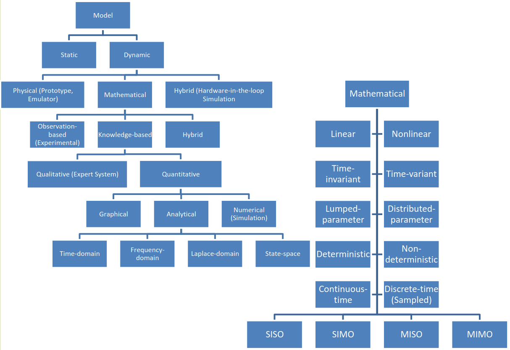

# Lecture 3, Jan 15, 2024

## Taxonomy of System Models

{width=80%}

* Dynamic system models can be physical (i.e. a prototype), mathematical (e.g. simulations) or hybrid (HITL simulation)
* Mathematical models can be one of 3 types:
	* Observation-based (experimental): black-box approach
		* Model is developed only based on empirically observed input-output relations
		* Used when the system's internal dynamics are unknown or too complex to model, e.g. biological systems
	* Knowledge-based: white-box approach
		* Using known dynamics of the system to model it
	* Hybrid: grey-box approach
		* Model is based on both empirical input-output relations and knowledge of the system
		* DEs are used for the model and parameters are identified by experiments
* Within knowledge-based systems, models can be qualitative (expert systems, a set of if-then rules using fuzzy sets/logic) or quantitative (analytical/using DEs, numerical algorithms/simulation, graphical diagrams)
* This course will focus on dynamic, mathematical, knowledge-based, quantitative, analytical models in the time, frequency and Laplace domains
* Systems can be lumped- or distributed-parameter
	* Most physical systems have parameters that are continuously distributed, e.g. a real spring has mass, stiffness, and damping distributed in all 3 axes
	* For such distributed-parameter systems, not only do we need to model the dynamics in time, but also the distribution of properties in space
		* This means using PDEs instead of ODEs and makes things much more complicated
	* Lumped-parameter systems approximate the real physical system with a discrete number of parameters, e.g. reducing a real spring to a point mass, ideal spring, and dashpot
	* When reducing systems and simplifying them, make sure to state all assumptions
* Systems can be linear or nonlinear
	* Physical systems are generally nonlinear, but the relation between input and output can be locally linear within a narrow range (*smooth nonlinearity*)
	* A linear model can approximate the system well in this case if the operation stays within a small range
	* Given a general nonlinear model $Y = \dot X = F(X, U)$, we wish to obtain an approximate linear model $\dot X = AX + BU$ where $A, B$ are constants, about an operating point $X_0, U_0$; this can be achieved using a Taylor series
	* Linear systems are desirable due to the principle of superposition
	* If the coefficient on $u$ is 1 (or identity), we can also reorder systems connected in series (principle of interchangeability)
* In time-invariant systems, system parameters stay the same regardless of time, so the input-output relationship does not change in time
	* For a constant time delay $T$, if $u(t)$ gives output $y(t)$, then $u(t - T)$ gives output $y(t - T)$
	* Practically to check for time invariance, we will give the system some input then delay the output by some time, and compare this against the system's output for a delayed input
* Deterministic models assume that nominal values of inputs, initial conditions, states and parameters (and thus the output) can all be identified without random deviations
	* In probabilistic models, inputs, initial conditions, and/or parameters may vary according to a PDF (noisy), but state variables are still deterministic
		* Note static models can be probabilistic
	* In stochastic models, the system state can vary as well

