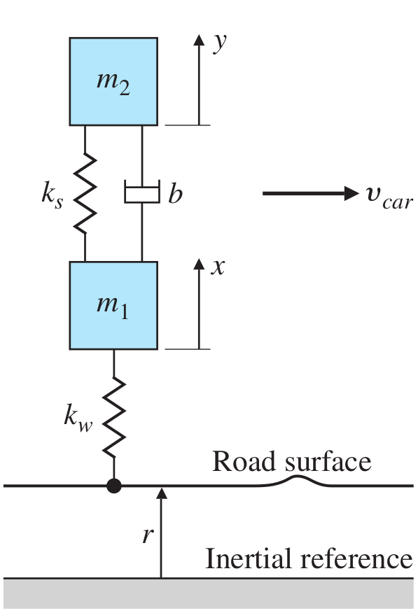

# Lecture 4, Jan 18, 2024

## Dynamic System Modelling

* Electrical, mechanical, fluid and thermal systems can be represented by analogous models, regardless of the underlying system, by taking an energy perspective
* We divide basic elements into two groups: energy storage and energy dissipation; within energy storage, elements can be either capacitive or inductive
* Each element is defined by either a *through variable* (aka *t-type*, a property that appears to flow through the element unaltered), or *across variable* (aka *a-type*, a property that is measured as a difference at the two ends of the element)
	* Capacitive elements are represented by t-type variables; inductive elements are represented by a-type variables
	* All energy dissipation elements are represented by t-type variables
* Sometimes we might want to use the integrated version of the t-type and a-type variables

{width=70%}

{width=70%}

{width=70%}

{width=70%}

* Note this is referred to as a force-current analogy; alternatively we can have a force-voltage analogy instead

{width=30%}

* Example: cruse control model
	* We apply a force $u$ to the car of mass $m$, which has a resistive force proportional to the speed
	* We want to know how the speed of the car varies in time
	* Assumptions:
		* Car is a rigid body
		* Rotational inertia of the wheels is negligible
		* Friction/drag is proportional to speed with a factor of $b$
	* $F = ma \implies u - b\dot x = m\ddot x \implies \ddot x + \frac{b}{m}\dot x = \frac{u}{m}$
	* Change variable to $v$: $\dot v + \frac{b}{m}v = \frac{u}{m}$
	* Typically, we rearrange the system to put all the outputs on the left and all the inputs on the right
	* We get a first order linear ODE

{width=25%}

* Example: mass-spring-damper system
	* The input force $f$ is applied at time 0; we want to know how $x$ (measured from equilibrium) varies in time as a result of this force
	* $x_e$ is the equilibrium position of the mass with no force applied; $x_0$ is the uncompressed length of the spring
	* In equilibrium, $k(x_0 - x_e) = mg$
	* The full FBD would have the external force $m$ upwards, the spring force $k(x_0 - (x_e + x))$ upwards, the gravitational force $mg$ downwards, the damping $b\dot x$ downwards
	* $k(x_0 - x_e - x) - b\dot x - mg + f = m\ddot x$
		* Notice that the equilibrium condition means the $k(x_0 - x_e)$ cancels with $mg$, so we have no $g$ term in the final expression
	* Final ODE: $m\ddot x + b\dot x + kx = f$ (second order linear ODE)
	* In general, in mechanical systems moving around their equilibrium state, the holding (static) forces and moments required for maintaining the equilibrium do not contribute to the motion state
		* In this example, the spring force and gravity at equilibrium are the holding forces
		* Therefore we don't have $x_0, x_e$ or $g$ in the model

{width=25%}

{width=40%}

* Example: automobile suspension system
	* Each wheel of the car is equipped with a suspension system
		* The tire itself acts like a spring
		* The suspensions system consists of a spring and a dashpot
	* Consider the car moving on a road with some profile; we wish to model the vertical movement of the car body
	* This is a single input, two output system because we also need to model the movement of the wheel itself to get the movement of the car body
	* Drawing free body diagrams around the equilibrium allows us to ignore gravity and consider only the forces by the springs and dashpots
	* Dynamic equations: $\twopiece{b(\dot y - \dot x) + k_s(y - x) - k_w(x - r) = m_1\ddot x}{-k_s(y - x) - b(\dot y - \dot x) = m_2\ddot y}$
	* Rearrange: $\twopiece{\ddot x + \frac{b}{m_1}(\dot x - \dot y) + \frac{k_s}{m_1}(x - y) + \frac{k_w}{m_1}x = \frac{k_w}{m_1}r}{\ddot y + \frac{b}{m_2}(\dot y - \dot x) + \frac{k_s}{m_2}(y - x) = 0}$

{width=30%}

* Example: electrical system with KCL
	* Node 1: $i^* = i_1 + i_L$
	* Node 2: $i_L = i_2 + i_4$
	* Node 3: $i(t) = i_1 + i_3 + i_L$
	* $i(t) = \frac{v_1}{R_1} + C_1\diff{v_1}{t} + i_L$
	* $i_L = C_2\diff{v_2}{t} + \frac{v_2}{R_2}$
	* $v_1 - v_2 = L\diff{i_L}{t}$
	* $LC_1C_2\diffn{3}{v_2}{t} + \left(\frac{LC_1}{R_2} + \frac{LC_2}{R_1}\right)\diffn{2}{v_2}{t} + \left(\frac{L}{R_1R_2} + C_1 + C_2\right)\diff{v_2}{t} + \left(\frac{1}{R_1} + \frac{1}{R_2}\right) + i(t)$
	* This ends up being a third order linear ODE

