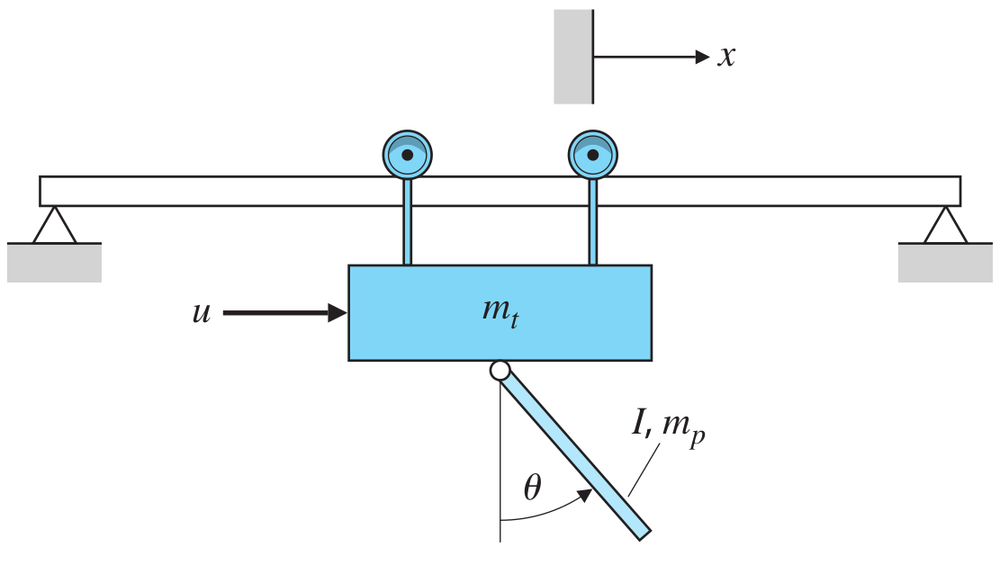
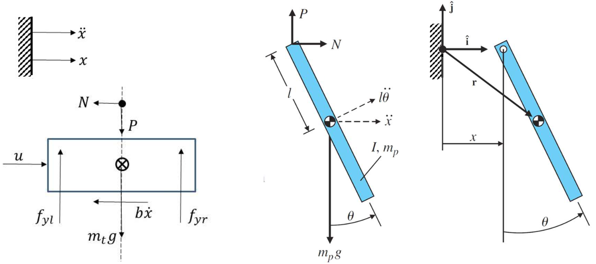
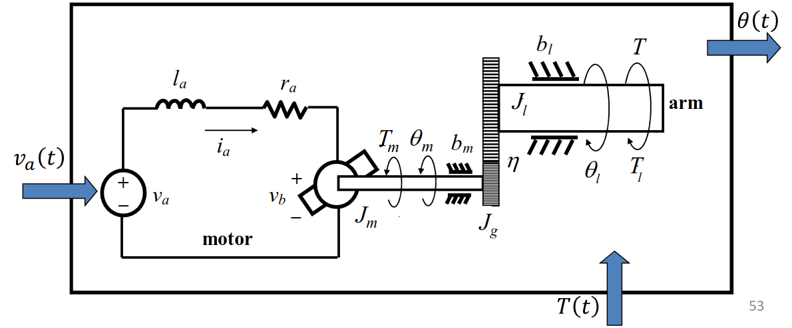
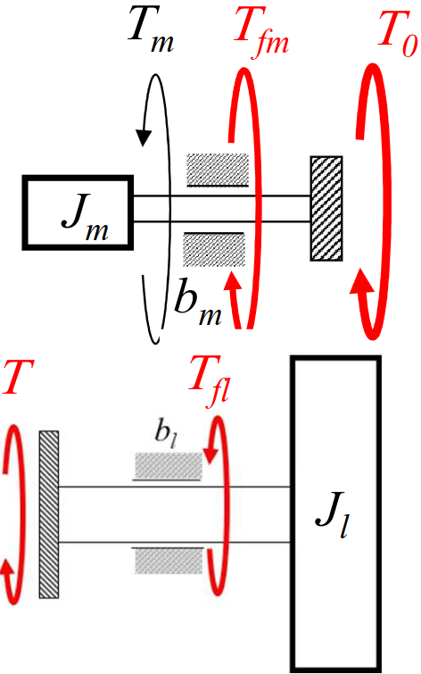

# Lecture 5, Jan 22, 2024

## More Dynamic System Examples

* Example: pendulum with point mass $m$ under gravity, input torque $T_c$ around the pivot
	* $T_c - mgl\sin\theta = I\ddot\theta \implies \ddot\theta + \frac{g}{l}\sin\theta = \frac{T_c}{ml^2}$
		* We can do this since all the moments act on the same axis in planar motion
	* Linearize using $\sin \theta \to \theta$ for small angles
		* These assumptions need to be checked later
	* In free oscillation this would oscillate around 0 with $\omega _n = \sqrt{\frac{g}{l}}$
	* If $T_c$ is constant, then this gives a constant bias angle to the oscillation

{width=50%}

{width=80%}

* Example: consider a pendulum on a cart as shown above
	* The cart is subject to an applied force and viscous friction (also gravity and normal forces which cancel)
		* The pendulum also applies unknown forces to the cart at the hinge position
		* $u - N - b\dot x = m_t\ddot x$
	* For the pendulum we write the equations about the centre of mass for both forces and moments, since we don't have a fixed point on the body anymore
		* To find the accelerations of the centre of mass we differentiate its position
			* $\bm r = x\ihat + l(\ihat\sin\theta - \jhat\cos\theta)$
			* $\ddot{\bm r} = \ddot x\ihat + l\ddot\theta(\ihat\cos\theta + \jhat\sin\theta) - l\dot\theta^2(\ihat\sin\theta - \jhat\cos\theta)$
		* $N = m_p\ddot x + m_pl\ddot\theta \cos\theta - m_pl\dot\theta^2\sin\theta$
		* $P - m_pg = m_pl\ddot\sin\theta + m_pl\dot\theta^2\cos\theta$
		* $-Pl\sin\theta - Nl\cos\theta = I\ddot\theta$
	* Clean up to get $\twopiece{(m_t + m_p)\ddot x + b\dot x + m_pl\ddot\theta\cos\theta - m_pl\dot\theta^2\sin\theta = u}{(I + m_pl^2)\ddot\theta + m_pgl\sin\theta + m_pl\ddot x\cos\theta = 0}$
	* We can linearize this around $\theta = 0$ for a crane system, or around $\theta = \pi$ for a segway (inverted pendulum) system, assuming $\theta, \dot\theta$ are small

{width=80%}

{width=30%}

* Example: DC brushed motor
	* The brushes power the rotor and provide the polarity switching needed to maintain a constant rotation in one direction
	* The electric part can be obtained through KVL: $l_a\diff{i_a}{t} + r_ai_a = v_a - K_e\dot\theta _m$
		* Lorentz law: $T_m = K_1\varphi i_a = K_li_a$ where $\varphi$ is determined by the field strength, $i_a$ is the current and $K_1$ is determined by the loop geometry
		* Faraday law: $v_b = K_2\varphi\dot\theta _m = K_e\dot\theta _m$ where $v_b$ is the back-EMF, a voltage
	* The mechanical part has 2 bodies: the shaft directly connected to the rotor and the output arm, connected to the load
		* The motor generates a torque $T_m(t)$, which has to overcome a resistive torque load $T(t)$ to give the final output $\theta _m(t)$
		* For the smaller shaft: $T_m - b_m\dot\theta _m - T_0 = J_m\ddot\theta _m$
			* $T_0$ is some torque applied by the larger output shaft
			* $b_m\dot\theta _m$ is a viscous friction torque
			* $J_m$ is the moment of inertia of the shaft
		* For the larger shaft: $T - b_l\dot\theta _l = J_l\ddot\theta _l$
		* $\theta _l$ and $\theta _m$ are related as $\theta _l = \eta\theta _m$ and $T_0 = \eta T$ since $r_m\theta_m = r_l\theta _l$
			* $\eta$ is the gear ratio, $\eta = \frac{r_m}{r_i}$
			* Note we always use the smaller radius in the numerator so the gear ratio is always 1 or less
		* This gives $J_m\ddot\theta _m + b_m\dot\theta _m = T_m - \eta T = K_li_a - \eta T = K_li_a - \eta J_l\ddot\theta _l - \eta b_l\dot\theta _l$
		* Expand and rearrange: $(J_m + \eta^2 J_l)\ddot\theta _m + (b_m + \eta^2 b_l)\dot\theta _m = K_ti_a$
	* Now we can solve for $i_a$ from the mechanical system and its derivative and substitute into the first equation
	* This gives us a third order linear ODE, however we can reduce this by noting that the time constant of the electric part is much smaller than the time constant of the mechanical part (i.e. after a voltage change, the current stabilizes much faster than the motor speed), which allows us to ignore the inductance of the coil and reduce the electric part to a static system, which reduces the overall differential equation to 2nd order

