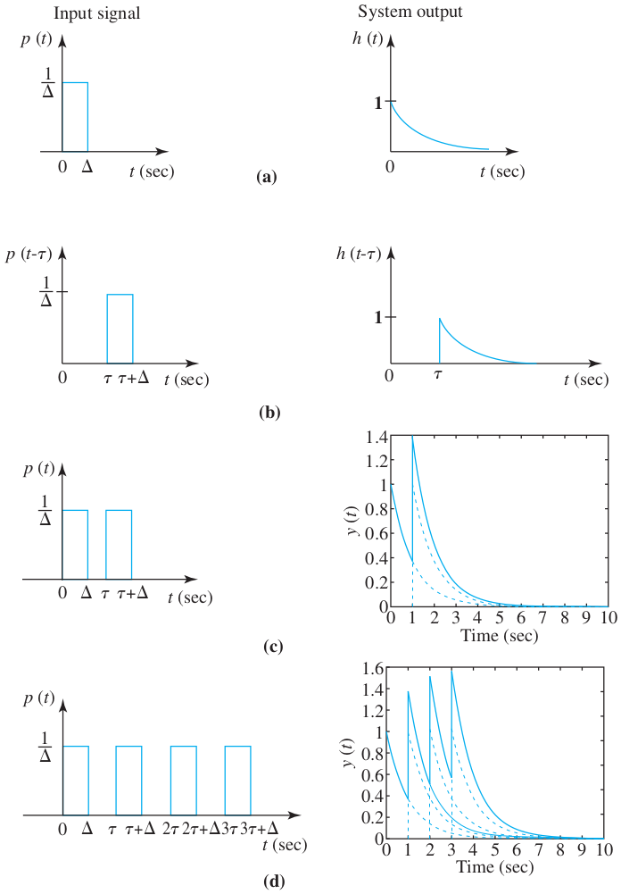
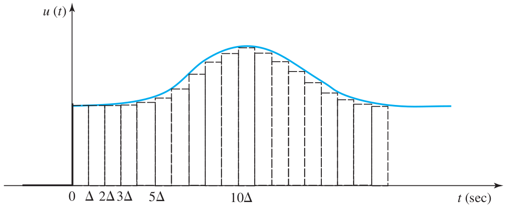

# Lecture 6, Jan 25, 2024

## Linear Time-Invariant Systems

* *Zero state response*: the response of a system to some input when the system is initially "at rest", i.e. all inputs, outputs,  states and their derivatives are initially zero
	* When we talk about linear systems, we are usually assuming zero-state
* The most important property of linear systems is homogeneity and superposition -- we can scale and add inputs and the outputs will scale and add accordingly
* In a time-invariant system the parameters $C$ are constant in time, so delaying the input will delay the output by the same amount and leave it otherwise unchanged
	* This also works in reverse -- if the system output remains the same but delayed when the input is delayed, then the system is time-invariant (we can show that this implies that $C$ is constant)
* These properties let us determine the response of a system to any general input by only knowing its impulse response
	* Any general input $u(t)$ can be approximated by a series of pulses $p_\Delta(t) = \twocond{\textstyle\frac{1}{\Delta}}{0 \leq t \leq \Delta}{0}{\text{otherwise}}$
		* The input at $t = k\Delta$ has a value $u(t) = u(k\Delta)$, so we can approximate this as $u(k\Delta) \cdot \Delta \cdot p_\Delta(t - k\Delta)$
			* Note we multiply by $\Delta$ so the integral remains the same
		* If the system has a response $h_\Delta(t)$ to $p_\Delta(t)$, then due to homogeneity and time-invariance the response to the above input is $y(t) = y(n\Delta) = u(k\Delta) \cdot \Delta \cdot h_\Delta(n\Delta - k\Delta)$
		* Then the total response to all the pulses is $y(t) = \sum _{k = 0}^\infty u(k\Delta) \cdot \delta \cdot h_\Delta(t - k\Delta)$
	* In the limit, $p_\Delta(t)$ becomes the Dirac delta function $\delta(t)$ (or *unit impulse function*); $h_\Delta(t)$ becomes the *impulse response* $h(t)$
	* Therefore the output is a convolution: $y(t) = \int _0^\infty u(\tau)h(t - \tau)\,\dd\tau = u(t) * h(t)$
		* Formally the convolution integral should be from $-\infty$, however we consider the zero-state response so we don't need to consider $t < 0$
		* Furthermore, if $t - \tau < 0$, we would be considering negative time for $h(t)$, which makes no sense for a causal system (in other words $y(t)$ would depend on values of the input in the future); therefore our upper bound is $t$ instead of $\infty$
* Note this only applies to LTI systems, or upon linearization assuming a small input region

\noteSummary{The response of an LTI system to any arbitrary input $u(t)$ is given by $$y(t) = \int _0^t u(\tau)h(t - \tau)\,\dd\tau = u(t) * h(t)$$where $h(t)$ is the response of the system to the unit impulse $\delta(t)$.}

{width=50%}

{width=50%}

* Note convolution has the following properties:
	* Commutativity: $x_1(t) * x_2(t) = x_2(t) * x_1(t)$
		* Obtained by a simple change of variables
	* Associativity: $x_1(t) * [x_2(t) * x_3(t)] = [x_2(t) * x_2(t)] * x_3(t)$
	* Distributivity: $x_1(t) * [x_2(t) + x_3(t)] = x_1(t) * x_2(t) + x_2(t) * x_3(t)$
	* Shift: $x_1(t) * x_2(t - T) = x_1(t - T) * x_2(t)$
		* $x_1(t) * x_2(t) = y(t) \implies x_1(t - T_1) * x_2(t - T_2) = y(t - T_1 - T_2)$
	* Impulse: $x(t) * \delta(t) = \intinf x(\tau)\delta(t - \tau) = x(t)$
	* Width: the convolution of a function covering a length of time $T_1$ and another function covering $T_2$ covers a time of $T_1 + T_2$
* Example: find the impulse response of the following system, with $y(0^-) = 0$: $\dot y + ky = u(t)$
	* $\int _{0^-}^{0^+} \dot y\,\dt + k\int _{0^-}^{0^+} y\,\dt = \int _{0^-}^{0^+} \delta(t)\,\dt$
		* The second term goes to zero since $y$ is a continuous function
		* The right hand side is by definition 1
	* $\int _{0^-}^{0^+} \dot y\,\dt = 1 \implies y(0^+) - y(0^-) = 1 \implies y(0^+) = 1$
	* Now we use the model of the system to find other times, which gives $y = Ae^{\alpha t}$
		* $A\alpha e^{\alpha t} + kAe^{\alpha t} = 0 \implies \alpha = -k$
		* $y(0^+) = 1 \implies A = 1$
	* This gives $y(t) = h(t) = e^{-kt}1(t)$ where $1(t) = \twocond{0}{t < 0}{1}{t \geq 0}$ is the Heaviside step function (sometimes denoted $u(t)$)
		* We need the $1(t)$ because for $t < 0$ we assumed zero-state
	* For a general input $u(t)$, $y(t) = \int _0^\infty e^{-k\tau}u(t - \tau)\,\dd\tau$ or $\int _0^t e^{-k\tau}u(t - \tau)\,\dd\tau$ for a causal system
		* The Heaviside function is gone because our bound starts at $0$, so it is 1 for the entire integration range

