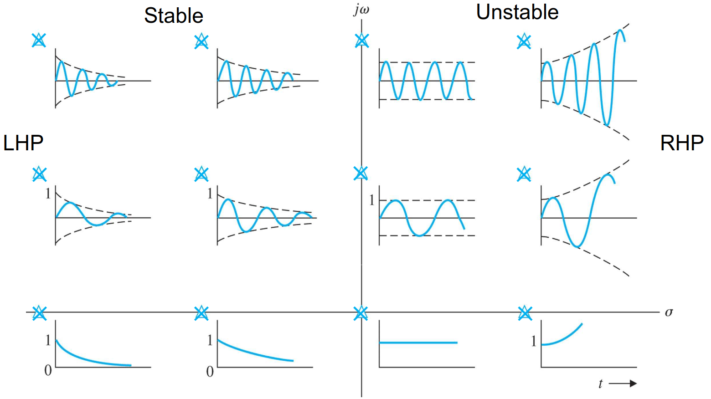

# Lecture 7, Jan 29, 2024

## Laplace Transform

\noteDefn{The \textit{Laplace transform} for a generic function $f(t)$ is defined as $$F(s) \equiv f(t)e^{-s}\,\dt$$The \textit{unilateral} (one-sided) Laplace transform is defined as $$F(s) = \laplace{f(t)} \equiv \intuinf{0^-} f(t)e^{-st}\,\dt$$where $s = \sigma + j\omega$ is a complex frequency variable with units of inverse time.}

* The Laplace transform transforms linear ODEs into algebraic equations
* For our purposes since we only consider $t \geq 0$, we consider all functions to be 0 for $t < 0$ and so the unilateral transform suffices
* $F(s)$ exists (i.e. the integral converges) if for all $\Re(s) > \alpha$ we have $\abs{f(t)} < Me^{\alpha t}$ for all $s \in \complex, M \in \reals$, i.e. $f(t)$ grows slower than exponential
	* When multiplying transforms, the output is only valid for values of $s$ in the intersection of the regions of convergence
* Some examples:
	* Unit step: $\laplace{1(t)} = \intuinf{0} 1(t)e^{-st}\,\dt = -\frac{1}{s}\inteval{e^{-st}}{0}{\infty} = \frac{1}{s}$
	* Unit impulse: $\laplace{\delta(t)} = \intuinf{0^-} \delta(t)e^{-st}\,\dt = \eval{e^{-st}}{t = 0} = 1$
		* Note that we had to start at $0^-$ to include 0 in the integration region
	* Exponential: $\laplace{e^{\alpha t}} = \intuinf{0} e^{\alpha t}e^{-st}\,\dt = \intuinf{0} e^{-(s - a)t}\,\dt = -\frac{1}{s - a}\inteval{e^{-(s - a)t}}{0}{\infty} = \frac{1}{s - a}$
		* Note we need to assume $\Re(s) > \Re(a)$ so that the exponent has a negative real part
	* Sinusoid: $\alignedeqntwo[t]{\laplace{\cos(\omega t)}}{\intuinf{0} \cos(\omega t)e^{-st}\,\dt}{\intuinf{0} \frac{e^{j\omega t} + e^{-j\omega t}}{2}e^{-st}\,\dt}{-\frac{1}{2(s - j\omega)}\inteval{e^{-(s - j\omega)t}}{0}{\infty} - \frac{1}{2(s + j\omega)}\inteval{e^{-(s + j\omega)t}}{0}{\infty}}{\frac{1}{2(s - j\omega)} + \frac{1}{2(s + j\omega)}}{\frac{s}{s^2 + \omega^2}}$
		* Similarly we can show $\laplace{\sin(\omega t)} = \frac{\omega}{s^2 + \omega^2}$
	* Power of $t$: $\alignedeqntwo[t]{\intuinf{0}t^ne^{-st}\,\dt}{\inteval{-\frac{t^n}{s}e^{-st}}{0}{\infty} + \intuinf{0} nt^{n - 1}\frac{e^{-st}}{s}\,\dt}{\frac{n}{s}\intuinf{0} t^{n - 1}e^{-st}\,\dt}{\frac{n}{s}\laplace{t^{n - 1}}}{\frac{n!}{s^{n + 1}}}$
		* Therefore the unit ramp function has $\laplace{t} = \frac{1}{s^2}$
* Important properties:
	* Linearity/superposition: $\laplace{\alpha _1f_1(t) + \alpha _2f_2(t)} = \alpha _1F_1(s) + \alpha _2F_2(s)$
	* Time delay: $\alignedeqntwo[t]{\laplace{f(t - \tau)1(t - \tau)}}{\intuinf{0} f(t - \tau)1(t - \tau)e^{-st}\,\dt}{\intuinf{\tau} f(t - \tau)e^{-st}\,\dt}{\intuinf{0} f(\lambda)e^{-s(\tau + \lambda)}\,\dd\lambda}{e^{-\tau s}\intuinf{0}f(\lambda)e^{-s\lambda}\,\dd\lambda}{e^{-\tau s}F(s)}$
		* A delay in time domain is a multiplication by an exponential in Laplace domain
	* Differentiation: $\alignedeqntwo[t]{\laplace{\diff{}{t}f(t)}}{\intuinf{0}e^{-st}\dot f(t)\,\dt}{\inteval{f(t)e^{-st}}{0}{\infty} + s\intuinf{0}f(t)e^{-st}\,\dt}{sF(s) - f(0)}$
		* Note the $f(0)$ term vanishes for a zero-state response
		* For higher derivatives: $\laplace{\diffn{2}{}{t}f(t)} = s(sF(s) - f(0)) - \dot f(0) = s^2F(s) - sf(0) - \dot f(0)$
		* Going backwards: $\laplace{tf(t)} = -\diff{}{s}F(s)$
	* Integration: $\alignedeqntwo[t]{\laplace{\int _0^t f(\tau)\,\dtau}}{\intuinf{0}\int _0^t f(\tau)\,\dtau e^{-st}\,\dt}{-\frac{1}{s}\inteval{\int _0^t f(\tau)\,\dtau e^{-st}}{0}{\infty} + \frac{1}{s}\intuinf{0} f(t)e^{-st}\,\dt}{\frac{1}{s}F(s)}$
	* Convolution: $\alignedeqntwo[t]{\laplace{f(t) * h(t)}}{\intuinf{0}\int _0^t f(t - \tau)h(\tau)\,\dtau e^{-st}\,\dt}{\intuinf{0}\int _0^t f(t - \tau)h(t)e^{-st}\,\dtau\,\dt}{\intuinf{0}\int _\tau^\infty f(t - \tau)h(\tau)e^{-st}\,\dt\,\dtau}{\intuinf{0}\intuinf{0}f(\lambda)h(\tau)e^{-s(\lambda + \tau)}\,\dd\lambda\,\dtau}{\intuinf{0}f(\lambda)e^{-s\lambda}\,\dd\lambda\intuinf{0}h(\tau)e^{-s\tau}\,\dtau}{F(s)H(s)}$
		* This means we can multiply the Laplace transform of the input by the Laplace transform of the impulse response to get the Laplace transform of the output
		* Note $\laplace{f(t)h(t)} = \frac{1}{2\pi j}(F(s) * H(s))$
	* Final Value Theorem: $\lim _{t \to \infty} f(t) = \lim _{s \to 0} sF(s)$
		* Recall that $\laplace{\diff{}{t}f} = sF(s) - f(0)$
		* $\lim _{s \to \infty}(sF(s) - f(0)) = \lim _{s \to 0} sF(s) - f(0) = \lim _{s \to 0} \intuinf{0}e^{-st}\diff{f}{t}\,\dt = \intuinf{0}\diff{f}{t}\,\dt = \lim _{t \to \infty} f(t) - f(0)$
		* Note this requires that $f(t)$ and $\diff{f}{t}$ have Laplace transforms, and $\lim _{t \to \infty}f(t)$ exists, i.e. it is *stable*
	* Initial Value Theorem: $\lim _{t \to 0^+} f(t) = \lim _{s \to \infty} sF(s)$

## Transfer Functions

\noteDefn{\textit{Transfer Function}: The ratio of the Laplace transforms of the output to the input of a system, assuming that the system was initially at equilibrium (zero state/initial conditions).}

* All transfer functions assume zero-state; if we want to look at initial conditions we shouldn't use transfer functions
* Given any input $u(t)$ to the system, the output of the system in time domain is $y(t) = h(t) * u(t)$ where $h(t)$ is the impulse response
* In Laplace domain, the output is $Y(s) = H(s)U(s)$ where $H(s) = \frac{Y(s)}{U(s)}$, the Laplace transform of the impulse response, is the transfer function
* For all LTI systems, the transfer function of the system fully characterizes the system dynamics
* Most transfer functions are rational functions $H(s) = K_H\frac{n_H(s)}{d_H(s)} = K_h\frac{s^m + b_1s^{m - 1} + \dots + b_m}{s^n + a_1s^{n - 1} + \dots + a_n}$
	* *Poles* are the roots of $d_H(s)$
		* These are more important than the zeros
	* *Zeros* are the roots of $n_H(s)$
	* Poles are denoted with an X while zeros are denoted by O on the complex plane when plotting
	* $K_H$ is the transfer function *gain*
	* $d_H(s)$ is the *characteristic equation* of the transfer function/system
		* The system's *order* is the degree of $d_H(s)$
* For all causal systems, the *relative degree* $n - m$ of the transfer function is always greater than or equal to zero
	* Consider $H(s) = s$; then for an input $U(s)$, we get output $Y(s) = sU(s)$, which means $y(t) = \diff{}{t}u(t)$
		* Such a system cannot be causal, because in order to determine the derivative of the input, the system needs to somehow anticipate the input's behaviour in the future
		* e.g. if we put in a sinusoid, it will be shifted to the left, which is non-causal
		* Generally, zeros tend to push the system towards non-causality by moving the response earlier in time, while poles push the system towards causality by delaying the response
	* The transfer function is a *proper ratio* (if $m < n$, then it is *strictly proper*)
	* Most systems we will study have strictly proper transfer functions
* $H(s) = K_H\frac{\prod _{i = 1}^m (s - z_i)}{\prod _{i = 1}^n (s - p_i)} = \left(\frac{K_H\prod _{i = 1}^m z_i}{\prod _{i = 1}^n p_i}\right)\frac{\prod _{i = 1}^m \left(\frac{s}{z_i} - 1\right)}{\prod _{i = 1}^n\left(\frac{s}{p_i} - 1\right)}$ where $z_i$ are the zeros, $p_i$ the are poles

{width=80%}

* For any LTI system, the poles of a system determines its behaviour
	* Note complex poles always come in conjugate pairs
	* Any poles on the right hand plane are unstable, i.e. the output will keep growing
		* Larger real values lead to faster growth
	* Any poles on the left hand plane are convergent, i.e. output eventually settles to 0
		* More negative real values lead to faster decay
	* Poles with zero real part neither grow nor shrink in magnitude
	* Any imaginary component in the pole causes the output to oscillate
		* Larger imaginary component lead to higher oscillation frequency
* When there are multiple poles and zeros, they will interact with each other and lead to more interesting behaviour
* The *DC gain* (or *static gain*) is the steady-state response of the system to the unit step input
	* This will give an output $Y_s(s) = H(s)U(s) = \frac{1}{s}H(s)$
	* Using FVT, $\lim _{t \to \infty} y_s(t) = \lim _{s \to 0}s\left(\frac{1}{s}H(s)\right) = \lim _{s \to 0} H(s)$
	* This makes the DC gain very easy to find

