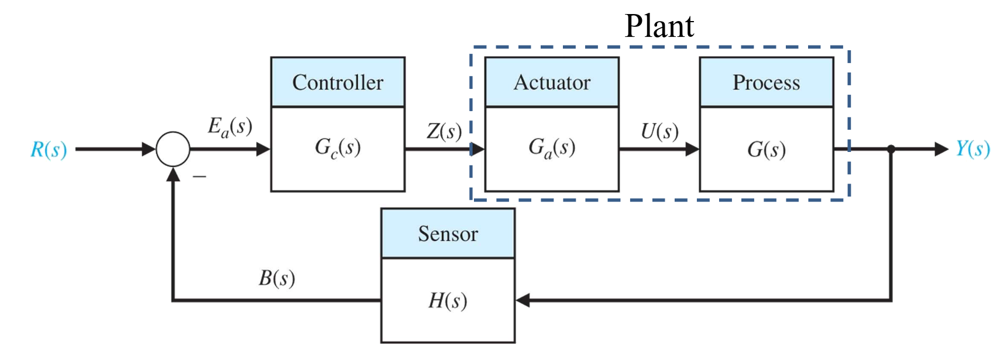
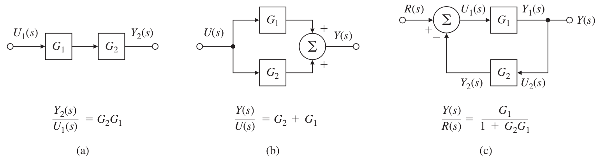
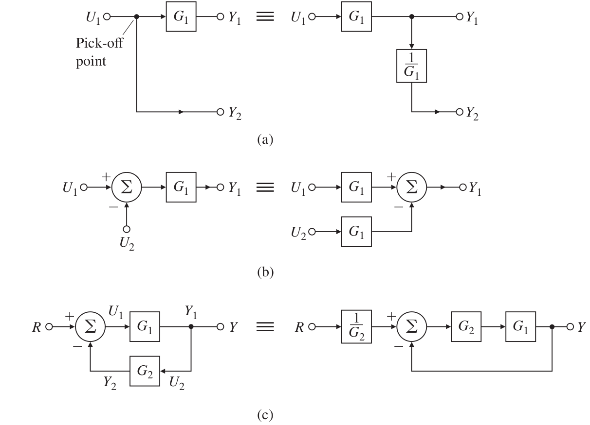

# Lecture 8, Feb 1, 2024

## Block Diagrams

* We use block diagrams to depict cause-and-effect relationships within a system
	* Each block shows a function acting on an input to generate output
		* The block is depicted with a transfer function
	* Arrows are used to represent the direction of signals (i.e. information flow)
	* Circles are used for algebraic sum and differences of signals
	* Nodes (aka pick-off points) are used for branching out signals
* Note when we have a feedback system, we usually depict the plant' transfer function by $G(s)$ and the feedback's transfer function by $H(s)$

{width=70%}

* Transfer function definitions for a general feedback system:
	* Closed-loop TF: $\mathcal T = \frac{Y(s)}{R(s)} = \frac{G_c(s)G_a(s)G(s)}{1 + G_c(s)G_a(s)G(s)H(s)}$
	* Open-loop TF: $L(s) = \frac{B(s)}{E_a(s)} = G_c(s)G_a(s)G(s)H(s)$
		* Note this is not the output to input without feedback (which would be feedforward TF)
		* This is the ratio of the feedback signal to $E_a(s)$
	* Error TF: $\frac{E(s)}{R(s)} = \frac{R(s) - Y(s)}{R(s)} = \frac{1 + G_c(s)G_a(s)G(s)(H(s) - 1)}{1 + G_c(s)G_a(s)G(s)H(s)}$
		* Note the $E(s)$ here is not the same as $E_a(s)$
	* Feedforward TF: $\frac{Y(s)}{E_a(s)} = G_c(s)G_a(s)G(s)$
		* Note here we use $E_a(s)$ not $E(s)$
	* Feedback TF: $\frac{B(s)}{R(s)} = \frac{G_c(s)G_a(s)G(s)H(s)}{1 + G_c(s)G_a(s)G(s)H(s)}$
		* This is the ratio of feedback signal to input signal
		* We can find this easily by taking $\frac{Y(s)}{R(s)}H(s)$
	* Sensitivity TF: $\mathcal S(s) = \frac{1}{1 + G_c(s)G_a(s)G(s)H(s)}$
		* This is important to the robustness of the controller as we will later see
		* This is the inverse of the characteristic equation
	* Characteristic equation: $1 + G_c(s)G_a(s)G(s)H(s)$
		* This is the denominator of the closed-loop TF
* Block diagrams can be simplified to find the overall transfer function of the system
	* There are a number of simplification rules

{width=80%}

{width=60%}

## First-Order System Response

* Consider a pure integrator: $y(t) = \int _0^t u(t)\,\dt + y(0)$ which has transfer function $H(s) = \frac{1}{s}$ if $y(0) = 0$
	* The ODE is $\dot y(t) = u(t)$
	* The impulse response is $y_i(t) = \ilaplace{H(s)} = \ilaplace{\frac{1}{s}} = 1$
	* The step response is $y_s(t) = \ilaplace{H(s)\frac{1}{s}} = \ilaplace{\frac{1}{s^2}} = t$
	* What if the initial condition is not zero?
		* Laplace transform the ODE to get $sY(s) - y(0) = U(s) \implies Y(s) = \frac{1}{s}U(s) + \frac{1}{s}y(0)$
		* For a step response, $y_s(t) = \ilaplace{\frac{1}{s^2}} + \ilaplace{\frac{1}{s}y(0)} = t + y(0)1(t) = t + y(0)$

