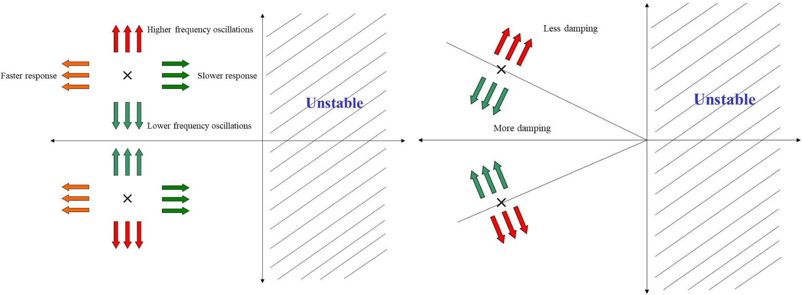

# Lecture 9, Feb 5, 2024

## First-Order System Response

* Consider a pure integrator: $y(t) = \int _0^t u(t)\,\dt + y(0)$ which has transfer function $H(s) = \frac{1}{s}$ if $y(0) = 0$
	* The ODE is $\dot y(t) = u(t)$
	* The impulse response is $y_i(t) = \ilaplace{H(s)} = \ilaplace{\frac{1}{s}} = 1$
	* The step response is $y_s(t) = \ilaplace{H(s)\frac{1}{s}} = \ilaplace{\frac{1}{s^2}} = t$
	* What if the initial condition is not zero?
		* Laplace transform the ODE to get $sY(s) - y(0) = U(s) \implies Y(s) = \frac{1}{s}U(s) + \frac{1}{s}y(0)$
		* For a step response, $y_s(t) = \ilaplace{\frac{1}{s^2}} + \ilaplace{\frac{1}{s}y(0)} = t + y(0)1(t) = t + y(0)$
* Consider an RC circuit with input voltage $Ku(t)$
	* Form the ODE: $T\dot y(t) + y(t) = Ku(t)$ where $T = RC$
	* Laplace transform: $TsY(s) + Y(s) = KU(s) \implies H(s) = \frac{Y(s)}{U(s)} = \frac{K}{Ts + 1}$
	* Impulse response: $y_i(t) = \ilaplace{H(s)} = \frac{K}{T}e^{-\frac{t}{T}}$
	* Step response: $y_s(t) = \ilaplace{\frac{K}{s(Ts + 1)}} = K\ilaplace{\frac{1}{s} - \frac{T}{Ts + 1}} = K\left(1 - e^{-\frac{t}{T}}\right)$
	* We can see that $T$ is the time constant of the system; the smaller it is, the faster the system evolves
	* DC gain: $y_ss = \lim _{t \to \infty} y_s(t) = \lim _{s \to 0}s\frac{K}{s(Ts + 1)} = K$
* In general a first-order system has transfer function $H(s) = \frac{b}{s + a}$ and impulse response $h(t) = be^{-at}1(t)$
	* For positive $a$, this is stable and the system decays to 0; for negative $a$, this is unstable; for $a = 0$ the system maintains a constant output
		* Positive $a$ gives poles in the LHP and negative $a$ gives poles in the RHP
	* The step response is given by $y_s = \frac{b}{a}(1 - e^{-at})1(t)$
		* For positive $a$, this converges to the DC gain $\frac{b}{a}$
		* For negative $a$ this diverges exponentially
		* For zero $a$ this gives a linear response (note we can derive this by nothing $H(s) = \frac{b}{s}$ in this case)
* The time constant is given by $T = \frac{1}{a}$
	* The rise time is given by $t_r \approx 2.2t$, which is the time taken for the output to go from 10% to 90% of the DC gain
	* The settling time is given by $t_s \approx \frac{4.6}{a}$, which is the time taken for the output to reach 99% of the DC gain
* In a first-order system, there is never any overshoot or oscillation; the output never passes the steady state value

{width=70%}

## Second Order System Response

* Consider a spring-mass-dashpot system: $m\ddot y(t) + b\dot y(t) + ky(t) = kf(t)$
	* Laplace transform: $m(s^2Y(s) - sy(0^-) - \dot y(0^-)) + b(sY(s) - y(0^-)) + kY(s) = kF(s)$
	* $Y(s) = \frac{\frac{k}{m}}{s^2 + \frac{b}{m}s + \frac{k}{m}}F(s) + \frac{s + \frac{b}{m}}{s^2 + \frac{b}{m}s + \frac{k}{m}}y(0^-) + \frac{1}{s^2 + \frac{b}{m}s + \frac{k}{m}}\dot y(0^-)$
	* Assuming zero state, $H(s) = \frac{Y(s)}{F(s)} = \frac{\frac{k}{m}}{s^2 + \frac{b}{m}s + \frac{k}{m}} = \frac{\omega _n^2}{s^2 + 2\zeta\omega _n s + \omega _n^2}$
		* $\omega _n = \sqrt{\frac{k}{m}}$ is the damping ratio
		* $\zeta = \frac{b}{2\sqrt{km}}$ is the damping ratio
	* The poles are at $-\zeta\omega _n \pm \omega _n\sqrt{\zeta^2 - 1}$
		* Depending on $\zeta$ we can get real or imaginary poles
	* If $\zeta > 1$ (i.e. $b > 2\sqrt{km}$) we have two distinct real poles; the system is *overdamped*
		* Let $-\sigma _1 = -\zeta\omega _n + \omega _n\sqrt{\zeta^2 - 1}$, $-\sigma _2 = -\zeta\omega _n - \omega _n\sqrt{\zeta^2 - 1}$
		* Then $\omega _n = \sqrt{\sigma _1\sigma _2}, \zeta = \frac{\sigma _1 + \sigma _2}{2\sqrt{\sigma _1\sigma _2}}$
	* If $\zeta = 1$ (i.e. $b = 2\sqrt{km}$) we have two overlapping real poles; the system is *critically damped*
		* $H(s) = \frac{\sigma^2}{(s + \sigma)^2}$ where $\sigma = \omega _n$
	* If $0 \leq \zeta < 1$ (i.e. $b < 2\sqrt{km}$) we have two complex conjugate poles; the system is *underdamped*
		* The poles are $s_1, s_2 = -\sigma \pm j\omega _d$ where $\sigma = \zeta\omega _n, \omega _d = \omega _n\sqrt{1 - \zeta^2}$
		* $H(s) = \frac{\omega _n^2}{(s - (-\sigma + j\omega _d))(s - (-\sigma - j\omega _d))} = \frac{\sigma^2 + \omega _d^2}{(s + \sigma)^2 + \omega _d^2}$
		* In this case the system oscillates
		* $\omega _d$ is the oscillation frequency and $\sigma$ is the decay rate

{width=25%}

{width=70%}

* Consider the impulse response of the underdamped case
	* $y_i(t) = \ilaplace{\frac{(\sigma^2 + \omega _d^2)}{(s + \sigma)^2 + \omega _d^2}} = \ilaplace{\frac{(\sigma^2 + \omega _d^2)}{\omega _d} \frac{\omega _d}{(s + \sigma)^2 + \omega _d^2}} = \frac{\sigma^2 + \omega _d^2}{\omega _d}e^{-\sigma t}\sin(\omega _dt)$
	* Alternatively $y_i(t) = \frac{\omega _n}{\sqrt{1 - \zeta^2}}e^{-\zeta\omega _nt}\sin\left(\omega _n\sqrt{1 - \zeta^2}t\right)$
	* The response is a decaying exponential

{width=40%}

