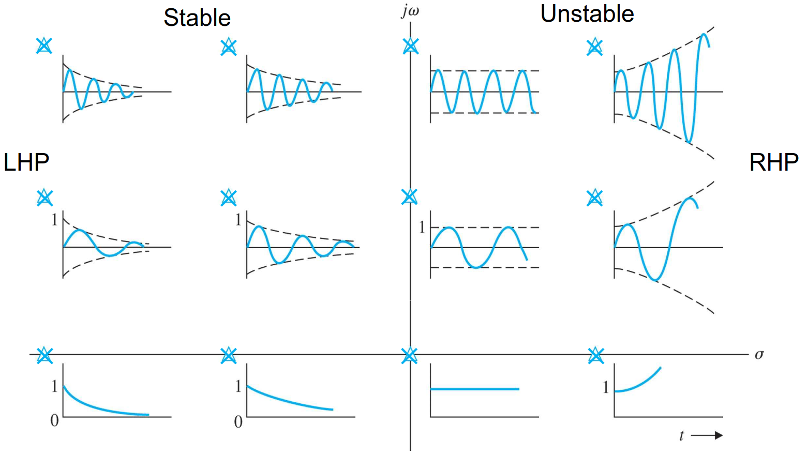
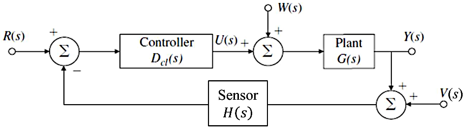

# AER372 Control Systems Reference Sheet

## Dynamic System Response

* The response of an LTI system to $u(t)$ is $y(t) = \int _0^t u(\tau)h(t - \tau)\,\dd\tau = u(t) * h(t)$ where $h(t)$ is the response of the system to the unit impulse $\delta(t)$; convolution has the properties:
	1. Commutativity: $x_1(t) * x_2(t) = x_2(t) * x_1(t)$
	2. Associativity: $x_1(t) * [x_2(t) * x_3(t)] = [x_2(t) * x_2(t)] * x_3(t)$
	3. Distributivity: $x_1(t) * [x_2(t) + x_3(t)] = x_1(t) * x_2(t) + x_2(t) * x_3(t)$
	4. Shift: $x_1(t) * x_2(t - T) = x_1(t - T) * x_2(t)$
	5. Impulse: $x(t) * \delta(t) = \intinf x(\tau)\delta(t - \tau) = x(t)$
	6. Width: the convolution of a function covering a length of time $T_1$ and another function covering $T_2$ covers a time of $T_1 + T_2$
* Laplace transform: $F(s) = \laplace{f(t)} \equiv \intuinf{0^-} f(t)e^{-st}\,\dt$ (see table of transforms)

{width=50%}

{width=70%}

* Transfer function definitions for a general feedback system:
	* Closed-loop: $\mathcal T(s) = \frac{Y(s)}{R(s)} = \frac{G_c(s)G_a(s)G(s)}{1 + G_c(s)G_a(s)G(s)H(s)}$
	* Open-loop: $L(s) = \frac{B(s)}{E_a(s)} = G_c(s)G_a(s)G(s)H(s)$
	* Error: $\frac{E(s)}{R(s)} = \frac{R(s) - Y(s)}{R(s)} = \frac{1 + G_c(s)G_a(s)G(s)(H(s) - 1)}{1 + G_c(s)G_a(s)G(s)H(s)}$
		* Note the $E(s)$ here is not the same as $E_a(s)$
	* Feedforward: $\frac{Y(s)}{E_a(s)} = G_c(s)G_a(s)G(s)$
	* Feedback: $\frac{B(s)}{R(s)} = \frac{G_c(s)G_a(s)G(s)H(s)}{1 + G_c(s)G_a(s)G(s)H(s)}$
	* Sensitivity: $\mathcal S(s) = \frac{1}{1 + G_c(s)G_a(s)G(s)H(s)}$
* Stability:
	* Bounded-Input-Bounded-Output (BIBO): any bounded input creates bounded output (no convergence requirement)
	* Asymptotic: any initial condition decays to 0
	* Marginal/neural: (for zero input) any initial condition generates a bounded output
* Routh array: only LHP roots if all elements in the first column are positive; number of RHP roots is equal to the number of sign changes

### First-Order System

* $H(s) = \frac{b}{s + a} \implies h(t) = be^{-at} \implies y_s(t) = \frac{b}{a}\left(1 - e^{-at}\right)$
* DC gain: $\frac{b}{a}$
* Time constant: $T = \frac{1}{a}$
* Rise time: $t_r \approx 2.2T$ (10% to 90%)
* Settling time: $t_s \approx \frac{4.6}{a}$ (0 to 99%)

### Second-Order System

{width=30%}

{width=100%}

* $H(s) = \frac{\omega _n^2}{s^2 + 2\zeta\omega _ns + \omega _n^2}$; poles: $-\zeta\omega _n \pm \omega _n\sqrt{\zeta^2 - 1}$
	* Overdamped: $\zeta > 1$, then $-\sigma = -\zeta\omega _n \pm \omega _n\sqrt{\zeta^2 - 1} \iff \omega _n = \sqrt{\sigma _1\sigma _2}, \zeta = \frac{\sigma _1 + \sigma _2}{2\sqrt{\sigma _1 + \sigma _2}}$
	* Critically damped: $\zeta = 1$, then $\sigma = \omega _n$
	* Underdamped: $\zeta < 1$, then $\sigma = \zeta\omega _n, \omega _d = \omega _n\sqrt{1 - \zeta^2}$, poles at $s = -\sigma \pm j\omega _d$
		* $H(s) = \frac{\sigma^2 + \omega _d^2}{(s + \sigma)^2 + \omega _d^2}$
	* **Analysis below assumes underdamped case**
* $h(t) = \frac{\sigma^2 + \omega _d^2}{\omega _d}e^{-\sigma t}\sin(\omega _dt) = \frac{\omega _n}{\sqrt{1 - \zeta^2}}e^{-\zeta\omega _nt}\sin\left(\omega _n\sqrt{1 - \zeta^2}t\right)$
* $y_s(t) = 1 - e^{-\sigma t}\left(\cos(\omega _dt) + \frac{\sigma}{\omega _d}\sin(\omega _dt)\right) = 1 - e^{-\sigma t}\frac{\omega _n}{\omega _d}\cos(\omega _d t - \phi)$
	* $\phi = \tan^{-1}\left(\frac{\omega _d}{\sigma}\right) = \tan^{-1}\left(\frac{\omega _d}{\zeta\omega _n}\right)$
* DC gain: 1 (no scaling)
* Peak time: $t_p = \frac{n\pi}{\omega _n\sqrt{1 - \zeta^2}} = \frac{n\pi}{\omega _d}$
* Overshoot: $M_p = e^{-\frac{\pi\zeta}{\sqrt{1 - \zeta^2}}} \iff \zeta = \sqrt{\frac{(\ln M_p)^2}{\pi^2 + (\ln M_p)^2}}$
	* $\zeta = 0.5$ gives 16% overshoot, $\zeta = 0.7$ gives 5% overshoot
* Rise time: $t_r \approx \frac{1.8}{\omega _n}$ (for $\zeta = 0.5$)
* Settling time: $t_s \approx \frac{4.6}{\zeta\omega _n} = \frac{4.6}{\sigma}$

### General Trends

* LHP zero: faster response; shorter rise time, larger overshoot; no effect on steady-state
* RHP zero (nonminimum-phase): longer rise time, less overshoot than LHP zero (but still increased); can cause system to start in the wrong direction
* Additional poles: slower system; longer rise time, less overshoot
* Poles and zeros with a real part more than 4 times further can be ignored

\pagebreak

## Block Diagram Simplification

{width=100%}

\pagebreak

## Control System Performance

{width=60%}

* $Y_{cl} = \mathcal TR(s) + G\mathcal SW(s) - H\mathcal TV(s) \implies E_{cl} = R - Y_{cl} = (1 - \mathcal T)R - G\mathcal SW + H\mathcal TV$
	* $\mathcal T(s) = \frac{Y(s)}{R(s)} = \frac{G(s)D_{cl}(s)}{1 + H(s)G(s)D_{cl}(s)} = T_{cl}(s)$ (assume $W(s) = V(s) = 0$)
	* $\frac{Y(s)}{W(s)} = G(s) \cdot \frac{1}{1 + H(s)G(s)D_{cl}(s)} = G(s)\mathcal S(s)$ (assume $R(s) = V(s) = 0$)
	* $\frac{Y(s)}{V(s)} = -H(s) \cdot \frac{D_{cl}(s)G(s)}{1 + H(s)D_{cl}(s)G(s)} = -H(s)\mathcal T(s)$ (assume $R(s) = W(s) = 0$)
	* For unity feedback: $\mathcal T(s) + \mathcal S(s) = 1 \implies E_{cl} = \mathcal SR(s) - G\mathcal SW(s) + \mathcal TV(s)$
* Sensitivity: $\mathcal S^{\mathcal T}{G} = \frac{G}{\mathcal T}\diff{\mathcal T}{G} = \frac{1}{1 + HGD_{cl}}$
* Type: the maximum order $k$ of a polynomial reference $r(t) = t^k$ that the system can follow with $e_{ss}$ being constant
	* For tracking and $H(s) = 1, W(s) = V(s) = 0$, the type is the number of poles $GD_{cl}(s)$ has at $s = 0$
	* For regulation and $R(s) = V(s) = 0$, the type is the number of zeros $\frac{E_{cl}(s)}{W(s)} = -T_w(s) = -\frac{G(s)}{1 + H(s)G(s)D_{cl}(s)}$ has at $s = 0$
* $E(s) = (1 - \mathcal T(s))R(s) \implies e_{ss} = \lim _{s \to 0} sE(s)$ assuming stability
* Error constants (wrt tracking):
	* Type 0: $K_p = \lim _{s \to 0} GD_{cl}(s) \implies e_{ss} = \frac{1}{1 + K_p}$
	* Type 1: $K_v = \lim _{s \to 0} sGD_{cl}(s) \implies e_{ss} = \frac{1}{K_v}$
	* Type 2: $K_a = \lim _{s \to 0} s^2GD_{cl}(s) \implies e_{ss} = \frac{1}{K_a}$

\pagebreak

## Root Locus Design Method

* Evans form: $1 + D_c(s)G(s)H(s) = a(s) + Kb(s) = 0 \implies 1 + K\frac{b(s)}{a(s)} = 1 + KL(s) = 0$
* $s_0$ is on the locus if $\sum _{i = 1}^m \angle(s_0 - z_i) - \sum _{i = 1}^n \angle(s_0 - p_i) = 180\degree + 360\degree(l - 1)$
* Given $L(s) = \frac{b(s)}{a(s)} = \frac{\prod _{i = 1}^n (s - z_i)}{\prod _{i = 1}^m (s - p_i)}$, a positive root locus follows the following rules:
	1. There are $n$ branches each starting from the open-loop poles; $m$ of these branches will end at the open-loop zeros of $L(s)$, while the rest go to infinity
	2. The segments of the locus on the real axis are always to the left of an odd number of real poles and zeros (on the real axis)
	3. For the $n - m$ poles that must go to infinity, their asymptotes are lines radiating from the real axis at $s = \alpha$ at angles $\phi _l$, where:
		* $\alpha = \frac{\sum _i p_i - \sum _i z_i}{n - m}$
		* $\phi _l = \frac{180\degree + 360\degree(l - 1)}{n - m}$
		* $l = 1, 2, \dots, n - m$ is the branch number
		* Geometrically this means that the asymptotes evenly divide the $360\degree$ and are always symmetric about the real axis; for an odd number of branches, there is always an asymptote towards the negative real axis
	4. Each branch departs at an angle of $\phi _{l, d} = \sum _i \psi _i - \sum _{i \neq l} \phi _i - 180\degree$ from an open-loop pole, where $\psi _i$ are the angles from zeros to the pole, and $\phi _i$ are angles from the other poles to the pole
		* If the pole is repeated $q$ times, $\phi _{l, d} = \sum _i \psi _i - \sum _{i \neq l} \phi _i - 180\degree - 360\degree(l - 1)$ for $l = 1, 2, \dots, q$
		* Angles of arrival at a zero are $\psi _{l, a} = \sum \phi _i - \sum _{i \neq l} \psi + 180\degree + 360\degree(l - 1)$
	5. At points where branches intersect (where the characteristic polynomial has repeated roots), if $q$ branches intersect at the point, then their departure angles are $\frac{180\degree + 360\degree(l - 1)}{q}$ plus an offset; together the $q$ branches arriving and $q$ branches departing should form an array of $2q$ evenly spaced rays
		* If the intersection is on the real axis, use Rule 2 to determine the orientation, otherwise use Rule 4
	6. The breakaway/break-in points of the locus (i.e. intersection points) are among points where $\diff{L(s)}{s} = 0$
		* If the multiplicity of the root of $\diff{L(s)}{s} = 0$ is $r$, then the multiplicity of the corresponding root in the closed-loop characteristic equation is $q = r + 1$ (i.e. $r + 1$ branches meet)
* After desired point $s_0$ is found, $K = \frac{1}{\abs{L(s)}} = \frac{\abs{\prod _{i = 1}^n (s_0 - p_i)}}{\abs{\prod _{i = 1}^m (s_0 - z_i)}} = \frac{\prod _{i = 1}^n \abs{s_0 - p_i}}{\prod _{i = 1}^m \abs{s_0 - z_i}}$
	* Substitute $K$ back into $L(s) = \frac{1}{K}$ to solve for the other roots at this gain
* Lead, lag and notch compensators do not have poles or zeros at the origin, thus they do not change the system type
* Lead compensator: $D_c(s) = K\frac{s + z}{s + p}$ where $z < p$; approximates PD control: speeds up response (lowering rise time) and decreases overshoot
	1. Determine where closed-loop poles need to be to meet specifications
	2. Create a root locus with only a proportional controller
	3. If more damping is needed, choose $z$ to be 1/4 to 1 times the desired $\omega _n$ and pick $p$ to be 5 to 25 times $z$
	4. If less damping is needed, decrease $p$; if more damping is needed, increase $p$ and/or decrease $z$
		* The ratio $p / z$ should be as low as possible (less than 25) in order to minimize the effects of noise from a derivative controller
	5. When values of $z$ and $p$ are found so that the root locus passes through the desired region, select the value of $K$ and check the step response
	6. Add integral control or lag compensator if steady-state error requirements are not met
* Notch compensator: $D_c(s) = K\frac{s^2 + 2\zeta\omega _0s + \omega _0^2}{(s + \omega _0)^2}$; captures problematic poles with its zeros, cancelling a specific unwanted resonant frequency in the plant
	* Choose the zeros close to the undesirable pole and a bit closer to the imaginary axis
	* Imaginary part of zeros is either above or below the poles, so the locus stays in the LHP
* Lag compensator: $D_c(s) = K\frac{s + z}{s + p}$ where $z > p$; approximates PI control, decreasing steady-state error
	1. Determine the factor of increase in the error constant needed, which gives $z / p$ (typically between 3 to 10)
	2. Select $z$ to be approximately 100 to 200 times smaller than the system's dominant natural frequency
	3. Plot the resulting root locus and adjust $z$ and $p$ as necessary
	4. Plot the step input to verify that the time domain response is still satisfactory
		* If the lag compensator is too slow, increase $z$ and $p$ while keeping their ratio constant, but keep still far from dominant poles

\pagebreak

## Frequency Design Method

* Process for plotting a composite Bode plot:
	1. Manipulate the transfer function into Bode form to identify all break point frequencies
	2. Plot the low-frequency asymptote: Determine the value of $n$ for the class 1 term and plot its magnitude as a line with slope of $n$ passing through $K_0$ at $\omega = 1$
	3. Draw the asymptotes for the magnitude plot: Extend the low-frequency asymptote until the next break point, then change the slope by $\pm 1$ or $\pm 2$ depending on the class of the break point and whether it is numerator or denominator; repeat until all break points are accounted for
	4. Correct the magnitude values at break points:
		* For class 2, increase the magnitude by a factor of $1.41$ (numerator) or decrease by a factor of $0.707$ (denominator)
		* For class 3, change by a factor of $(2\zeta)$ (numerator) or a factor of $\frac{1}{2\zeta}$ (denominator)
		* Note these values may change of break points are close together; if break points are less than a factor of 10 away, the break point offsets are inaccurate
	5. Plot the low-frequency asymptote of the phase curve: $\phi = n \cdot 90\degree$
	6. Draw the horizontal asymptotes for phase: Change the value of the phase asymptote by $\pm 90\degree$ for class 2 break points and $\pm 180\degree$ for class 3 break points for each break point in ascending order
	7. Determine intermediate asymptotes for each break point
	8. Add each phase curve together graphically
* Bandwidth $\omega _{BW}$: the highest frequency where the output still tracks the input in a satisfactory manner, typically when gain hits $\sqrt{2}/2 = 0.707$
	* A higher bandwidth means a faster response -- the larger $\omega _{BW}$ is, the larger $\omega _n$ is and the shorter our rise and peak times
* Resonant peak $M_r$: the maximum value of the amplitude ratio
	* $M_r = \frac{1}{2\zeta\sqrt{1 - \zeta^2}}, \omega _r = \omega _n\sqrt{1 - 2\zeta^2}$ for a second-order system
* Gain margin (GM): the factor by which $K$ can be increased before the system becomes unstable; $GM < 1$ indicates instability
	* This is the value of $\frac{1}{\abs{KG(j\omega)}}$ where $\angle G(j\omega) = -180\degree$
* Phase margin (PM): the amount by which $\angle G(j\omega)$ exceeds $-180\degree$ (less negative) when $\abs{KG(j\omega)} = 1$; $PM < 0$ indicates instability
	* A value of $PM = 30\degree$ is typically regarded as the lowest value for a safe stability margin
	* $PM = \tan^{-1}\left(\frac{2\zeta}{\sqrt{\sqrt{1 + 4\zeta^4} - 2\zeta^2}}\right)$ for a second-order system
	* $\zeta \approx \frac{PM\degree}{100}$ for $PM < 65\degree$
* Crossover frequency $\omega _c$: the frequency at which the open-loop magnitude is unity
	* $PM = \angle L(j\omega _c) - (-180\degree)$
	* $\omega _c \leq \omega _{BW} \leq 2\omega _c$ with $\omega _c = \omega _{BW}$ for $PM = 90\degree$
* Disturbance rejection bandwidth $\omega _{DRB}$: the max frequency at which the disturbance rejection (i.e. sensitivity $\mathcal S$) is below a certain amount, usually -3 decibels/0.707

{width=40%}

{width=50%}

* Rule of thumb: having $\abs{KG(j\omega)}$ at a constant slope of -1 for a decade around $\omega _c$ will result in a PM of $90\degree$
* A unity feedback system of type $n$ has an open-loop magnitude plot with a slope of $-n$ at low frequencies
	* $\abs{KD_cG(j\omega)} \approx \frac{K_n}{\omega^n}$ at low frequencies
* Lead compensator: $D_c(s) = \frac{T_Ds + 1}{\alpha T_Ds + 1}$ where $\alpha < 1$, with corner frequencies $\omega _l = \frac{1}{T_D}$ (low) and $\omega _h = \frac{1}{\alpha T_D}$ (high); increases the crossover frequency and the speed of response
	1. Determine $K$ to satisfy error or bandwidth requirements
		* For error, pick $K$ to satisfy the error constant
		* For bandwidth, pick $K$ so that $\omega _c$ is within a factor of two below the desired closed-loop bandwidth
	2. Evaluate the PM of the uncompensated system using this $K$
	3. Find the amount of PM increase we need (add a safety margin, usually $5\degree$ or more)
	4. Determine $\alpha = \frac{1 - \sin\phi _{max}}{1 + \sin\phi _{max}}$
	5. Pick the desired crossover frequency and make $\omega _{max}$ there, and determine $T_D$ using $\frac{1}{T_D} = \omega _{max}\sqrt{\alpha}$
	6. Draw the compensated frequency response and check that the PM requirement is satisfied; iterate if not
* Lag compensator: $D_c(s) = \alpha\frac{T_Is + 1}{\alpha T_Is + 1}$, where $\alpha > 1$; decreases steady-state error; alternatively can be used to decrease the magnitude at frequencies above break points (with adjustment in $K$), to increase PM
	1. Determine the gain $K$ required to get the desired PM without compensation, with a $5\degree$ to $10\degree$ margin to account for the PM reduction of the compensator
	2. Draw the Bode plot of the uncompensated open-loop TF and check the low-frequency gain, which gives the steady-state error
	3. Determine the value of $\alpha$ to meet the steady-state error requirement -- $\alpha$ is how much more we need to multiply the low-frequency gain by in order to meet the steady-state error requirement
	4. Choose the upper corner frequency $\frac{1}{T_I}$ (the zero) to be one octave to multiple decades below the uncompensated $\omega _c$
	5. Iterate on the design and verify that it meets requirements

