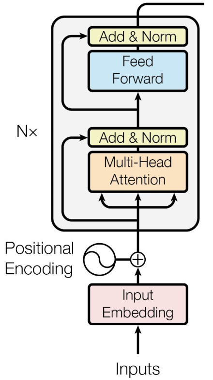

# Lecture 10, Mar 25, 2024

## Attention Mechanisms

* The main building block of transformers
* In an attention mechanism, the model learns an *attention score* for different parts of the input sequence
	* Parts with higher attention score are deemed more important, e.g. adjectives on nouns, compared to connecting words
* The attention scores are used to aggregate the data, e.g. by taking a weighted sum, before it is passed to the rest of the model
* Example: attention-based pooling for a system classifying tweets
	* We can take every word in the sentence, find its embedding (using word2vec/GloVe) and take the sum or average to get an aggregate result that can be passed to a classifier network, but relative importance and order information is lost
	* We can use a fully connected network that takes word embeddings and gives a score for each embedding, then normalize the scores (softmax), then use the attention scores to take a weighted sum of the word embeddings
		* This network is trained end-to-end with the classifier
		* Note that this simple attention mechanism does not track order
* Attention can be defined between two elements, which gives 2 types:
	* *Cross-attention*: between two sequences
		* e.g. in translation, we compute the attention between words in two languages
	* *Self-attention* (or *intra-attention*): input with respect to itself, i.e. for a token, compute the attention for all other tokens in the same sequence
		* This can be used to match different words of the input, e.g. figuring out what the word "it" refers to
* Given two embeddings we have many different methods to compute their attention scores
	* Methods such as dot product or cosine similarity are simple but has no weights to learn
	* We can use a bilinear form $a^TWb$ to add weights
	* Can also use more complex forms such as a fully-connected network

## Transformer Networks

* RNNs' sequential nature means we can't parallelize them easily, making them slow to train
* Transformers are a type of network based solely on self-attention
* Attention is modelled as a "soft neural dictionary": it retrieves a value $v_i$ for a query $q$ based on a key $k_i$
	* Values, queries, and keys are $d$-dimensional embeddings
	* Rather than return a fixed value for a query, it uses a soft retrieval: retrieving all values and then computing their importance with respect to the query based on the similarity between the query and their keys
		* The result is a kind of weighted average of all the keys with the weights being the similarities between the query and each value's associated key
* Given an input sequence $X \in \reals^{n \times i}$, queries $Q \in \reals^{n \times k}$, keys $K \in \reals^{n \times k}$, values $V \in \reals^{n \times v}$, are generated from the same input using 3 different linear layers with different weights
	* This is equivalent to a matrix multiplication
	* The queries and keys have the same dimension, but the values do not
		* Both dimension sizes are hyperparameters
	* Given an input sequence of $n$ tokens, we will have $n$ of each queries, keys and values
* Mathematically the attention is defined as $\operatorname{Attention}(Q, K, V) = \operatorname{softmax}\left(\frac{QK^T}{\sqrt{d_k}}\right)V$
	* This is known as *scaled dot-product attention*
	* $QK^T$ would give us the pairwise attention scores between all tokens within the input sequence
	* $d_k$ is the hidden dimension of $Q$ and $K$ (i.e. the dimensionality of the embeddings); this keeps the scores from increasing artificially with embedding size
	* After a softmax, we get the normalized attention scores ($n \times n$), which we then multiply by $V$
* In the end, each token in the result is a weighted sum of all other tokens, weighted by how important the other tokens are to that token
	* We now have a new embedding that integrates the surrounding context
	* Unlike word2vec or GloVe these are context-sensitive, since the meaning of a word depends on its surroundings
	* This process is easily parallelized since it is not sequential, and doesn't suffer from memory loss

{width=20%}

* *Multi-head attention*: the total representation space is divided into $h$ subspaces, parallel linear layers and attentions are run for the subspaces and the final result is the concatenation of all subspaces, after passing through another linear layer
	* Before passing to each attention head and after concatenation, we use linear layers
	* Instead of having one very strong model, we have several weaker models that work together
	* This tends to increase performance

{width=30%}

* Each transformer encoder layer consists of a multi-head self-attention sublayer, followed by a fully connected sublayer (which can be deep), with residual (skip) connections around each of the sublayers followed by layer normalization
	* The output of the multi-head attention is normalized (layer norm)
	* We can stack transformer layers just as with any other type of network
* The output from the transformer encoder is an embedding that we can feed to further layers for processing

{width=25%}

* After the transformer, we pool its output using methods such as summing, which produces embedding sizes that do not depend on the input length
	* Since the model has no recurrent or convolutional layers, it doesn't take into account order by itself
* We need positional encoding to give the model order information
	* One way to do this is alternate between sines and cosines
	* The goal is to create an encoding in the same shape as the input word embeddings, with a unique value for each position in the sequence and embedding
	* This is then added elementwise to the input embeddings before being passed into the encoder layer
	* The positional encoding is defined outside the model
* Transformers have a number of advantages over RNNs:
	* Good with long-range dependencies (no memory loss since everything has a direct path to output, regardless of its position in the input sequence)
	* Less likely to have vanishing or exploding gradients
	* Fewer training steps in general (due to lack of recurrent relation)
		* However for smaller datasets RNNs might be better
	* Allows parallel computation (again due to lack of recurrent relation)
* In PyTorch, use linear layers to compute the $Q, K, V$ matrices, and use `nn.MultiheadAttention(hidden_size, num_heads, batch_first=True)` for the attention
	* `nn.MultiheadAttention` is called with $Q, K, V$ matrices as arguments

### Applications

* Most common application is in language processing since it can process context
* Example: Google's BERT (Bidirectional Encoder Representations from Transformers) model
	* Trained on two self-supervised tasks:
		* Masked word prediction: randomly mask 15% of tokens and predict what was masked
			* Similar to a de-noising encoder
			* Loss is computed on masked words only (otherwise the model memorizes the unmasked words)
		* Next sentence prediction: predicting if two sentences are likely to appear together (binary output)
	* Inputs are the elementwise sum of embeddings for each token, embeddings for each sentence (same embeddings for all the words in a sentence) and positional encodings
		* Uses special control tokens to determine the task and sentence separation, etc
	* The transformer part can be isolated and used for transfer learning, like CNNs
* They can also be used in computer vision tasks; these are known as *vision transformers* (ViTs)
	* Compared to CNNs, ViTs achieve higher accuracies on large datasets due to their higher modelling capacity (i.e. more flexibility), lower inductive biases, and global receptive fields (i.e. they look at the entire image at once)
	* However CNNs are still on par or better in terms of model complexity or size vs. accuracy (i.e. CNNs can work better for the same number of parameters)
* ViTs split the image into smaller sections (*patches*), gives each one a positional embedding and passes it to a transformer encoder
	* Each patch is flattened and passed through fully connected layers to first obtain an embedding
	* If the patches are small enough, we lose no spacial information
	* The transformer itself does not change

{width=70%}

