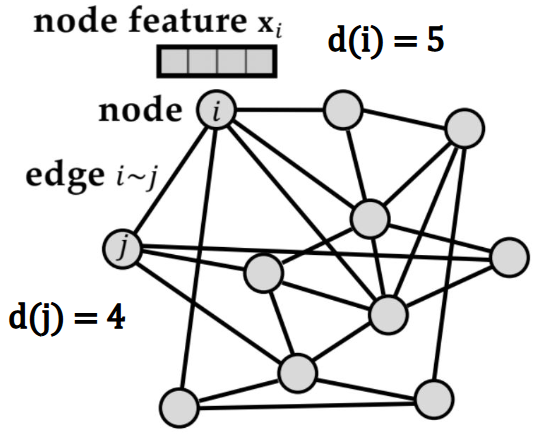
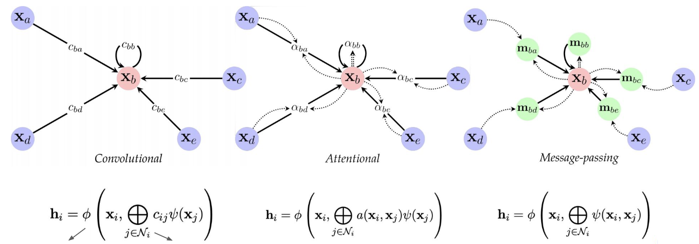

# Lecture 11, Apr 1, 2024

## Graph Neural Networks (GNNs)

* We might want to give inputs to our models that might have general, non-Euclidean relationships, such as a molecule, or a 3D structure, etc
* Architectures we've seen so far such as CNNs or RNNs cannot handle generic relationships such as these
* In general, to achieve order invariance we first learn embeddings for each item using a shared network $\psi$ to project into a shared latent space, then use an order-invariant aggregation function (e.g. sum, mean, max) to aggregate all input embeddings into a single embedding, and finally use another neural network $\phi$ to project into the output space
	* This is known as a *deep set*
	* Similar to putting words into GloVe embeddings first and then summing, except in this case we want order invariance
* Suppose we omit the positional encoding from the transformer input; then the input will be treated as a set, and representations won't change if the input tokens are shuffled
	* This is known as *order-invariance* or *permutation-invariance*
	* This is useful for certain tasks such as determining whether a molecule is toxic, where the order of input does not matter (*non-Euclidean*)
		* This is opposed to the tasks we've seen so far operating on images or text, where if the input order changes, the meaning also changes (*Euclidean*)
	* Since the transformer learns an attention matrix, it creates a fully-connected graph over all nodes in the input and learns the edge weights
* A *graph* $G = (V, E, X)$ is a data structure that encodes pairwise interactions/relations among concepts or objects as well as their features:
	* $V$ is a set of nodes representing the concepts or objects
	* $E$ is a set of edges connecting nodes and representing relations among them
	* $X$ encodes the features of each node (information attached to each node)
	* The *degree* of a node is a number of edges connecting to that node
	* $V$ and $E$ can be represented in an *adjacency matrix* $A$ where $a_{ij} = \twocond{1}{(i, j) \in E}{0}{(i, j) \notin E}$

{width=30%}

* Graphs are order-invariant; we can arbitrarily permute the node order as long as the adjacency matrix is updated
	* Functions on graphs should also be order-invariant
	* Feeding the adjacency matrix to a network directly doesn't work since there are $n!$ distinct adjacency matrices that describe the same graph, so the network needs to learn all of them
* We want our model, which is a function on a graph, to have 2 main properties:
	* *Invariance*: output does not change in response to changes in input ordering
		* e.g. if we input a molecule, the order that we put the atoms in should not affect whether the model predicts it is toxic
	* *Equivariance*: output (at the node level) properly changes in response to changes in input ordering
		* e.g. if we change the order of the atoms, then the order of the classes of atoms changes with it appropriately
* GNNs are a general type of neural network that can be modelled as a function on graphs, $f(X, A)$
	* Mostly based on *message passing*, i.e. communicating with neighbours to update embeddings
	* The inputs $(X, A)$ are transformed to latents $(H, A)$; the graph adjacency matrix $A$ does not change but the data representation is now in latent space
	* The latents can be used for e.g. node classification (operating on each node, e.g. what kind of atom is each node), graph classification (operating on the entire graph, e.g. what kind of molecule is the entire graph), or link prediction (operating on edges, e.g. what kind of bond is between two atoms)
* To perform message-passing, the embeddings of all neighbours of a node are aggregated using an order-invariant function (e.g. sum, mean, max), then combined with the node's own embedding (not necessarily order invariant), and the embedding for the node is updated
	* This is performed in parallel for every node
	* $h_v^{(k)} = \on{COMBINE}^{(k)}\left(h_v^{(k - 1)}, \on{AGGREGATE}^{(k)}\left(\Set{\left(h_v^{(k - 1)}, h_u^{(k - 1)}, e_{uv}\right) | u \in \mathcal N(v)}\right)\right)$
		* $\mathcal N(v)$ are the neighbours of node $v$
		* AGGREGATE is an order-invariant function, but COMBINE may not be (we can use operations such as concatenate, or another neural network)
* With a single message passing update, each node receives the embeddings from all its immediate neighbours; but with more updates, information from further nodes can propagate and reach the node as well
	* The more updates we do, the larger the receptive field of each node
* To get data out of the graph, we use a *read-out* (pooling) function, which must be another order-invariant function
	* $h_G = \on{READOUT}(\set{h_v^{(K)} | v \in G})$
	* This gives us a graph embedding which we can pass to another network

{width=80%}

### Graph Convolutional Networks (GCNs)

* A GNN layer at its core is a nonlinear function over node features and the adjacency matrix, $H = f(A, X)$
* The simplest model could be $H = \sigma(AXW)$ where the activation $\sigma$ provides the non-linearity and $W$ is a weight matrix
	* Both $A$ and $X$ are given inputs; we learn the weights $W$
* This has some issues we need to fix:
	* Simply multiplying with $A$ sums up the features of neighbours but not the node itself
		* We can add self-loops, i.e. $A \gets A + I$
		* This essentially does aggregate and combine at the same time
	* $A$ is not normalized so the multiplication will completely change the scale of the feature vectors (i.e. we unintentionally make some features more important than others)
		* We symmetrically normalize $A$ using $D$ such that all rows sum to 1: $D^{-\frac{1}{2}}AD^{-\frac{1}{2}}$
		* The degree matrix $D$ is the diagonal matrix where the entries are the degrees of each node
		* We can obtain this by simply summing the rows of $A$ and putting the result in a diagonal matrix
* The GCN layer is defined as $H = \sigma\left(D^{-\frac{1}{2}}AD^{-\frac{1}{2}}XW\right)$ (assuming $A$ has already been aggregated by identity)
* A GCN layer will only update the node embeddings based on the immediate ("1-hop") neighbours, since $A$ will only be nonzero where there is an edge
	* To get influence from further nodes, we have to apply the GNC update multiple times
		* Each time we update, we use a different weight matrix
		* This is analogous to adding deeper layers
	* This is analogous to increasing the receptive field in CNNs, since as we do more updates, further neighbours can start influencing each node

### Graph Attention Networks (GATs)

* Instead of using node degrees, GATs learn an attention score between two nodes
	* Similar to a transformer but without the positional encoding
* A shared neural network is used to compute the attention score between two nodes, then softmax normalized, and the node embeddings are updated based on the attention scores
	* $h_i = \sigma\left(\sum _{j} \alpha _{ij} Wh_j\right)$ where $a_{ij} = \operatorname{softmax}_j(e_{ij})$ where $e_{ij}$ is the attention score between nodes $i$ and $j$ computed by a neural network

### GNN Implementation

* In a naive dense implementation, we simply use `nn.Linear()` to make the weight matrix $W$, and perform the matrix operations normally with `torch.mm()`
	* We add identity to the input matrix and apply the normalization to compute $D^{-\frac{1}{2}}(A + I)D^{-\frac{1}{2}}$
		* To get the degree matrix $D$ we take a sum across each row and create a diagonal matrix, `torch.diag(torch.sum(A, dim=0))`, since this counts the number of connections for each node
	* Use the linear layer to compute $D^{-\frac{1}{2}}(A + I)D^{-\frac{1}{2}}XW$, and then apply the activation function to finish the layer
	* Get the graph embedding by pooling all the resulting embeddings through, e.g. a sum with `torch.sum(x, dim=0)`
	* Pass the graph embedding through more (normal) fully connected layers to get the final prediction
* However, most graphs are sparse, so using the adjacency matrix $A$ is unnecessarily expensive
* The PyTorch Geometric (PYG) library allows us to use a sparse representation that is more efficient
* Using `torch_geometric.data.Data(x, edge_index, y)` we can represent graphs
	* `x` is an $N \times D$ tensor that contains all the feature vectors
	* `edge_index` is a $2 \times M$ tensor where matching indices in the two rows denote edges
	* `y` is the ground truth label tensor
* Using `torch_geometric.nn.GCNConv(in_features, out_features)` we can replace all the matrix operations by just calling the layer as a function
	* Normalization and adding identity is taken care of by `GCNConv`
	* The layer expects `x` and `edge_index` as the inputs, which we get from the `Data` object
	* We still need to apply the activation function
* `torch_geometric.nn.GATConv(in_features, out_features)` can be used in place of `GCNConv()` as well
* For a dense implementation, the batched adjacency matrix would be done by creating a diagonal matrix of adjacency matrices
	* This would make it even less efficient since the matrix would be filled with zeroes
* In the sparse implementation uses an index vector that maps each node to its respective graph in the batch
	* e.g. if we have $\rvec{0}{0}{0}{1}{1}{1}^T$ this means the first 3 nodes belong to graph 0, while the last 3 nodes belong to graph 1
	* Use a `torch_geometric.data.DataBatch(batch, edge_index, x, y)` where `batch` is the batch index vector
	* `torch_geometric.loader.DataLoader(dataset, batch_size, shuffle)` is the data loader type for `torch_geometric`
		* `torch_geometric.datasets` has common datasets that can be loaded, similar to torchvision
	* Use `torch_geometric.nn.global_add_pool(x, batch)` to do add pooling with proper batching (since we can no longer do a simple `torch.sum()`)
		* The result is still an embedding tensor that can be passed to FC layers as usual
* Training works in the exact same way as any other model

