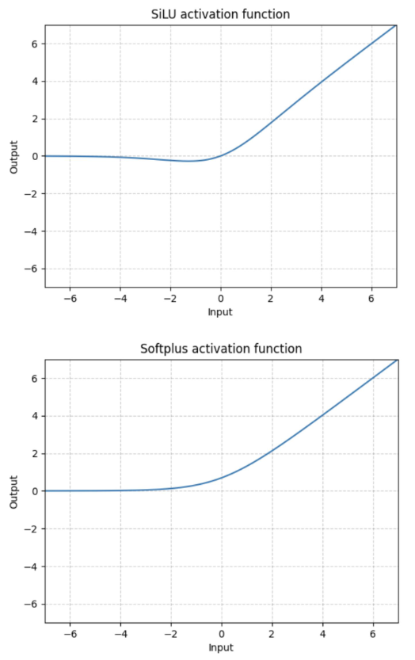

# Lecture 2, Jan 15, 2024

## Artificial Neural Networks

### Neurons

{width=30%}

* Each neuron takes inputs $\bm x$, has weights $\bm w$ and bias $b$, and an activation function $f$ which produces the output $y$
	* $y = f(\bm w \cdot \bm x + b)$
	* In a fully connected neural network, the inputs of the next layer are taken as all of the outputs of the previous layer
* The activation function takes the weighted sum of the input and produces an output
	* e.g. for a linear activation function $y = \bm w \cdot \bm x + b$, this draws out a hyperplane which splits the input space in 2; the $\bm w$ are the slopes of the plane and $b$ controls how far it is from the origin
		* This can be used for a classification task where the data is linearly separable by drawing a line that separates the data categories
* Linear activation functions are not useful because composing any number of them will still result in another linear function, so there is no benefit to having a more complex network
	* Most data in reality is not linearly separable, so linear activation functions can never work even with many layers
* Example activation functions:
	* Perceptron: $f(x) = \sgn(x) = \twocond{-1}{x < 0}{1}{x > 0}$, or $f(x) = \twocond{0}{x < 0}{1}{x \geq 0}$
		* $0$ is the *decision boundary*, where the output of the neuron changes
		* Used in early artificial neurons and no longer used today
		* Problem: Not differentiable, continuous or smooth
	* Sigmoid: a family including $f(x) = \tanh(x)$ (hyperbolic tangent) or $f(x) = \frac{1}{1 + e^{-x}}$ (logistic)
		* Maps the entire range of input into an output range of $[-1, 1]$ or $[0, 1]$
		* Commonly used before 2012, still used sometimes today
		* Differentiable, smooth, and continuous
		* Problem: large inputs saturate the neuron, which kills the gradient, resulting in very slow learning; also not as performant as some other options
	* ReLU (Rectified Linear Unit): $f(x) = \max(0, x)$
		* The derivative at zero is defined as 0
		* Differentiable (and very fast to compute derivatives), continuous
		* The family also includes other functions:
			* Leaky ReLU: $x < 0$: $f(x) = \twocond{x}{x \geq 0}{cx}{x < 0}$
				* Use a small constant slope for values less than zero
			* Parametric ReLU (PReLU) makes the slope for negative values a tunable parameter for the network
			* SiLU: $f(x) = x\sigma(x) = \frac{x}{1 + e^{-x}}$
				* Continuous approximation of ReLU
			* SoftPlus: $f(x) = \frac{1}{\beta}\log(1 + e^{\beta x})$
				* Another continuous approximation
				* Often gives better performance than regular ReLU but possibly slower to train

{width=25%}
{width=25%}
{width=25%}
{width=25%}

### Training Neural Networks

* Training a neuron is the process of selecting the weights and bias of the neuron so the network does what we want
	* Initially the weights and biases of each neuron is randomized
	* Note we will refer to all parameters as "weights", including the bias term
* In general, training a neuron involves the following steps:
	1. Make a prediction for some input data $\bm x$: $y = M(\bm w; \bm x)$
	2. Compare the correct output with the predicted output to compute the loss: $E = \operatorname{loss}(y, t)$
	3. Adjust the weights to make the prediction closer to the ground truth, i.e. minimize the error
	4. Repeat until the level of error is acceptable
* Training involves a forward pass (given input, compute the output), which is used in both training and inference, and a backward pass (given the output and loss, find the effect of each weight on the loss)

## Loss

* The *loss function* is a measure of performance of the network; it computes how bad predictions are compared to ground truth labels
	* The larger the loss, the worse the network's performance is
	* We want to compute the loss over all the input data and take the average
* To compare against the ground truth label, we first have to convert the label and the output of the network into matching forms
	* A *softmax* function normalizes the network output into a categorical probability distribution; this is used for single-label classification tasks
		* $\operatorname{softmax}(x_i) = \frac{e^{x_i}}{\sum _{k = 1}^K e^{x_k}}$
		* This converts the non-normalized output from the network into a probability distribution that sums to 1
		* The network's output before passing through any activation is called *logits*
	* Then use a *one-hot encoding* to map category labels to a vector representation; the element representing the category of a label is 1, while all other labels are 0
		* This can also be interpreted as a probability distribution
* Example loss functions:
	* Mean squared error (MSE): $\frac{1}{N}\sum _{n = 1}^N (y_n - t_n)^2$
		* $N$ training samples, with network predictions $y_n$ and true labels $t_n$
		* Used mainly for regression tasks because it doesn't work well with probabilities
	* Cross entropy (CE): $-\frac{1}{N}\sum _{n = 1}^N\sum _{k = 1}^K t_{n,k}\log(y_{n,k})$
		* $N$ training samples, $K$ classes ($t_{n,k}$ is the probability of training sample $n$ being in category $k$)
		* Used for classification tasks since it works on probabilities
	* Binary cross entropy (BCE): $-\frac{1}{N}\sum _{n = 1}^N \left(t_n\log(y_n) + (1 - t_n)\log(1 - y_n)\right)$
		* Used for binary classification tasks, where the output can either be 0 or 1
		* A special case of the cross entropy loss function

### Gradient Descent

* Ultimately training a neural network is an optimization problem; we want to find the minimum of the loss function by adjusting the weights of the network
	* This can be accomplished using gradient descent
* When training we want to find how changing each weight of the neuron affects the final output, i.e. finding $\pdiff{E}{w_{ji}}$
* Once we find the gradient, the weights are updated as $w_{ji}^{t + 1} = w_{ji}^t - \Delta w_{ji} = w_{ji}^t - \gamma\pdiff{E}{w_{ji}}$
	* $\gamma$ is the *learning rate*, or step size of the gradient descent
	* In the most simple case, $\gamma$ is set to a constant (adaptive size methods also exist)

{width=35%}

* Example: consider MSE loss $E = (y - t)^2$ with sigmoid activation $f(x) = \frac{1}{1 + e^{-x}}$; how do we compute $\pdiff{E}{w_p}$?
	* Using the chain rule: $\pdiff{E}{w_p} = \pdiff{E}{y}\pdiff{y}{a}\pdiff{a}{w_p}$
	* $\pdiff{E}{y} = \pdiff{}{y} (y - t)^2 = 2(y - t)$
	* $\pdiff{y}{a} = \pdiff{}{a}\left[\frac{1}{1 + e^{-a}}\right] = y(1 - y)$
	* $\pdiff{a}{w_p} = \pdiff{}{w_p}\left[\sum _p w_px_p + b\right] = x_p$
	* Multiplying this together: $\pdiff{E}{w_p} = 2x_p(y - t)(1 - y)y$
* The gradients are easy to find for layers that are next to the output, but for intermediate layers this is requires *backpropagation*

### Network Architecture

* Having a single decision boundary is insufficient for most problems, so having multiple layers is necessary
* As the number of layers approaches infinity, a neural network approaches a universal function approximator
* However for deeper networks, computing the gradient is harder
	* The problem of finding these gradients is the *credit assignment problem* -- how much influence does each weight have on the error?
	* This is solved by backpropagation
* With multiple layers, we can think of each layer picking out features of the data that get higher and higher in level with deeper layers
	* The complex, non-linearly separable data is processed by earlier layers into a form that is linearly separable at the final output layer
* *Feed-forward network*: information only flows forward from one layer to a later layer, from input to output
* *Fully-connected network*: each neuron takes its input from all neurons in the previous layer; i.e. Neurons between adjacent layers are fully connected
* The total number of layers is the number of hidden layers plus the output layer
	* We don't count the input layer (because it's decided by the input data format, so we don't have control), but we do count the output layer

{width=70%}

