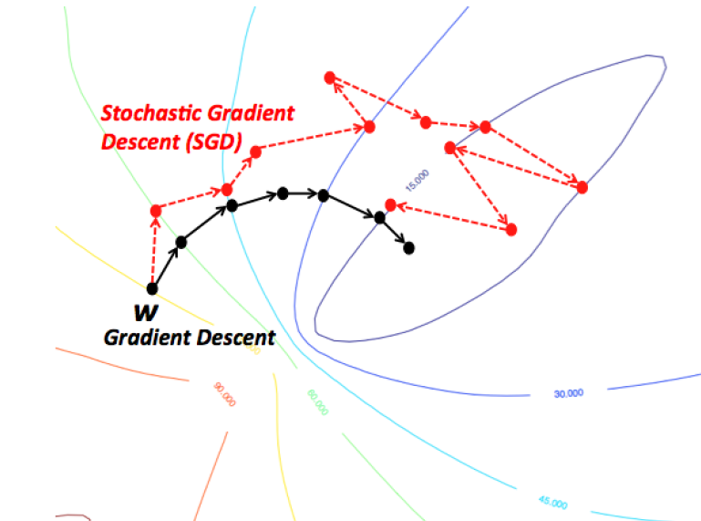

# Lecture 3, Jan 22, 2024

## Hyperparameters

* Hyperparameters are parameters that are not optimized during learning
* This can include:
	* Batch size
		* Rule of thumb: start out with a batch size that will max out the GPU
	* Number of layers
	* Layer size
	* Type of activation function
	* Learning rate
	* etc.
* Weights are updated through gradient descent as the inner loop of optimization; hyperparameters are tuned in the outer loop of optimization
* The full dataset (historic data) is split into train, validation, and test dataset (stratified sampling without replacement)
	* The training dataset is used to train the model itself
	* The validation dataset is used to tune the hyperparameters
	* The testing dataset is only used to evaluate the final model

{width=50%}

{width=40%}

* To tune hyperparameters, we can use either a grid search or a random search
	* In a grid search, we search over a grid of evenly/regularly spaced values for each hyperparameter
	* In a random search, we pick the combinations of hyperparameters randomly
	* Both have the problem that the number of points we need to fill the space increases exponentially with more hyperparameters (curse of dimensionality), so for larger problems it may become infeasible to search the entire space
	* Other techniques such as Bayesian optimization also exist

## Optimizers

* Defining a loss function turns our learning problem into a mathematically defined optimization problem
* An optimizer determines how each parameter should change to minimize the loss function
* All the optimizers that we use in this course are based on *gradient descent*
* Pytorch automates the gradient computation

{width=35%}

* Stochastic gradient descent (SGD)
	* In SGD, in each iteration we evaluate a training sample taken from the dataset at random
	* Computing the gradient takes less time since the sample is smaller, but overall this may not be faster
	* Gradient descent takes into account the entire dataset at a time while SGD only look at a subset
		* This means SGD is only approximating what the overall gradient looks like
		* As a result, instead of a smooth path to the minimum, the optimization looks more erratic and jumps around a lot more
	* However, SGD allows you to do a more global search, and often results in a better set of weights
* Mini-match gradient descent
	* Instead of working with a single sample at a time, we batch samples together
	* Use the network to make predictions for $n$ samples, average the loss for these samples, and take a step to optimize the average loss for these samples
	* This procedure is very widely used
	* Definitions:
		* Batch size: number of training samples used per optimization step
		* Iteration/step: each time we change the weights of the model
		* Epoch: number of times that we go though all the training data
	* e.g. if there are 1000 samples in the training data, with a batch size of 10, each epoch will have 100 iterations
	* When plotting loss, we usually plot against the epochs instead of iterations
	* If the batch size is too small, we are optimizing a potentially very loss function at each iteration, so the result is noisy
	* If the batch sizes are too large, each iteration is very expensive and the average loss might not change a lot as the batch size grows
		* Larger batches are not always better (overfitting)
* Since we're optimizing in a large number of dimensions, many weights end up at saddle points which have zero gradient
	* Plateaus are are problem but can be addressed using specialized variants of gradient descent, such as momentum

{width=40%}

* *Ravines* are areas where the gradient in one dimension is much steeper than in the other; gradient descent will jump around in the steep direction and move slowly in the shallow direction
* SGD with *momentum* remedies this by adding a momentum term
	* $v_{ji}^t = \lambda v_{ji}^{t - 1} - \gamma\pdiff{E}{w_{ji}}$
	* $w_{ji}^{t + 1} = w_{ji}^t + v_{ji}^t$
	* $\lambda = 1 - \gamma$
	* Note that we have no way of changing the momentum; if we make a bad choice at the beginning, we're stuck with it
* In *adaptive moment estimation* (Adam) each weight has its own learning rate; this incorporates both momentum and adaptive learning rate
	* $m_t = \beta _1m_{t - 1} + (1 - \beta _1)\pdiff{E}{w_{ji}}$
	* $v_t = \beta _2v_{t - 1} + (1 - \beta _2)\left(\pdiff{E}{w_{ji}}\right)^2$
		* Squaring the gradient emphasizes it
	* $w_{ji}^{t + 1} = w_{ji}^t - \frac{\gamma}{\sqrt{v_t} + \epsilon}m_t$
		* The $\epsilon$ is a noise term so that we won't divide by zero
	* Advantages include rapid convergence, minimal tuning
	* Note in Pytorch the $\beta _1$ and $\beta _2$ parameters are set to the defaults found in the paper
	* We can use this in pretty much all situations

### Learning Rate

* The learning rate $\gamma$ is the size of the step that an optimizer takes during each iteration
* A larger step size changes the parameters more in each iteration
* A good choice would be 0.01 to 0.001
	* If the learning rate is too large, it can overshoot or bounce around the minimum
	* If it is too small, it will take a very long time
* The appropriate learning rate depends on the learning problem, type of optimizer, the match size and the stage of training
	* Larger batches require larger learning rates (since there are fewer iterations)
	* As the stage of training progresses the learning rate should be reduced
	* Methods of adjusting the learning rate can include step decay, exponential decay and two-stage exponential decay

{width=40%}

## Normalization

* We normalize the inputs to prevent the model from paying attention to the scale of features
	* Without normalization, the model would pay more attention to features with larger range
	* Always normalize the inputs!
* The inputs are normalized as $X_i = \frac{X_i - \mu _i}{\sigma _i}$ across all inputs
	* This only normalizes the data for the first layer; we still need to normalize subsequent layers

{width=70%}

* Batch normalization: normalize activations batch-wise for each layer, done right before activation, but after multiplying by weights and adding bias
	* Again we add some amount of noise $\epsilon$ to prevent dividing by zero
	* This "centers" the data around the active region of the activation function (around zero), which speeds up training
	* After normalization, we can scale and shift the data as well (not used too often)
		* This adds more parameters to be learned
	* We still need to normalize during inference time since the network is used to seeing normalized data
		* Use a moving average across the entire training dataset
			* $\mu _{mov_i} = \alpha \mu _{mov_i} + (1 - \alpha)\mu _i$
			* $\sigma _{mov_i} = \alpha\sigma _{mov_i} + (1 - \alpha)\sigma _i$
		* At inference time, use this moving average from the training data to normalize
	* Advantages:
		* Allows higher learning rates, which speeds up the training
		* Regularizes the model
		* Less sensitivity to the initialization of the model (initially weights are randomly chosen)
	* Disadvantages:
		* Depends on the batch size; has no effect with small batches
		* Can't work with SGD (since summary statistics are computed over the batch, so SGD with batch size of 1 is useless)

{width=20%}

* Layer normalization: normalize across all the neurons for an entire layer
	* Much simpler to implement and we don't need moving averages or parameters
	* Not as effective as batch normalization however

## Regularization

* Regularization are techniques that reduce overfitting or underfitting
* Dropout: randomly set weights to 0 with probability $p$ (i.e. drop out connections)
	* Every time we train, the weights that are dropped out are shuffled
	* This forces a neural network to learn more robust features since the model is forced to work with less data
	* During inference, multiply all weights by $(1 - p)$ to keep the same distribution
	* Dropouts are performed after activation
* *L2 weight decay* (aka *L2 norm regularization*): adding the L2 norm of the weight vector to the loss function
	* This reduces each weight multiplicatively in each iteration
	* Effectively changes the update equation to $W_{t + 1} = W_t - \gamma\left(\alpha W_t + \pdiff{E}{W}\right)$
	* Prevents the weights from exploding

{width=50%}

* *Early stopping*: stopping the training when loss starts to increase
	* With "patience", start a counter when the loss starts to increase and reset it when the loss decrease; if it reaches a certain point then stop training
	* This a common technique; we often have to wait multiple times

## PyTorch Implementations

* Use `torch.manual_seed()` to ensure reproducibility, since model weights are initialized randomly
* Class `nn.Linear(in, out)` defines a fully connected linear layer
* To define a network, we inherit from class `nn.Module`
	* In the constructor we set up the network
	* In the `forward()` method we do a forward pass to make a prediction
		* We take the input and pass through the layers by calling them as functions
		* To apply activation functions we call methods from `nn.functional`, e.g. `relu()`
		* Note we don't apply an activation function for the final layer
			* PyTorch has implementations of loss functions that include the final activation
				* `nn.BCEWithLogitsLoss()` applies sigmoid internally, whereas `nn.BCELoss()` does not
				* `nn.CrossEntropyLoss()` applies softmax internally, whereas `nn.NLLLoss()` expects a proper distribution
			* For numerical stability these are better
* Calling the model like a function allows us to do the forward pass 
* To compute gradients, we call `backward()` on the loss function (e.g. `nn.BCEWithLogitsLoss`, `nn.CrossEntropyLoss`)
* Use an optimizer in `optim` and specify parameters; we also need to pass in the tunable parameters via `model.parameters()`
	* For each sample in the training dataset:
		1. Make a prediction by calling `model(input)`
		2. Compute the loss by calling `criterion(out, labels)`
		3. Compute gradients using `loss.backward()`
		4. Update parameters by calling `optimizer.step()`
		5. Clean up optimizer by calling `optimizer.zero_grad()` (otherwise the optimizer saves previous gradients)
* For multi-class classification, the output layer needs to have as many neurons as classes, we need to softmax the final layer and use multiclass cross-entropy loss

## Debugging Neural Networks

* Make sure the model can overfit on a small amount of data
	* Do this with a small amount of data to do it quickly
* Ensure that the model is training at all -- check that loss is actually going down

{width=60%}

* The confusion matrix can be used to check the model performance and the data balance
	* True positive/negative: when prediction and true label agree
	* False positive: when prediction is positive but label is negative
	* False negative: when prediction is negative but label is positive
	* Common metrics:
		* *Accuracy*: probability of output being correct (sum of true positives and negatives over all samples)
		* *Precision*: probability of true positive, given positive prediction (true positives over sum of true and false positives)
		* *Recall*: probability of true positive, given positive label (true positives over sum of true positives and false negatives)
		* *F1 score*: $2 \times \frac{\text{recall} \times \text{precision}}{\text{recall} + \text{precision}}$
* We can also take data from later layers and plot the data to see if there are patterns
	* Using t-SNE for a 2D projection and visualization of the data structure
	* We should expect to see that different classes are clumped together

