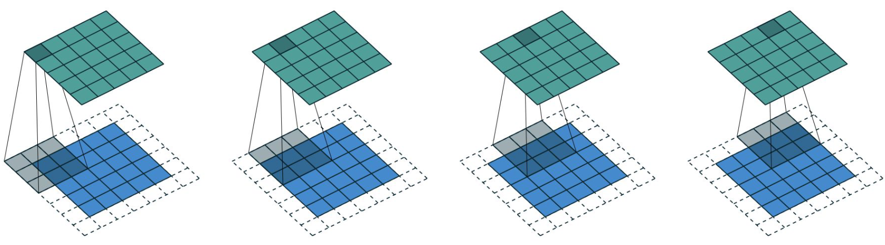
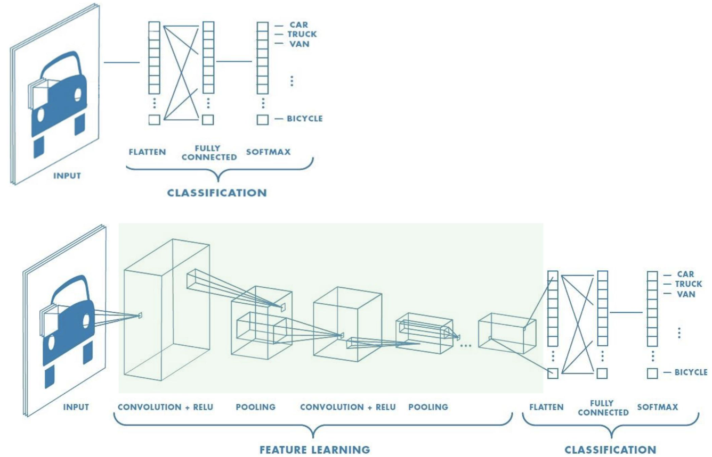
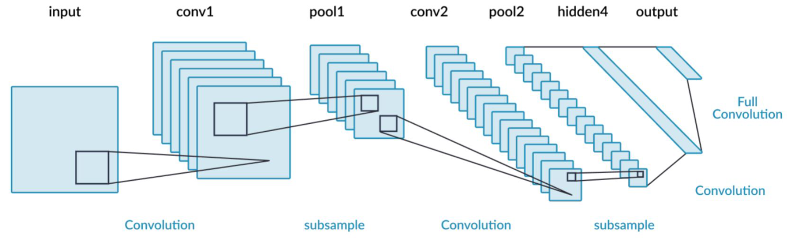

# Lecture 4, Jan 29, 2024

## Convolutional Neural Networks (CNNs)

* Using a regular ANN has disadvantages:
	* By flattening the image we lose geometric information about what pixels are next to each other
	* We are restricted to a specific image size (need to retrain the entire model if we change it)
	* The data needs to be preprocessed in a specific way (e.g. centered)
	* Computational complexity grows very quickly as layers get bigger

### The Convolution Operator

* A *convolution* is an operation that slides a *kernel* across an image, taking a weighted sum of the part of the image overlapping with the kernel for every kernel position
* $y[m, n] = I[m, n] * K[m, n] = \sum _{j = -\infty}^\infty\sum _{i = -\infty}^\infty I[i, j]K[m - i, n - j]$
* Convolutional filters can achieve various effects on an image, including blurring, edge detection, etc
* Kernels used to be hand-crafted, but in a CNN we make the network learn the kernel
* Applying a convolution to an image reduces the size of the image, unless we apply *padding* to the edges
	* We can add zeroes around the border to make the output the same size, or even bigger if we desire
	* Our feature space retains the same dimensionality and we don't lose any information around the edges

{width=70%}

* We can also change the *stride*, or how much the kernel moves each time
	* Increasing the stride reduces the output resolution and can act as a form of pooling
	* Lowering the output dimension can lower the number of parameters we need to learn
* Each output dimension has an output size of $o = \floor*{\frac{i + 2p - k}{s}} + 1$ where $i$ is the image dimension, $k$ is the kernel dimension, $p$ is the amount of padding (each side) and $s$ is the stride
	* Note different dimensions might have different amounts of padding, stride, etc

### Convolutional Neural Networks

* Use convolutional filters in the networks, where the kernels are learned by the network
* CNNs use locally connected layers (kernels act on a small, local region of the image) and use weight sharing (the same local features are detected across the entire image)
	* This retains the geometric information in the image that would otherwise be lost by flattening
	* Weight sharing significantly reduces the number of parameters that need to be learned

{width=80%}

* The later layers will learn more abstract/higher level features and there will be fewer neurons
	* At the end we flatten the features and pass to an ANN for classification
	* At this point the features are very abstract and no longer geometric, so we don't lose information
* The network learns all the weights in the kernel, as well as a bias for each kernel
	* The weights are randomly initialized
* Images and convolutional layers can have multiple channels
	* For colour images, the kernel becomes a 3-dimensional tensor, operating on all 3 channels at the same time; the image would be $3 \times i \times i$ and kernel $3 \times k \times k$
		* This is like applying a separate kernel to each channel and then summing the results for each pixel
	* To detect many different features, we can have multiple kernels (increasing the *filter depth*)
		* The number of kernels is the number of output channels -- each kernel produces its own output channel
		* Each kernel will learn a different set of features because they are randomly initialized, so upon gradient descent they will move towards detecting different features
	* e.g. colour input image of $3 \times 28 \times 28$ using kernels $5 \times 3 \times 8 \times 8$ has 3 input channels, 5 output channels and $5 \times 3 \times 8 \times 8 + 5$ trainable weights (including biases)
* As we go through the layers, the filter depth increases, and the feature map size decreases; i.e. we have more sets of features that are each individually lower in resolution

{width=70%}

### Pooling

* *Pooling* is a way to consolidate information, i.e. removing information not useful for the task
	* This is like reducing the layer size before the final output layer in an ANN
* Pooling is essentially another convolution over the output, but the kernel is not learnable:
	* *Max pooling*: taking the max value in the entire area that the kernel covers
	* *Average pooling*: taking the average of all the values in the area the kernel covers
	* Output dimension is given by $o = \floor*{\frac{i - k}{s}} + 1$
* An alternative to pooling is to just use another convolution layer with a larger stride
	* Since this kernel can be learned, it introduces more parameters
	* This makes the model more powerful but increases computational cost

### PyTorch Implementation

* Use `nn.Conv2d(in_channels, out_channels, kernel_size, stride, padding)` to implement a convolutional layer
	* Default for stride is 1, padding is 0
	* Specify integers to use the same across 2 dimensions, or make it a tuple for different parameters in each dimension
* Use `nn.MaxPool2d(kernel_size, stride)` etc for pooling
* Once the convolutional layers are done we go back to using `nn.Linear()` to implement the ANN layers
* First apply the convolutional layer, then the activation function, then the pooling
* The training code stays the same whether it's a CNN or ANN because PyTorch handles all the gradient calculations

