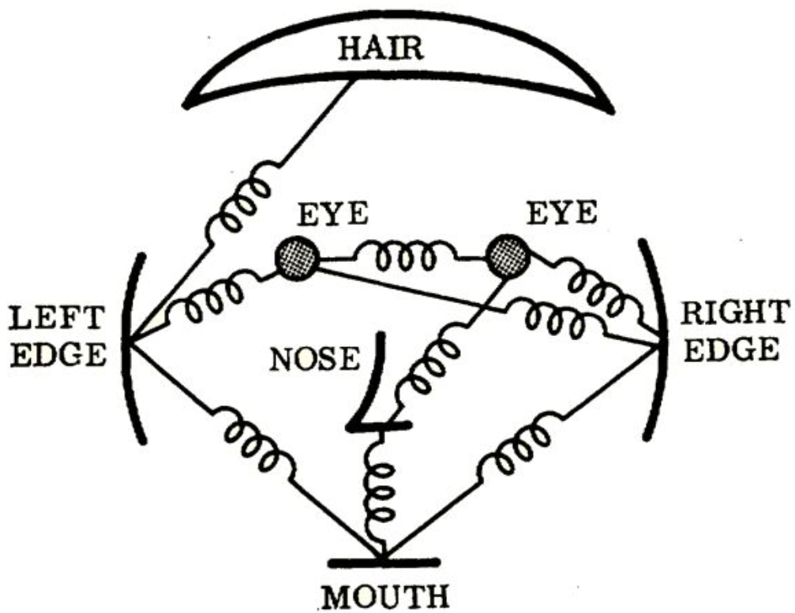
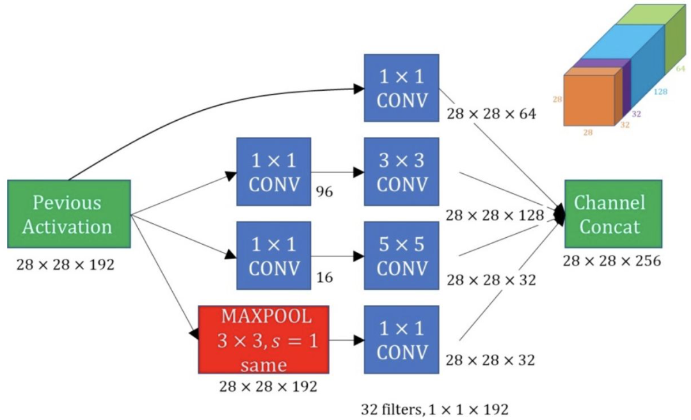
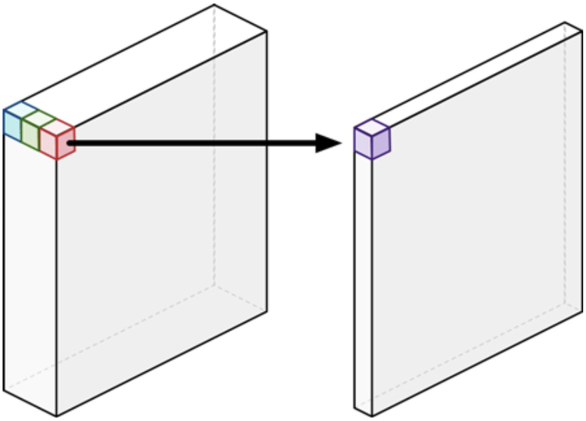
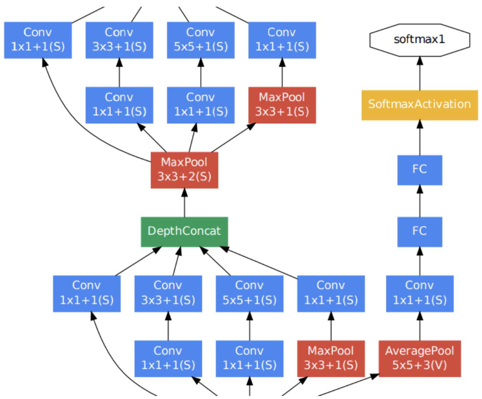
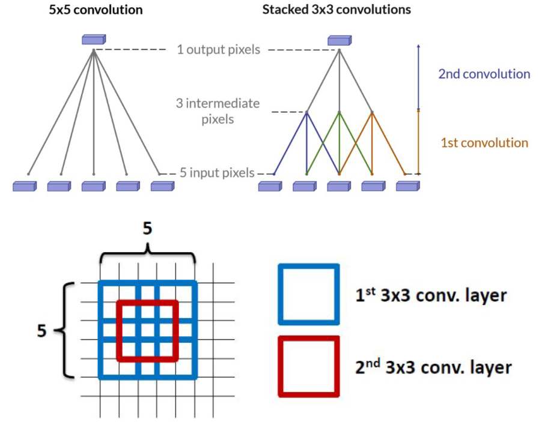
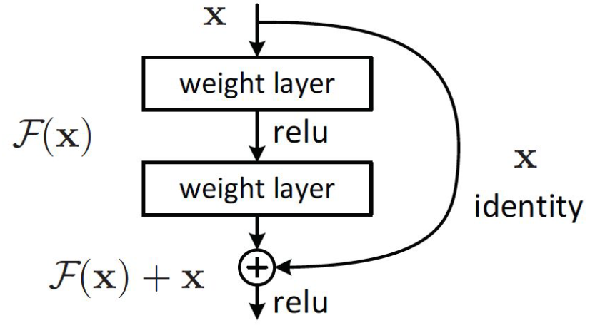
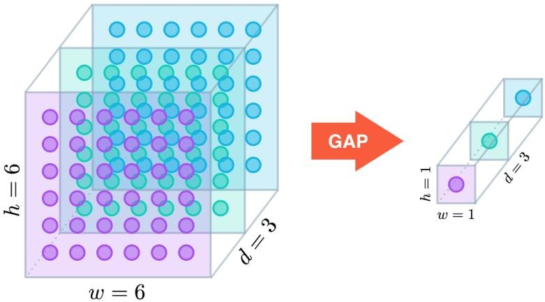

# Lecture 5, Feb 5, 2024

## Convolutional Neural Networks (Continued)

### Visualization of Convolutional Filters

* We can display the convolutional filters as images to get an idea of what the network is learning
	* The earlier layers have filters that capture low-level features such as edges and blobs, similar to hand-crafted features
	* Later layers pick up more abstract features, and at this point we can't tell what the filters do anymore
* One way to visualize which parts of the image the network picks out is to use a *saliency map*
	* Pass the input image through the network and compute the loss
	* Take the gradients with respect to the inputs (as opposed to the weights as is during training)
	* For multiple channels, take the max absolute value across all channels for each pixel
	* Plotting this will give us a heatmap of which regions the network considers relevant to the problem
* However saliency maps are not very practical because they don't give much detailed information
	* This can also be misleading

### Evolution of CNNs

* LeNet was the original CNN introduced in 1989; we mostly refer to LeNet-5
	* LeNet demonstrated invariance to translation, scaling, rotation, squeezing/stretching, stroke width, and noise
* For the next 20 years CNNs were outperformed by other techniques such as random forests/decision trees or support vector machines
* *Deformable parts models* were one popular technique used at that point
	* Detect features that make up the object and their locations
	* Introduce constraints on where the features can be in relation to each other
	* Allow some amount of deformation before the object is considered invalid
	* However this requires handcrafting the models for each type of object; models are not transferable or generalizable
	* Also only works well with one specific perspective/view angle

{width=25%}

* ILSVRC is a subset of the ImageNet dataset and is a competition for image recognition models
* AlexNet was an entry of ILSVRC that significantly improved over past results
	* Significantly larger than LeNet -- more parameters and much deeper
	* Used ReLU instead of sigmoid
	* Used dropout, weight decay, scheduled learning rates and data augmentation
* GoogLeNet achieved near-human accuracy in 2014
	* Much deeper than other networks with 22 convolution layers
	* Only 4 million parameters vs. 60 million for AlexNet
	* Increased parameter efficiency was achieved using *inception blocks*
* ResNet achieved better-than-human accuracy in 2015 using skip connections, batch normalization, and ReLU
	* The use of skip/residual connections allowed the network to be very deep (152 layers)
	* Used strided convolutions instead of pooling layers
	* Only a single fully-connected classification layer since the convolution layers were very good
	* Uses global average pooling
* ILSVRC is now a solved problem
* Object recognition in the wild is still an open problem

### Modern CNN Techniques

* *Data augmentation*: applying class-preserving transformations to the input to generate more data, e.g. cropping, resizing, translation, color filtering, noise addition, blur
	* PyTorch has tools to do this
	* Helps generate more data and increase robustness
* Increasing the depth of models improves generalization performance, but with very deep models, we run into issues of vanishing or exploding gradients due to the long path the input takes to the loss function
	* To address this we can use better initialization for ReLU, skip connections, and normalization
* *Inception block*: using a mixture of filter sizes on one layer
	* Normally we need to fit all these into a tensor so they need the same dimensions, but we can break it up
	* The most important features can be mostly learned with just $3 \times 3$ filters, with a few larger ones added; this significantly improves parameter efficiency

{width=40%}

* *Pointwise convolutions*: Applying pixel-wise transformations that map each pixel into a higher or lower dimensional space, e.g. turning RGB pixels into a single value
	* These transformations are nonlinear due to the activation function
	* Used in most modern CNN architectures except VGG
	* This is useful for consolidating information between channels

{width=25%}

* *Auxiliary loss*: adding additional loss functions partway through the network, and optimizing the total loss
	* i.e. adding intermediate classifiers and making the final loss the combination of the intermediate and final losses
		* Note these intermediate classifiers also need their own fully connected layers; i.e. we're taking the intermediate output of the convolutional layers and using fully connected layers to classify them with the same labels, so the intermediate classifiers should have the same labels
	* During inference the intermediate classifiers are discarded
	* This helps with the vanishing and exploding gradient problem and can also help with overfitting
	* At the time, skip connections didn't exist

{width=40%}

* *Stacked convolutions*: simple architecture made of simple stacked blocks
	* VGG (Visual Geometry Group, Oxford) showed that stacked $3 \times 3$ filters can approximate larger filters more efficiently
	* Stacked filters apply a smaller sized filter multiple times to approximate a larger sized filter with only $3 \times 3$ filters
	* This makes hyperparameter tuning easier; we no longer have to consider different kernel sizes, just the number of filter layers
* VGG also introduced a data augmentation scheme commonly used today

{width=40%}

* *Residual networks* (ResNets): using skip connections to provide deeper layers more direct access to outputs of earlier layers
	* The input to a deep layer comes from the layer directly before it, added with the output of a layer several levels before, skipping intermediate layers
	* Effectively introduces a shortcut for the data/gradient
	* This helps with vanishing gradients and allows training very deep networks

{width=30%}

* *Global average pooling*: instead of flattening the final feature maps, take an average cross the entire feature map for each channel
	* The result is fed to ANN layers or directly to softmax
	* This effectively reduces each feature map's dimensions to just $1 \times 1$
	* To implement in PyTorch we can use an `nn.AdaptiveAvgPool2d(1)` layer
		* Argument is the desired output size, which is 1 for GAP
		* Kernel size is computed automatically, which makes it average across the entire input

{width=35%}

### Transfer Learning

* The output produced after all the convolutional layers but before the classification layers is an *embedding*
	* This is a set of features that contain everything needed to classify an image
	* These embeddings can be reused to train new networks
* After training on large datasets, the convolutional layers learn something general about representing images that is useful across a range of tasks, so we can reuse them for different tasks
	* The encoder essentially becomes a universal feature extractor
* To transfer learning to a new problem, the classification (fully connected) layers are removed, and the weights in the convolutional layers are frozen; then new layers are added that are more suitable for the new task and retrained
	* This lets us use very powerful pre-trained networks such as AlexNet for customized tasks
* Since the weights in the CNN are frozen, they won't be trained and the CNN is used as a feature extractor
	* We can alternatively also train these weights but with very small learning rates, which is known as *fine-tuning*
		* Start by tuning the later layers first
		* If the dataset is big enough we can try to tune the earlier layers
	* This helps the CNN adapt to the new task
* Models are available pre-trained from `torchvision`
	* Use `torchvision.models` to create the models, and pass `pretrained=True` to get the pre-trained weights

